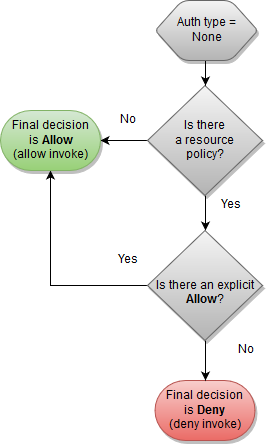
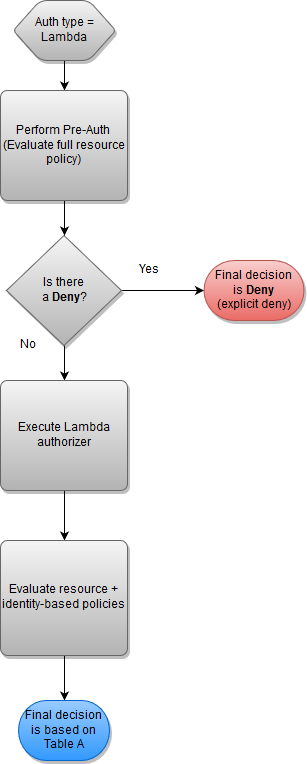
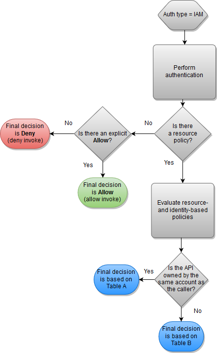

### Amazon API Gateway 学习手册

`Amazon API Gateway`可以创建、发布、维护、监控和保护 REST、HTTP 和 WebSocket 的 API，API 开发工程师能创建访问 AWS 或其他 web 服务的 API，这些 API 可以用于你自己的客户端应用程序或者提供给第三方应用开发人员。API 开发者需要 AWS 账户来创建和部署 API，一个应用程序开发者创建一些底层应用通过`Amazon API Gateway`来调用 AWS services。底层的应用程序通过`Amazon API Gateway`来暴露。`Amazon API Gateway` 能够处理几十万的实时请求，这些处理包含流量管理、权限访问控制、监控和版本管理，`Amazon API Gateway`相当于通往后端服务的大门。

1. 使用`Amazon API Gateway`创建 REST API：一个`API Gateway REST API`是一个资源和方法的组合。资源是一个可以通过资源路径访问的逻辑实体，方法相当于用户提交的请求或对该请求的响应。应用程序不需要知道存储和获取资源的位子，所有在`Amazon API Gateway`里配置的 API 都将为前端封装请求方法和响应方法，并通过集成请求和集成响应与后端交互。

2. 使用`Amazon API Gateway`可以创建比 REST API 更低延迟和更低花费的 HTTP RESTful API。可以使用 HTTP API 发送请求到`AWS Lambda functions`或者任意的 HTTP 站点。

3. 使用`Amazon API Gateway`可以创建 WebSocket API, 使用 WebSocket API 可以在 client 和 server 之间建立连接发送消息，由 WebSocket API 来保证连接安全和实时的通信。

##### Amazon API Gateway 术语描述

- API Gateway: 创建、部署和管理RESTful应用程序接口和WebSocket API，通过前端HTTP和WebSocket站点调用，暴露给后端服务。
- API Gateway REST API: 一个HTTP资源和方法的集合，可以与后端HTTP站点，Lambda或其他的AWS services集成，你能将其部署在一个或多个stages，通常API根据应用逻辑生产一个资源树，每一个API资源能暴露一个或多个API方法。
- API Gateway HTTP API: 一个routes和methods的集合，可以和HTTP站点或lambda做集成，同时可以将其部署在一个或多个stages里，每个路由能暴露一个或多个API方法，每个API方法支持一个HTTP方法。
- API Gateway WebSocket API: 一个WebSocket路由和路由键的集合，可以和HTTP站点、lambda或者其他的AWS Services做集成，可以部署在一个或多个stages上，API的方法被WebSocket连接调用，同时可以为WebSocket连接注册域名。
- API deployment: 一个时间点的API Gateway中的API快照，部署是与一个或多个API stages关联的，部署后可以被用户调用。
- API developer: AWS account的拥有者，可以创建`Amazon API Gateway`。
- API endpoint: API的主机名部署到特定的区域，主机名的格式是{api-id}.execute-api.{region}.amazonaws.com 
- API key: 一个包含数字和字母的字符串用于标识使用API的app developer。
- API stage: 一个API的生命周期的管理阶段。
- APP developer: 一个应用程序的开发者，拥有或者没有AWS account，其应用需要跟`Amazon API Gateway`做集成。
- Callback URL: 当一个新的客户端通过WebSocket connection连接到API，`Amazon API Gateway`可以存储客户端的callback URL，然后你可以通过后台系统用这个URL来发送消息。
- Developer portal: 一个应用程序可以用来注册，发现和订阅你的API产品，管理API keys,查看API的使用指标。
- Edge-optimized API endpoint: 默认的主机名部署在一个特定的区域，使用CloudFront分发系统方便客户端的跨AWS区域的访问，API的请求将路由到最近的CloudFront point of Presence(POP),可以为不同地域的客户端提高连接时间。
- Integration request: `Amazon API Gateway`中WebSocket API route或REST API method的内部接口，可以格式化路由请求的请求体或者方法请求的参数和请求体，然后传给后台。
- Integration response: `Amazon API Gateway`中WebSocket API route或REST API method的内部接口，可以格式化返回状态码、返回头和返回体，然后返回给客户端程序。
- Mapping template: 一个VTL脚本用来转换请求体到后端，后者转换返回体到前端。可以在integration request和integration response中配置，可以引用运行时上下文和stage变量中的数据。
- Method request: 在`Amazon API Gateway`中的公有的API method接口，可以定义后端的请求参数和请求体。
- Method response: 在`Amazon API Gateway`中的公有API的接口，定义了响应状态码，响应头和相应体的模型。
- Mock integration: 可以直接从`Amazon API Gateway`中生成响应，不需要和后端的集成，可以使用状态码来配置integration request和integration response。
- Model: 一个定义了请求和响应数据结构的数据模型，model是生产API的强类型SDK所必须的。
- Private API endpoint: 一个私有的站点可以通过在VPC的站点接口允许客户端安全访问API资源，私有的API将互联网隔离开了，只允许通过VPC的站点访问。
- Private integration: 一个`Amazon API Gateway`的integration类型，可以允许客户端通过私有API站点访问VPC的内部资源而不暴露给公网。
- Proxy integration: 一个简单化的`Amazon API Gateway`集成配置，你可以使用HTTP proxy integration或者Lambda proxy integration，HTTP proxy integration将传递所有的请求和响应，Lambda proxy integration将发送所有的请求到Lambda函数，然后将Lambda的输出转换成一个前端的HTTP响应。在REST API配置中proxy integration代表着匹配贪婪模式资源路径。
- Regional API endpoint: 一个部署在特定的区域内的API的主机名，并打算给相同区域内的服务使用，在同一个区域中，API的请求直接发送到区域内的API Gateway而不需要通过CloudFront分发系统。
- Route: 一个`Amazon API Gateway`中的WebSocket路由用来将消息指向特定的integration，当你定义一个WebSocket API时，你就需要声明一个route key和一个integration backed。这个route key是一个message body的属性，当这个route key匹配到一个进来的消息与之对应的integration backend将被调用。
- Route request: 一个公用的WebSocket API方法接口，定义了app developer在请求中发送的消息体发送到后端。
- Route response: 一个公用的WebSocket API接口，定义了状态码，相应头和响应体的Model。
- Usage plan: 可以指定API的客户端访问一个或多个REST、WebSocket API，配置这些请求的流量和定额。
- WebSocket connection: API GateWay维护在客户端和自身之间的一个永久连接，但是在`Amazon API Gateway`和后端的integration之间没有这样的永久链接，只有在需要调用后端时才会连到后端。

##### REST APIs

 一个在`Amazon API Gateway`的REST API是一组资源和方法的集合，它们可以和后端的服务集成。可以很方便的管理你的API的整个生命周期。`Amazon API Gateway`使用model来定义请求和响应的格式，这样的model可以用于不同的同步响应的应用。

 ###### 1.创建和配置

 在`Amazon API Gateway`中当创建一个REST API代表一个API Gateway资源集合，每个资源可以有一个或多个方法，一个方法定义了应用程序接口向客户端暴露资源也可以表示一个客户端发起的请求。你可以创建一个集成资源去将方法和后端站点集成起来，可以将这个集成资源当成集成站点，可以使用站点的URI来传递请求。支持转换请求参数和请求体来匹配后端的需求。对于后端响应，可以创建一个Method Response资源来代表一个请求的响应，你也可以创建一个Integration Response资源代表从后端来的响应。你可以配置集成响应转换响应消息格式。

 ###### 2.API endpoint类型

 - Edge-optimized API endpoints: 一个edge-optimized API endpoint是在地理位置上分布客户端的最佳选择，API的请求将路由到最近的CloudFront Point of Presence(POP)，这是默认的API endpoint配置。用于edge-optimized API任意的自定义域名将适用于所有区域。Edge-optimized APIs会将所有的HTTP头中的名字首字母大写，CloudFront会将HTTP cookies按照自然排序后再转发。
 - Regional API endpoints: 一个regional API endpoint是所有客户端在同一区域中的最佳选择，或者只服务于数量很少的客户端，这样可以降低连接成本。
 - private API endpoints: 一个private API endpoint只允许从VPC发起请求。

 ##### 3. 创建REST API method

 在`Amazon API Gateway`中一个API method包含一个method request和一个method response。你创建一个API method用于定义客户端发送请求到后端服务和定义从后端服务返回的请求响应。在请求中可以根据客户端运行时传输的数据来选择请求参数和请求体。在响应中使用后端返回的数据映射到你定义的响应状态码、响应头和响应体。
 - 一个API method request是一个HTTP request。配置method request我们需要配置一个HTTP method动词，一个API资源路径，请求头，请求参数。还可以为POST、PUT和PATCH配置请求体。

 - 一个API method response是一个HTTP response。对于non-proxy的intergration必须配置method response来指明返回和响应之间的映射对象，这将把integration response的返回头和返回体转换成method response的响应头和响应体。这个映射也可以直接返回integration response的返回头和返回体。一般情况下配置method response处理2XX、4XX、5XX三种状态码的返回，但是你无法对没有匹配上或未知的返回都定义method response，最佳的实践是定义一个默认的错误码为500的返回。为了支持校验请求和返回的请求体和响应体，你可以创建Model来定义请求和响应的body体类型。

##### 4. 访问控制

1. 使用`Amazon API Gateway`的资源策略：资源策略是一个JSON策略文档，你可以附加到一个API上指定特定策略来访问这个API，这样你的API可以被安全的访问了
- 从特定的AWS账户来的请求
- 从指定的IP地址或者CIDR块来的请求
- 从指定的VPC或者VPC站点来的请求
  你可以使用资源策略来控制所有类型的`Amazon API Gateway`访问请求。对于私有APIs你可以使用资源策略和VPC endpoint策略一起来控制对资源的访问。资源策略包含以下元素:
- Resources: 你可以授权或禁止对APIs资源的访问；
- Actions: AWS定义了对资源的一系列操作，你可以使用允许或拒绝对资源的操作，例如`execute-api:Invoke`将允许你调用API。
- Effect: 对于该资源操作的授权，只有Allow和Deny两种；
- Rrincipal: 账户或用户，定义对谁授权。

2. 当API gateway在评估资源策略的时候结果会受到定义API时授权类型的影响：

- 当API定义授权类型时选择无授权，评估资源策略时允许访问需要明确允许访问，禁止访问可以是明确或隐试的。

  

- 当API定义授权类型时选择Lambda授权器，先评估是否有明确的拒绝策略，如果有则直接拒绝，如果没有就需要评估Lambda的执行角色策略和资源策略相结合来评估结果。

  

- 当API定义授权类型时选择了IAM认证，将会根据IAM的认证策略和资源策略来评估是否有权访问API，如果调用者和API owener分别属于不同的账户，需要IAM认证策略和资源策略都被明确授权才能调用，如果调用者和API owener是属于同一个账户，则IAM认证策略和资源策略只需要有一个明确授权就可以调用。

  

  

