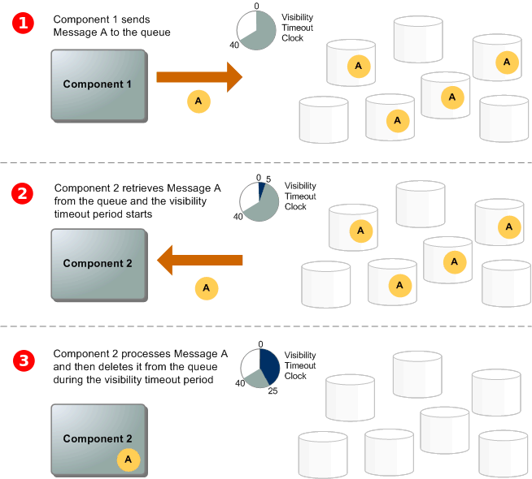

# Amazon SQS学习手册

### Amazon SQS基本架构

##### 1. 分布式的队列

在一个分布式的消息队列中有三个核心组成：分布式系统的组件，消息队列（分散在Amazon SQS servers中），最后就是消息队列中的消息。

##### 2.消息的生命周期

一个消息的生命周期可以参看下图：

1. 一个生成者发送消息A到消息队列，这个消息将被冗余的存储在分布式的Amazon SQS servers中；
2. 当一个消费者准备处理消息时，它将从消息队列中取出该消息，当一个消息被处理过程中它不会被其他的消费者获取，直到visibility超时；
3. 消费者处理完消息后为了防止有消息队列再次处理这条消息需要将这条消息从对列中删除。

### 消息队列类型

Amazon SQS支持两种类型的消息队列，标准队列和先进先出队列，下表对比了这两种类型消息队列的特性：

|            |                 标准队列                 | 先进先出对列                                                 |
| :--------: | :--------------------------------------: | :----------------------------------------------------------- |
|   吞吐量   |    标准队列支持几乎没有限制的API调用     | 在没有使用batch的情况下支持300次每秒的API调用，在使用batch的情况下支持3000次call，这3000次call代表了300次API的调用，每个API调用中包含10个消息。 |
|  一次传递  | 一个消息将被传递一次，但是偶尔被多次传递 | 一个消息只会被传递一次，保留在队列中直到被处理后删除，同一消息不会多次引入队列。 |
| 消息顺序性 |    偶尔会有消息不安发送顺序传递的情况    | 严格按照发送的顺序先进先出                                   |

### FIFO消息队列的交付逻辑

- 发送消息：连续发送消息时使用去重ID来区分每个消息，Amazon SQS将存储这些消息并确定传输，每个消息在传输过程中严格按其顺序消费处理。在FIFO队列中消息时基于group ID来保证顺序的，如果有过个主机或线程使用同一个group ID发送消息，Amazon SQS将按消息到达的顺序来存储消息。为了确保Amazon SQS中的消息是顺序，每个生产者使用唯一的group ID发送消息。
- 接受消息：在接受消息时，无法指定group ID接受消息，当从FIFO队列中接受消息时，Amazon SQS首先尝试返回同一个group ID的消息，这将让其他的消费者接收不同的group ID的消息，当你接受到group ID的消息时，除非你删除该消息或者该消息变为可见，否则不会再返回同一个group ID的消息。
- 重试：如果生产者检测到sendMessage操作失败，它可以根据需要多次重试发送，使用相同的消息去重ID。假设生产者在重复数据删除间隔到期之前至少收到一次确认，则多次重试不会影响消息的顺序，也不会引入重复消息。如果消费者检测到ReceiveMessage操作失败，则可以使用相同的接受请求尝试ID根据需要多次重试，加入消费者在可见性超时到期之前至少收到一次确认，则多次重试不会影响消息的顺序。
- FIFO队列是对标准消息队列的升级和补充，最重要的特点就是消息是严格按序传递的，而且消息只会被消费一次。
- FIFO有两种配置去重键的方式，一种使用SHA-256哈希算法来生成基于消息体的去重键，另一种是明确指定去重键(sequence number)。
- FIFO不支持消息级的延迟，只支持整个队列级别的延迟。

### FIFO消息队列的高吞吐量

Amazon SQS分区储存FIFO消息队列的数据，一个分区时一个存储集会被复制存放在多个可用区中。我们不需要管理分区，Amazon SQS会帮助我们管理这些分区，同时当吞吐量接近或超过区域限制时，Amazon会自动的扩充存储区域，相反则会自动减少存储区域。分区自动伸缩对用户和应用程序是透明的，你的消息将一致有效。

发送消息到FIFO队列时，Amazon SQS使用消息的group ID作为hash函数的输入，哈希值用于决定使用哪个分区存储消息。对于哈希到同一个分区的消息将按顺序存储，所以每个消息的存储位置是由消息的group ID的哈希结果决定。

每个分区最高支持3000个每秒的批处理消息，或者300消息每秒的发送，接受或删除的API操作。为了提高吞吐量，AWS建议在使用SendMessageBatch时使用相同的group ID，使用ReceiveMessage时设置MaxNumberOfMessage为10，将批量放回ReceiveMessage的处理结果。

### FIFO的技术术语

**消息去重ID**：用于发送消息去重的令牌，一旦包含指定去重ID的消息发送成功，拥有相同去重ID的消息将在5分钟内不会再被传输。消息去重将应用在整个队列上而不是单个分区上，就算消息被接受或删除Amazon SQS将会一直追踪消息的去重ID。

**消息group ID**: 属于同一个group ID的消息将被按序处理。

**接受请求尝试ID**：用于去重接受消息请求的令牌。

**Sequence number**：每个消息包含一个大的不连续的数字。

### Amazon SQS特征和性能

- 队列名字和URL：在一个AWS账户和区域下必须指定一个唯一的名字作为队列的名字，Amazon SQS会为每个队列指定一个包含队列名字的URL，你需要使用这个URL来操作这个队列，FIFO队列会带上.fifo的后缀，这个后缀会包在队列名字80字符的限制里面。

- Message ID：在发送Message时，系统会自动分配一个Message ID去唯一指定这个Message。

- 接受句柄：每当收到来自队列的消息时，都会收到该消息的接受句柄。此句柄与接受消息的操作相关，与消息本身无关。要删除消息或更改消息可见性，需要提供接受句柄而不是消息ID，因此必须是先接受消息然后才能删除它，如果多次收到相同的消息，那在删除该消息时要提供最新的句柄。

- 去重ID：FIFO队列使用发送消息时的去重ID发送消息成功，任何使用相同去重ID发送消息会被接受，但不会在5分钟的去重间隔内传输。

- 消息组ID：FIFO队列指定消息属于特定消息组的标签，属于同一个组的消息按严格顺序逐个处理。

- 序列号：为每个消息分配的序列号，对于同一个组的序列号按顺序分配。

- 消息属性：Amszon SQS允许使用消息属性我们附加结构性的元数据，每个消息支持最多10个消息属性，消息属性是独立于消息体的，消费者可以先于消息体处理消息属性。消息属性包含一个唯一的name，消息属性的type，目前支持字符串、数字和二进制，也可以为消息属性type添加自定义的信息，还有一个value。

- 消息系统属性：目前支持消息系统属性是AWSTraceHeader，消息type是String而它的值必须能正确的格式化为AWS X-Ray追踪头字符串，系统消息属性不被计算在总的消息大小内。

- Amazon SQS的标准队列是分布式存储的，所以可以确定delayed、visible和not visible的大概消息数量（已经很接近准确值），如果是FIFO队列这些数字是非常准确的。visible表示的是可以被消费的消息数，delayed表示的是当设置了延迟队列或者发送消息时设置了delay属性后，消息队列中不可被消费的消息数，not visible表示的是被消费的消息但是没有被客户端删除同时没有到visibility窗口期的消息数。

- Amazon SQS使用短连接消费消息将查询一个分布式存储服务器的子级（根据随机权重），并快速返回轮询到的消息，如果你持续轮询SQS server将会查询所有分布式存储服务器，并返回所有结果。如果使用长连接消费消息会查询所有分布式存储服务器，返回尽可能多的消息。长连接消费的好处是提高查询效率，减少空返回的概率，尽快消费可见的消息。

- 死信队列：Amazon可以为消息队列配置死信队列，redrive policy指定源队列，maxReceiveCount指定消费者的重试次数，当一个消息被消费了多次而没有被删除将会被移动到死信队列。redrive allow policy可以指定最多10个队列可以访问当前死信队列。一般情况下为不需要按序消费的标准队列配置死信队列将会减少应用程序错误或硬件错误而不停重试的开销。而对于需要按序消费的FIFO队列只能通过保证正确处理来解除消息消费的blocking。

- Visibility timeout：当从对列里获取消息后就开始计时，在visibility timeout这段时间内需要处理和删除这个消息，这样就不会引起消息堆积，对于标准队列visibility timeout不保证一次性消费，标准队列是分布式储存的，如果有一个server中的消息没有正常的接受和删除将会引起二次消费。如果是FIFO队列在消费消息时使用attempt ID去获取消息，开始处理一个group ID下的message同一个attempt ID只能处理同一个group ID 下的Message，且在visibility timeout之前需要处理完成和删除，允许同一个attempt ID进行无限重试，知道处理成功。

- 延迟队列：延迟队列允许消息延迟一段时间后才能被消费者接收，相当于消息发送到队列后隐藏一段时间，与visibility time的区别是延迟队列是新加进来的消息，而visibility timeout是被当消息被消费者消费后隐藏。可以为每个消息设置延迟时间去覆盖延迟队列的延迟时间。

- 临时队列：当使用一般消息模式开发时使用临时队列可以节约开发时间和开发成本，可以使用临时队列创建高吞吐量，成本优化，完全交由应用管理的临时队列。客户端可以自动的映射多个临时队列到一个queue上，应用程序将管理这些临时队列，临时队列的好处是：1、轻量级的通信通道；2、增加队列和删除队列不会增加成本；3、使用上兼容现有的Amazon SQS API。虚拟队列是临时队列的本地数据结构，可以将指向多个不同目标源的消息发送到同一个队列中。

- 消息定时器：可以为每个消息指定定时器，指定了消息进入队列中不可见的时间，消息定时器将覆盖所有延迟队列上的延迟时间。

  

  ### 最佳实践

  1. 及时处理消息，将visibility timeout设置成消息处理所需的最大时间，如果不知道处理消息需要多少时间可以建立一个心跳，如果主线程还没处理完成可以循环增加visibility timeout的时间。

  2. 处理请求错误：AWS SDK中包含自动重试和撤销逻辑，如果不用AWS SDK的重试和撤销特性，那在每次重试之前需要暂停一段时间比如200ms。

  3. 使用长连接：当receive message wait time设置的时间大于0，将使用长连接去接受Message，最长支持20秒的长连接。

  4. 使用死信队列：当重试指定次数还是无法处理消息，将会将这样的消息发送到死信队列，使用死信队列可以减少无法处理消息的重试，也减少了在队列中超过保留期限的消息数量。

  5. 设置死信队列的保留期限：当消息被发送到死信队列后，这个Message的timestamp始终还是消息进入原始队列的时间，所以死信队列的保留期限是需要减去在原始队列中停留的时间的。

  6. 使用批量处理：在接受、删除消息时使用一个请求批量处理消息。

  7. 消息去重ID主要用于发送消息时去掉重复的消息，当一个特定的ID发送成功，任何使用这个发送成功的去重ID发送的消息在5分钟内能被接受但不会被传递。所以生产者的重试需要考虑去重间隔时间，重试时间不应超过5分钟，否者就会发送重复消息到FIFO消息队列。

  8. 在FIFO队列中消费者需要最大限度的降低重复消费的风险，需要指定一个合理的visibility timeout来处理和消费接受的消息，当没有处理完时调用ChangeMessageVisibility来增加visibility timeout。

  9. 当使用FIFO队列时，尽量避免使用多个生产者和消费者，这样会增加重复消费的概率。

  10. 使用接受消息请求ID可以减少重复请求，特别是在长时间网络连接异常时。

      

  

