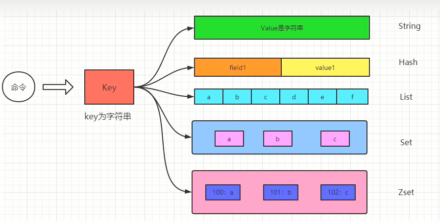
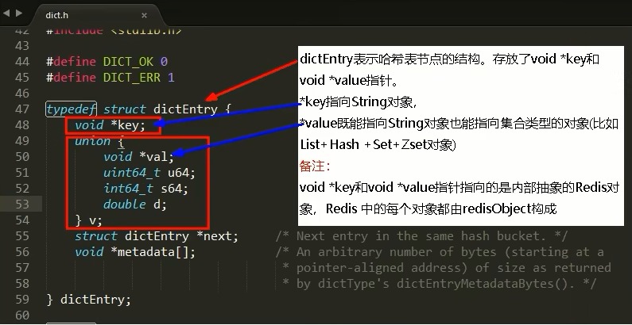

# Redis源码学习

### 1. Redis是怎样实现键值对数据库(Key，Value)的呢？

Redis是Key-Value存储系统，key一般都是String类型字符串对象，而value的类型则是各种**Redis对象**，所以这个Value可以使String类型，也可以是集合类型，比如List，Hash，Set和Zset等，如图所示：

### 2.Redis的十大数据类型：

传统的5大类型

- String
- List
- Hash
- Set
- ZSet

新介绍的5大类型

- bitmap -> 实质String
- HyperLogLog -> 实质String
- GEO -> 实质ZSet
- Stream -> 实质Stream
- bitfield -> 看具体key

Redis上帝视角：

### 3.Redis定义了redisObject结构体来表示string、hash、list、set、zset等数据类型

- C语言struct结构体语法简介

- 对于Redis客户端而言，Redis中每个对象都是一个redisObject结构，而在Redis的底层设计中，Redis实际上是一个由K-V键值对组成的字典，从上帝视角那张图中可以看出，server启动加载相关配置就开始生成K-V键值对的字典，然后这个字典使用hash映射到dictEntry。这里我们可以参看源码dict.h中对K-V键值对的具体定义:

- 再从dictEntry到redisObject，我们可以这样来看，在Redis底层K-V字典中的元素被设计成了dictEntry但是对外暴露给客户端是使用的redisObject. 

- redisObject +Redis数据类型+Redis 所有编码方式(底层实现)三者之间的关系

  

### 4. Redis源码分析

每个键值对都会有一个dictEntry，set hello word为例，因为Redis是KV键值对的数据库，每个键值对都会有一个dictEntry(源码位置:dict.h)，里面指向了key和value的指针,next 指向下一个dictEntry。key是字符串，但是 Redis没有直接使用C的字符数组，而是存储在redis自定义的SDS中。value 既不是直接作为字符串存储，也不是直接存储在 SDs中，而是存储在redisobject中。实际上五种常用的数据类型的任何一种，都是通过 redisobject来存储的。

- 看看类型：type 键

- 看看编码：object encoding hello

##### redisObject结构的作用

为了便于操作，Redis采用redisObjec结构来统一五种不同的数据类型，这样所有的数据类型就都可以以相同的形式在函数间传递而不用使用特定的类型结构。同时，为了识别不同的数据类型，redisObjec中定义了type和encoding字段对不同的数据类型加以区别。简单地说，redisObjec就是string、hash、list、set、zset的父类，可以在函数间传递时隐藏具体的类型信息，所以作者抽象了redisObjec结构来到达同样的目的。
