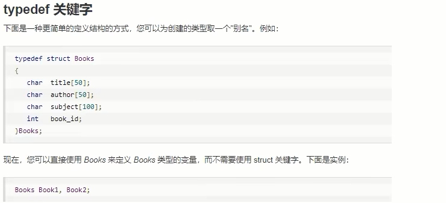
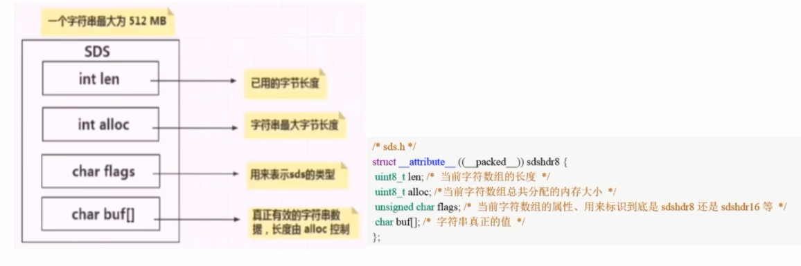
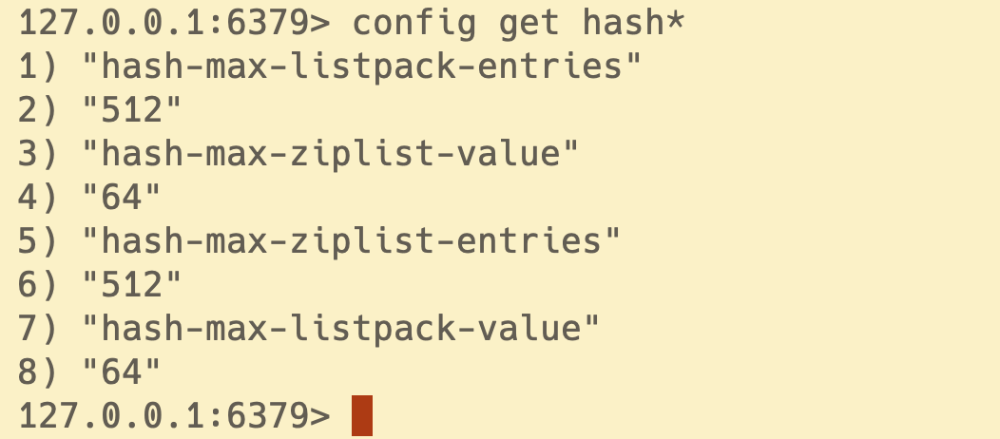
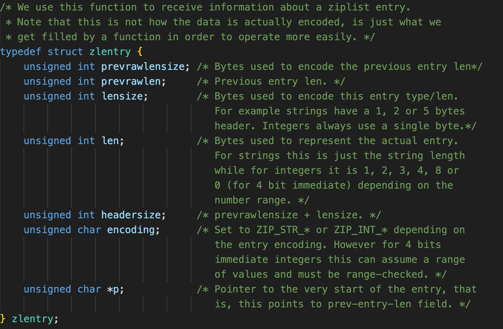
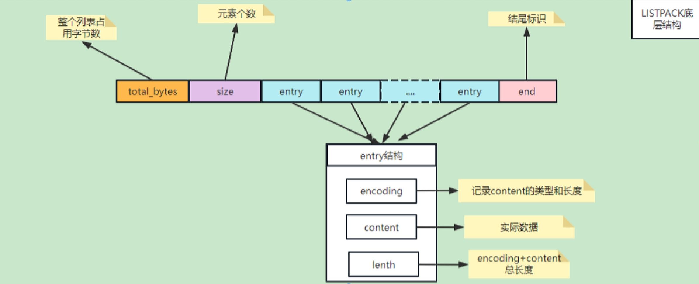
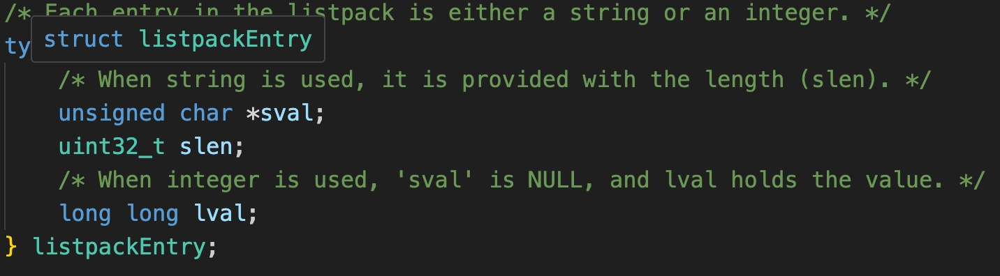
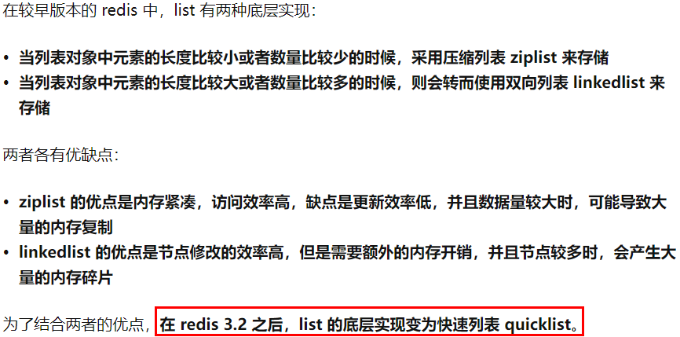
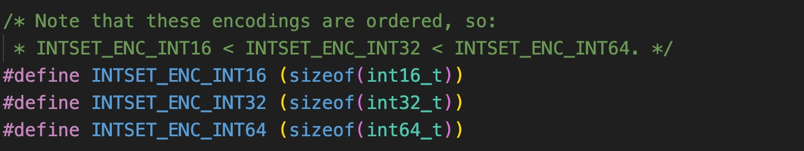
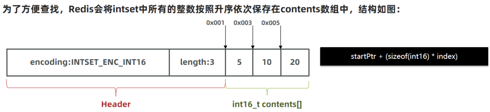
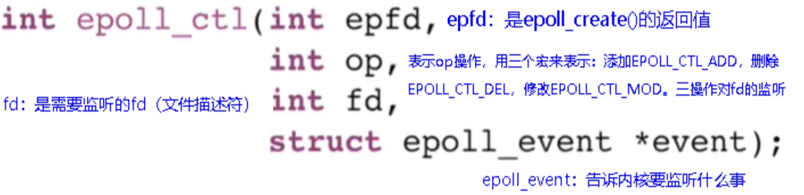

# Redis源码学习

### 1. Redis是怎样实现键值对数据库(Key，Value)的呢？

Redis是Key-Value存储系统，key一般都是String类型字符串对象，而value的类型则是各种**Redis对象**，所以这个Value可以使String类型，也可以是集合类型，比如List，Hash，Set和Zset等，如图所示：


### 2.Redis的十大数据类型：

传统的5大类型

- String
- List
- Hash
- Set
- ZSet

新介绍的5大类型

- bitmap -> 实质String
- HyperLogLog -> 实质String
- GEO -> 实质ZSet
- Stream -> 实质Stream
- bitfield -> 看具体key

Redis上帝视角：


### 3.Redis定义了redisObject结构体来表示string、hash、list、set、zset等数据类型

- C语言struct结构体语法简介




- 对于Redis客户端而言，Redis中每个对象都是一个redisObject结构，而在Redis的底层设计中，Redis实际上是一个由K-V键值对组成的字典，从上帝视角那张图中可以看出，server启动加载相关配置就开始生成K-V键值对的字典，然后这个字典使用hash映射到dictEntry。这里我们可以参看源码dict.h中对K-V键值对的具体定义:


- 再从dictEntry到redisObject，我们可以这样来看，在Redis底层K-V字典中的元素被设计成了dictEntry但是对外暴露给客户端是使用的redisObject. 


我们知道 Redis 是一个键值型（Key-Value Pair）的数据库，我们可以根据键实现快速的增删改查。而键与值的映射关系正是通过 Dict 来实现的。是 set 和 hash 的实现方式之一

##### Dict数据结构

Dict 由三部分组成，分别是：哈希表（DictHashTable）、哈希节点（DictEntry）、字典（Dict）


当我们向 Dict 添加键值对时，Redis 首先根据 key 计算出 hash 值（h），然后利用 h & sizemask 来计算元素应该存储到数组中的哪个索引位置。我们存储 k1=v1，假设 k1 的哈希值 h =1，则 1&3 =1，因此 k1=v1 要存储到数组索引1 位置。

注意这里还有一个指向下一个哈希表节点的指针，我们知道哈希表最大的问题是存在哈希冲突，如何解决哈希冲突，有开放地址法和链地址法。这里采用的便是链地址法，通过 next 这个指针可以将多个哈希值相同的键值对连接在一起，用来**解决哈希冲突**。


Dict 由三部分组成，分别是：哈希表（DictHashTable）、哈希节点（DictEntry）、字典（Dict）


##### dict深入理解

- 哈希算法：Redis 计算哈希值和索引值方法如下：

```c
#1、使用字典设置的哈希函数，计算键 key 的哈希值
hash = dict->type->hashFunction(key);
 
#2、使用哈希表的sizemask属性和第一步得到的哈希值，计算索引值
index = hash & dict->ht[x].sizemask;
```

- **解决哈希冲突**：这个问题上面我们介绍了，方法是链地址法。通过字典里面的 *next 指针指向下一个具有相同索引值的哈希表节点。
- 扩容和收缩：当哈希表保存的键值对太多或者太少时，就要通过 rerehash (重新散列）来对哈希表进行相应的扩展或者收缩。具体步骤：

1. 计算新 hash 表的 realeSize，值取决于当前要做的是扩容还是收缩：
   - 如果是扩容，则新 size 为第一个大于等于 dict.ht [0].used + 1 的 2^n
   - 如果是收缩，则新 size 为第一个小于等于 dict.ht [0].used 的 2^n （不得小于 4）
2. 按照新的 realeSize 申请内存空间，创建 dictht ，并赋值给 dict.ht [1]
3. 设置 dict.rehashidx = 0，标示开始 rehash
4. 将 dict.ht [0] 中的每一个 dictEntry 都 rehash 到 dict.ht [1]
5. 将 dict.ht [1] 赋值给 dict.ht [0]，给 dict.ht [1] 初始化为空哈希表，释放原来的 dict.ht [0] 的内存
6. 将 rehashidx 赋值为 - 1，代表 rehash 结束
7. 在 rehash 过程中，新增操作，则直接写入 ht [1]，查询、修改和删除则会在 dict.ht [0] 和 dict.ht [1] 依次查找并执行。这样可以确保 ht [0] 的数据只减不增，随着 rehash 最终为空

- 触发扩容的条件：
  1. 服务器目前没有执行 BGSAVE 命令或者 BGREWRITEAOF 命令，并且负载因子大于等于 1。
  2. 服务器目前正在执行 BGSAVE 命令或者 BGREWRITEAOF 命令，并且负载因子大于等于 5。

ps：负载因子 = 哈希表已保存节点数量 / 哈希表大小。

- **渐进式rehash**

什么叫渐进式 rehash？也就是说扩容和收缩操作不是一次性、集中式完成的，而是分多次、渐进式完成的。如果保存在 Redis 中的键值对只有几个几十个，那么 rehash 操作可以瞬间完成，但是如果键值对有几百万，几千万甚至几亿，那么要一次性的进行 rehash，势必会造成 Redis 一段时间内不能进行别的操作。所以 Redis 采用渐进式 rehash, 这样在进行渐进式 rehash 期间，字典的删除查找更新等操作可能会在两个哈希表上进行，第一个哈希表没有找到，就会去第二个哈希表上进行查找。但是进行 增加操作，一定是在新的哈希表上进行的。

##### Redis dictionary总结：

Dict 的结构：

- 类似 java 的 HashTable，底层是数组加链表来解决哈希冲突
- Dict 包含两个哈希表，ht [0] 平常用，ht [1] 用来 rehash

Dict 的伸缩：

- 当 LoadFactor 大于 5 或者 LoadFactor 大于 1 并且没有子进程任务时，Dict 扩容
- 当 LoadFactor 小于 0.1 时，Dict 收缩
- 扩容大小为第一个大于等于 used + 1 的 2n
- 收缩大小为第一个大于等于 used 的 2n
- Dict 采用渐进式 rehash，每次访问 Dict 时执行一次 rehash
- rehash 时 ht [0] 只减不增，新增操作只在 ht [1] 执行，其它操作在两个哈希表

- redisObject +Redis数据类型+Redis 所有编码方式(底层实现)三者之间的关系

  

### 4. Redis源码分析

每个键值对都会有一个dictEntry，set hello word为例，因为Redis是KV键值对的数据库，每个键值对都会有一个dictEntry(源码位置:dict.h)，里面指向了key和value的指针,next 指向下一个dictEntry。key是字符串，但是 Redis没有直接使用C的字符数组，而是存储在redis自定义的SDS中。value 既不是直接作为字符串存储，也不是直接存储在 SDS中，而是存储在redisobject中。实际上五种常用的数据类型的任何一种，都是通过 redisobject来存储的。

- 看看类型：type 键

- 看看编码：object encoding hello


##### redisObject结构的作用

为了便于操作，Redis采用redisObjec结构来统一五种不同的数据类型，这样所有的数据类型就都可以以相同的形式在函数间传递而不用使用特定的类型结构。同时，为了识别不同的数据类型，redisObjec中定义了type和encoding字段对不同的数据类型加以区别。简单地说，redisObjec就是string、hash、list、set、zset的父类，可以在函数间传递时隐藏具体的类型信息，所以作者抽象了redisObjec结构来到达同样的目的。

- redisObject各字段的含义

  

- 4位的type表示具体的数据类型 (String, Set, Zset, Hash, Stream)
- 4位的encoding表示该类型的物理编码方式，同一种数据类型可能有不同的编码方式。(比如String就提供了3种:int embstr raw)


- lru字段表示当内存超限时采用LRU算法清除内存中的对象。

- refcount表示对象的引用计数。 

- ptr指针指向真正的底层数据结构的指针。

- 使用`debug object key`命令来查看redisOjbect的具体值：

  

  Value at：内存地址，refcount：引用次数，encoding：物理编码类型，serializedlength：序列化后的长度（注意这里的长度是序列化后的长度，保存为rdb文件时使用了该算法，不是真正存储在内存的大小)，会对字串做一些压缩以便底层优化，lru：记录最近使用时间戳，lru_seconds_idle：空闲时间（每get一次，最近使用时间戳和空闲时间都会刷新）。

##### 各个类型的数据结构的编码映射和定义


##### String数据结构介绍

RedisObject内部对应三大物理编码：

1. 整数 int

   - 保存long 型（长整型）的64位（8个字节）有符号整数；
   - 最多19位数据；
   - 只有整数才会使用int，如果是浮点数，Redis内部其实先将浮点数转化为字符串值，然后再保存。

2. 嵌入式 embstr

   代表embstr格式的SDS(Simple Dynamic String简单动态字符串)，保存长度小于44字节的字符串。EMBSTR顾名思义即：embedded string，表示嵌入式的String。

3. 未加工数据 raw

   保存长度大于44字节的字符串。

Redis没有直接复用C语言的字符串，而是新建了属于自己的结构-----SDS 在Redis数据库里，包含字符串值的键值对都是由SDS实现的(Redis中所有的键都是由字符串对象实现的即底层是由SDS实现，Redis中所有的值对象中包含的字符串对象底层也是由SDS实现)。

##### SDS简单动态字符串

- sds.h源码分析

  

- 说明

  

  - Redis中字符串的实现,SDS有多种结构( sds.h) : sdshdr5、(2^5=32byte)，但是不会使用，是redis团队内部测试使用 sdshdr8、(2^8=256byte) sdshdr16、(2^16=65536byte=64KB) sdshdr32、(2 ^32byte=4GB) sdshdr64，2的64次方byte=17179869184G用于存储不同的长度的字符串。

  - len表示SDS的长度，使我们在获取字符串长度的时候可以在o(1)情况下拿到，而不是像C那样需要遍历一遍字符串。

  - alloc可以用来计算 free就是字符串已经分配的未使用的空间，有了这个值就可以引入预分配空间的算法了，而不用去考虑内存分配的问题。

  - buf表示字符串数组，真实存数据的。

- Redis为什么要重新设计一个SDS数据结构？

  |                | C语言                                                        | SDS                                                          |
  | :------------: | ------------------------------------------------------------ | ------------------------------------------------------------ |
  | 字符串长度处理 | 需要从头开始遍历,直到遇到'\O'为止，时间复杂度O(N)            | 记录当前字符串的长度，直接读取即可，时间复杂度O(1)           |
  |  内存重新分配  | 分配内存空间超过后，会导致数组下标越级或者内存分配溢出       | 空间预分配：SDS修改后，len长度小于1M，那么将会额外分配与 len相同长度的未使用空间。如果修改后长度大于1M，那么将分配1M的使用空间。 惰性空间释放：有空间分配对应的就有空间释放。SDS缩短时并不会回收多余的内存空间,而是使用free字段将多出来的空间记录下来。如果后续有变更操作，直接使用free中记录的空间，减少了内存的分配。 |
  |   二进制安全   | 二进制数据并不是规则的字符串格式，可能会包含一些特殊的字符，比如 '\0'等。前面提到过，C中字符串遇到'\0'会结束,那'\0'之后的数据就读取不上了 | 根据len长度来判断字符串结束的，二进制安全的问题就解决了      |

- NT编码格式

  命令示例: set k1 123

  当字符串键值的内容可以用一个64位有符号整形来表示时，Redis会将键值转化为long型来进行存储，此时即对应 OB_ENCODING_INT 编码类型。内部的内存结构表示如下:

  

  EMBSTR编码格式

  

  对于长度小于 44的字符串，Redis 对键值采用OBJ_ENCODING_EMBSTR 方式，EMBSTR 顾名思义即: embedded string，表示嵌入式的String。从内存结构上来讲即字符串sds结构体与其对应的redisObject对象分配在同一块连续的内存空间，字符串sds嵌入在redisObiect对象之中一样。

- RAW编码格式

  当字符串的键值为长度大于44的超长字符串时，Redis 则会将键值的内部编码方式改为OBJ_ENCODING_RAW格式，这与OBJ_ENCODING_EMBSTR编码方式的不同之处在于，此时动态字符sds的内存与其依赖的redisobiect的内存不再连续了

- 明明没有超过阈值，为什么变成raw了

  

##### String数据结构总结

只有整数才会使用int,如果是浮点数, Redis内部其实先将浮点数转化为字符串值,然后再保存。embstr与raw类型底层的数据结构其实都是SDS(简单动态字符串，Redis内部定义sdshdr一种结构)

| int    | Long类型整数时，RedisObiect中的ptr指针直接赋值为整数数据，不再额外的指针再指向整数了，节省了指针的空间开销。 |
| ------ | ------------------------------------------------------------ |
| embstr | 当保存的是字符串数据且字符串小于等于44字节时，emstr类型将会调用内存分配函数，只分配一块连续的内存空间，空间中依次包含 redisObject 与 sdshdr 两个数据结构，让元数据、指针和SDS是一块连续的内存区域，这样就可以避免内存碎片 |
| raw    | 当字符串大于44字节时，SDS的数据量变多变大了，SDS和RedisObject布局分家各自过，会给SDS分配多的空间并用指针指SDS结构，raw类型将会调用两次内存分配函数，分配两块内存空间，一块用于包含redisObject结构，而另一块用于包含sdshdr结构 |


##### Hash数据结构介绍

首先我们查看关于Redis hash的配置，使用`config get hash*`来返回当前redis的hash配置：



下面我们来解析一下Redis hash的实现方式：在Redis7以前使用ziplist和hashtable来实现Redis hash而自从Redis7开始使用listpack和hashtable来实现Redis hash，至于为什么现在还留着ziplist的配置，我个人认为现在可能还在比较两种List的实际使用性能。

- 图中entries指的是Redis hash的元素个数，value指的是Redis hash的值的长度；

- 如果Redis hash的元素个数<=512并且每个值的长度<=64字节，那么使用ziplist或者listpack，否则则使用hashtable。如果有兴趣可以修改这两个配置的值，然后使用`object encoding key`来测试一下；

- 从上面的配置来看，绝大多数情况下是使用的list来存储hash，如果修改了Redis hash后，超过了图中配置范围，那么redis会升级为hashtable，这种升级时不可逆的。

ziplist压缩列表是一种紧凑编码格式，总体思想是多花时间来换取节约空间，以读写性能为代价来换取极高的内存利用率，所以仅适用于字段个数少且字段值小的情况，压缩列表的高内存利用率是与其连续内存的特性分不开的。ziplist是特殊编码的双向链表，它不像普通的链表以前每个节点需要存储指向前一个节点的指针和指向后一个节点的指针，而是存储上一个节点的长度和当前节点的长度，在内存中是一段连续的空间，我们可以在ziplist.c源码中找到对应的编码格式：


对这种编码形式做一个解释：

|  属性   |   类型    |      长度      | 用途                                                         |
| :-----: | :-------: | :------------: | :----------------------------------------------------------- |
| zlbytes | uint_32_t |     4字节      | 记录整个压缩列表占用内存的字节数，对压缩列表进行内存冲分配和计算zlend的位置时使用。 |
| zltail  | uint_32_t |     4字节      | 记录压缩列表表尾节点距离压缩列表起始地址的字节数，通过偏移量无需遍历列表就可以确定表尾节点的地址。 |
|  zllen  | uint_16_t |     2字节      | 记录了压缩列表的节点个数，当元素个数小于UINT16_MAX时表示节点的元素个数，当元素个数大于UINT16_MAX，节点个数需要遍历整个列表计算出来。 |
|  entry  | 列表节点  | 由每个节点决定 | 压缩列表包含的节点，节点的长度由节点的内容决定。             |
|  zlend  | uint_8_t  |     1字节      | 特殊标记oxFF，用于标记列表的末端。                           |

在源码中每个节点定义成zlentry如图：



从源码中可以看出每个节点都保存了前一个节点的长度信息和当前节点的长度信息，这样使的遍历节点的速度加快，而且它不像是数据每次遍历的偏移量是固定的，在修改节点时它和数组具有同样的问题就是后面的元素都需要改动。可以印证我们前面提到的以时间换空间，对于绝大多少数据量小的hash来说这样的设计非常合理，计算的需求不大但是可以节省大量的内存空间。

压缩列表新增某个元素或修改某个元素时，如果空间不不够，压缩列表占用的内存空间就需要重新分配。而当新插入的元素较大时，可能会导致后续元素的 prevlen 占用空间都发生变化，从而引起**连锁更新**问题，导致每个元素的空间都要重新分配，造成访问压缩列表性能的下降。

首先需要知道的是：


案例说明：**压缩列表每个节点正因为需要保存前一个节点的长度字段，就会有连锁更新的隐患**

第一步：现在假设一个压缩列表中有多个连续的、长度在 250～253 之间的节点，如下图：


因为这些节点长度值小于 254 字节，所以 prevlen 属性需要用 1 字节的空间来保存这个长度值，一切OK。

第二步：这时，如果将一个长度大于等于 254 字节的新节点加入到压缩列表的表头节点，即新节点将成为entry1的前置节点，如下图：


因为entry1节点的prevlen属性只有1个字节大小，无法保存新节点的长度，此时就需要对压缩列表的空间重分配操作并将entry1节点的prevlen 属性从原来的 1 字节大小扩展为 5 字节大小。


第三步：连续更新问题出现


entry1节点原本的长度在250～253之间，因为刚才的扩展空间，此时entry1节点的长度就大于等于254，因此原本entry2节点保存entry1节点的 prevlen属性也必须从1字节扩展至5字节大小。entry1节点影响entry2节点，entry2节点影响entry3节点......一直持续到结尾。这种在特殊情况下产生的连续多次空间扩展操作就叫做**连锁更新**。

由于ziplist存在连锁更新问题，那么Redis又设计一个listpack来替换ziplist，在最新的Redis7中就使用的紧凑列表：

| Total Bytes         | 为整个listpack的空间大小，占用4个字节，每个listpack最多占用4294967295Bytes。 |
| ------------------- | ------------------------------------------------------------ |
| num-elements        | 为listpack中的元素个数，即Entry的个数占用2个字节             |
| element-1~element-N | 为每个具体的元素                                             |
| listpack-end-byte   | 为listpack结束标志，占用1个字节，内容为0xFF。                |

listpack个结构如下图：



每个listpack的entry是由三部分构成查看源码listpack.h：



从listpack的编码结构来看，比ziplist的结构相对简单，同时每个entry也不用记录前置节点的长度，这样就没有了连锁更新问题。

##### List数据结构介绍


 

在Redis3.0之前，list采用的底层数据结构是ziplist压缩列表+linkedList双向链表

然后在高版本的Redis中底层数据结构是quicklist(替换了ziplist+linkedList)，而quicklist也用到了ziplist。而在最新的redis7中quicklist使用的是listpack。结论：quicklist就是**双向链表 + 紧凑列表**组合，因为一个 quicklist 就是一个链表，而链表中的每个元素又是一个紧凑列表。



来查看源码quicklist.h中对quicklist的定义：


我们再来看看quicklistNode的定义：


##### Set数据结构介绍

我们先使用`config get set*`来查看set的配置信息：


从返回结果可以看出，当set的元素个数<=512时，就是使用inset来编码存储，如果当元素个数超过512就使用hashtable来存储Set。我们先来看看源码中对inset的定义：


从源码中我们可以看出inset定义非常简单，其中的encoding包含三种模式，表示存储的整数大小不同：



为了方便查找，Redis 会将 intset 中所有的整数按照升序依次保存在 contents 数组中，结构如图：


现在，数组中每个数字都在 int16_t 的范围内，因此采用的编码方式是 INTSET_ENC_INT16，每部分占用的字节大小为：

- encoding：4 字节 （可以理解为标识每个元素的类型）
- length：4 字节
- contents：2 字节 * 3 = 6 字节

inset自动升级

我们向该其中添加一个数字：50000，这个数字超出了int16_t的范围，intset 会自动升级编码方式到合适的大小。以当前案例来说流程如下：

- 升级编码为 INTSET_ENC_INT32 , 每个整数占 4 字节，并按照新的编码方式及元素个数扩容数组
- 倒序依次将数组中的元素拷贝到扩容后的正确位置
- 将待添加的元素放入数组末尾
- 最后，将 inset 的 encoding 属性改为 INTSET_ENC_INT32，将 length 属性改为 4

那么如果我们删除掉刚加入的 int32 类型时，会不会做一个降级操作呢？不会。主要还是减少开销的权衡。

Intset 可以看做是特殊的整数数组，具备一些特点：

- Redis 会确保 Intset 中的元素唯一、有序
- 具备类型升级机制，可以节省内存空间
- 底层采用二分查找方式来查询

##### ZSet数据结构介绍

当有序集合中包含的元素数量超过服务器属性 server.zset_max_plistpack_entries 的值（默认值为 128 ），或者有序集合中新添加元素的 member 的长度大于服务器属性 server.zset_max_plistpack_value 的值（默认值为 64 ）时，redis会使用跳跃表作为有序集合的底层实现。否则会使用listpack作为有序集合的底层实现。

跳表的引入：对于一个单链表来讲，即便链表中存储的数据是有序的，如果我们要想在其中查找某个数据，也只能从头到尾遍历链表。这样查找效率就会很低，时间复杂度会很高O(N)对于这个遍历问题提出了跳表，skiplist是一种以空间换取时间的结构。由于链表，无法进行二分查找，因此借鉴数据库索引的思想，提取出链表中关键节点（索引），先在关键节点上查找，再进入下层链表查找，提取多层关键节点，就形成了跳跃表。由于索引也要占据一定空间的，所以，索引添加的越多，空间占用的越多。

跳表查询的时间复杂度分析，如果链表里有N个结点，会有多少级索引呢？按照我们前面讲的，每两个结点会抽出一个结点作为上一级索引的结点，以此估算：

第一级索引的结点个数大约就是n/2，

第二级索引的结点个数大约就是n/4，

第三级索引的结点个数大约就是n/8，依次类推......

也就是说，第k级索引的结点个数是第k-1级索引的结点个数的1/2，那第k级索引结点的个数就是n/(2^k)

跳表查询的空间复杂度分析

比起单纯的单链表，跳表需要存储多级索引，肯定要消耗更多的存储空间。那到底需要消耗多少额外的存储空间呢？ 

我们来分析一下跳表的空间复杂度。

第一步：首先原始链表长度为n，

第二步：每两个节点取一个索引，每层索引的结点数：n/2, n/4, n/8 ... , 8, 4, 2 每上升一级就减少一半，直到剩下2个结点,以此类推；如果我们把每层索引的结点数写出来，就是一个等比数列。这几级索引的结点总和就是n/2+n/4+n/8…+8+4+2=n-2。所以，跳表的空间复杂度是O(n) 。也就是说，如果将包含n个结点的单链表构造成跳表，我们需要额外再用接近n个结点的存储空间。

第三步：每三个节点取一个索引，每层索引的结点数：n/3, n/9, n/27 ... , 9, 3, 1 以此类推；第一级索引需要大约n/3个结点，第二级索引需要大约n/9个结点。每往上一级，索引结点个数都除以3。为了方便计算，我们假设最高一级的索引结点个数是1。我们把每级索引的结点个数都写下来，也是一个等比数列通过等比数列求和公式，总的索引结点大约就是n/3+n/9+n/27+…+9+3+1=n/2。尽管空间复杂度还是O(n) ，但比上面的每两个结点抽一个结点的索引构建方法，要减少了一半的索引结点存储空间，**所以空间复杂度是O(n)**。

|      |      |      |
| ---- | ---- | ---- |
|      |      |      |
|      |      |      |
|      |      |      |
|      |      |      |
|      |      |      |
|      |      |      |
|      |      |      |

### 5. Redis高性能设计

并发多客户端连接，在多路复用之前最简单和典型的方案：同步阻塞网络IO模型，这种模式的特点就是用一个进程来处理一个网络连接(一个用户请求)，比如一段典型的示例代码如下。我们来总结一下这种方式：优点就是这种方式非常容易让人理解，写起代码来非常的自然，符合人的直线型思维。缺点就是性能差，每个用户请求到来都得占用一个进程来处理，来一个请求就要分配一个进程跟进处理，类似一个学生配一个老师，一位患者配一个医生，可能吗？进程是一个很重的东西。一台服务器上创建不了多少个进程。

进程在 Linux 上是一个开销不小的家伙，先不说创建，光是上下文切换一次就得几个微秒。所以为了高效地对海量用户提供服务，必须要让一个进程能同时处理很多个 tcp 连接才行。现在假设一个进程保持了 10000 条连接，那么如何发现哪条连接上有数据可读了、哪条连接可写了 ？我们当然可以采用循环遍历的方式来发现 IO 事件，但这种方式太低级了。我们希望有一种更高效的机制，在很多连接中的某条上有 IO 事件发生的时候直接快速把它找出来。其实这个事情 Linux 操作系统已经替我们都做好了，它就是我们所熟知的 IO 多路复用机制。

##### Redis的IO多路复用

Redis利用epoll来实现IO多路复用，将连接信息和事件放到队列中，一次放到文件事件分派器，事件分派器将事件分发给事件处理器。


Redis 是跑在单线程中的，所有的操作都是按照顺序线性执行的，但是由于读写操作等待用户输入或输出都是阻塞的，所以 I/O 操作在一般情况下往往不能直接返回，这会导致某一文件的 I/O 阻塞导致整个进程无法对其它客户提供服务，而 I/O 多路复用就是为了解决这个问题而出现 所谓 I/O 多路复用机制，就是说通过一种机制，可以监视多个描述符，一旦某个描述符就绪（一般是读就绪或写就绪），能够通知程序进行相应的读写操作。这种机制的使用需要 select 、 poll 、 epoll 来配合。多个连接共用一个阻塞对象，应用程序只需要在一个阻塞对象上等待，无需阻塞等待所有连接。当某条连接有新的数据可以处理时，操作系统通知应用程序，线程从阻塞状态返回，开始进行业务处理。 Redis 服务采用 Reactor 的方式来实现文件事件处理器（每一个网络连接其实都对应一个文件描述符） Redis基于Reactor模式开发了网络事件处理器，这个处理器被称为文件事件处理器。它的组成结构为4部分：多个套接字、IO多路复用程序、文件事件分派器、事件处理器。因为文件事件分派器队列的消费是单线程的，所以Redis才叫单线程模型。从Redis6开始，将网络数据读写、请求协议解析通过多个IO线程的来处理 ，对于真正的命令执行来说，仍然使用单线程操作。

#####  先要理解Liunx IO的发展：

1. 阻塞IO：Linux底层方法recvFrom：当用户进程调用了recvfrom这个系统调用，kernel就开始了IO的第一个阶段：准备数据（对于网络IO来说，很多时候数据在一开始还没有到达。比如，还没有收到一个完整的UDP包。这个时候kernel就要等待足够的数据到来）。这个过程需要等待，也就是说数据被拷贝到操作系统内核的缓冲区中是需要一个过程的。而在用户进程这边，整个进程会被阻塞（当然，是进程自己选择的阻塞）。当kernel一直等到数据准备好了，它就会将数据从kernel中拷贝到用户内存，然后kernel返回结果，用户进程才解除block的状态，重新运行起来。所以，**BIO的特点就是在IO执行的两个阶段都被block了。**


对于BIO的模型，程序存在的问题是如果客户端与服务端建立了连接，如果这个连接的客户端迟迟不发数据，程就会一直堵塞在read()方法上，这样其他客户端也不能进行连接，也就是一次只能处理一个客户端，对客户很不友好。利用多线程只要连接了一个socket，操作系统分配一个线程来处理，这样read()方法堵塞在每个具体线程上而不堵塞主线程，就能操作多个socket了，哪个线程中的socket有数据，就读哪个socket，各取所需，灵活统一。程序服务端只负责监听是否有客户端连接，使用 accept() 阻塞

客户端1连接服务端，就开辟一个线程（thread1）来执行 read() 方法，程序服务端继续监听

客户端2连接服务端，也开辟一个线程（thread2）来执行 read() 方法，程序服务端继续监听

客户端3连接服务端，也开辟一个线程（thread3）来执行 read() 方法，程序服务端继续监听

。。。。。。

 任何一个线程上的socket有数据发送过来，read()就能立马读到，cpu就能进行处理。多线程模型每来一个客户端，就要开辟一个线程，如果来1万个客户端，那就要开辟1万个线程。在操作系统中用户态不能直接开辟线程，需要调用内核来创建的一个线程，这其中还涉及到用户状态的切换（上下文的切换），十分耗资源。

2. 非阻塞IO：当用户进程发出read操作时，如果kernel中的数据还没有准备好，那么它并不会block用户进程，而是立刻返回一个error。从用户进程角度讲 ，它发起一个read操作后，并不需要等待，而是马上就得到了一个结果。用户进程判断结果是一个error时，它就知道数据还没有准备好，于是它可以再次发送read操作。一旦kernel中的数据准备好了，并且又再次收到了用户进程的system call，那么它马上就将数据拷贝到了用户内存，然后返回。**所以，NIO特点是用户进程需要不断的主动询问内核数据准备好了吗？一句话，用轮询替代阻塞！**


在NIO模式中，一切都是非阻塞的：accept()方法是非阻塞的，如果没有客户端连接，就返回无连接标识，read()方法是非阻塞的，如果read()方法读取不到数据就返回空闲中标识，如果读取到数据时只阻塞read()方法读数据的时间；在NIO模式中，只有一个线程：当一个客户端与服务端进行连接，这个socket就会加入到一个数组中，隔一段时间遍历一次，看这个socket的read()方法能否读到数据，这样一个线程就能处理多个客户端的连接和读取了。

NIO成功的解决了BIO需要开启多线程的问题，NIO中一个线程就能解决多个socket，但是还存在2个问题。

**问题一：**

这个模型在客户端少的时候十分好用，但是客户端如果很多，比如有1万个客户端进行连接，那么每次循环就要遍历1万个socket，如果一万个socket中只有10个socket有数据，也会遍历一万个socket，就会做很多无用功，每次遍历遇到 read 返回 -1 时仍然是一次浪费资源的系统调用。

**问题二：**

而且这个遍历过程是在用户态进行的，用户态判断socket是否有数据还是调用内核的read()方法实现的，这就涉及到用户态和内核态的切换，每遍历一个就要切换一次，开销很大因为这些问题的存在。

优点：不会阻塞在内核的等待数据过程，每次发起的 I/O 请求可以立即返回，不用阻塞等待，实时性较好。

缺点：轮询将会不断地询问内核，这将占用大量的 CPU 时间，系统资源利用率较低，所以一般 Web 服务器不使用这种 I/O 模型。

结论：让Linux内核搞定上述需求，我们将一批文件描述符通过一次系统调用传给内核由内核层去遍历，才能真正解决这个问题。IO多路复用应运而生，也即将上述工作直接放进Linux内核，不再两态转换而是直接从内核获得结果，**因为内核是非阻塞的。**

3. IO多路复用：IO multiplexing就是我们说的select，poll，epoll，有些技术书籍也称这种IO方式为event driven IO事件驱动IO。就是通过一种机制，一个进程可以监视多个描述符，一旦某个描述符就绪（一般是读就绪或者写就绪），能够通知程序进行相应的读写操作。可以基于一个阻塞对象并同时在多个描述符上等待就绪，而不是使用多个线程(每个文件描述符一个线程，每次new一个线程)，这样可以大大节省系统资源。所以，I/O 多路复用的特点是通过一种机制一个进程能同时等待多个文件描述符而这些文件描述符（套接字描述符）其中的任意一个进入读就绪状态，select，poll，epoll等函数就可以返回。


文件描述符（File descriptor）是计算机科学中的一个术语，是一个用于表述指向文件的引用的抽象化概念。文件描述符在形式上是一个非负整数。实际上，它是一个索引值，指向内核为每一个进程所维护的该进程打开文件的记录表。当程序打开一个现有文件或者创建一个新文件时，内核向进程返回一个文件描述符。在程序设计中，一些涉及底层的程序编写往往会围绕着文件描述符展开。但是文件描述符这一概念往往只适用于UNIX、Linux这样的操作系统。

基于 I/O 复用模型：多个连接共用一个阻塞对象，应用程序只需要在一个阻塞对象上等待，无需阻塞等待所有连接。当某条连接有新的数据可以处理时，操作系统通知应用程序，线程从阻塞状态返回，开始进行业务处理。

 

4. Reactor 模式，是指通过一个或多个输入同时传递给服务处理器的服务请求的事件驱动处理模式。服务端程序处理传入多路请求，并将它们同步分派给请求对应的处理线程，Reactor 模式也叫 Dispatcher 模式。即 I/O 多了复用统一监听事件，收到事件后分发(Dispatch 给某进程)，是编写高性能网络服务器的必备技术。


Reactor 模式中有 2 个关键组成：

1）Reactor：Reactor 在一个单独的线程中运行，负责监听和分发事件，分发给适当的处理程序来对 IO 事件做出反应。 它就像公司的电话接线员，它接听来自客户的电话并将线路转移到适当的联系人；

2）Handlers：处理程序执行 I/O 事件要完成的实际事件，类似于客户想要与之交谈的公司中的实际办理人。Reactor 通过调度适当的处理程序来响应 I/O 事件，处理程序执行非阻塞操作。

Redis 服务采用 Reactor 的方式来实现文件事件处理器（每一个网络连接其实都对应一个文件描述符）

 

Redis基于Reactor模式开发了网络事件处理器，这个处理器被称为文件事件处理器。

它的组成结构为4部分：多个套接字、IO多路复用程序、文件事件分派器、

事件处理器。因为文件事件分派器队列的消费是单线程的，所以Redis才叫单线程模型

Liunx底层IO多路复用的三个函数：select、poll、epoll:


select 函数监视的文件描述符分3类，分别是readfds、writefds和exceptfds，将用户传入的数组拷贝到内核空间调用后select函数会阻塞，直到有描述符就绪（有数据 可读、可写、或者有except）或超时（timeout指定等待时间，如果立即返回设为null即可），函数返回。当select函数返回后，可以通过遍历fdset，来找到就绪的描述符。

select 其实就是把NIO中用户态要遍历的fd数组(我们的每一个socket链接，安装进ArrayList里面的那个)拷贝到了内核态，让内核态来遍历，因为用户态判断socket是否有数据还是要调用内核态的，所有拷贝到内核态后，这样遍历判断的时候就不用一直用户态和内核态频繁切换了从代码中可以看出，select系统调用后，返回了一个置位后的&rset，这样用户态只需进行很简单的二进制比较，就能很快知道哪些socket需要read数据，有效提高了效率：


select缺点：

1、bitmap最大1024位，一个进程最多只能处理1024个客户端。

2、&rset不可重用，每次socket有数据就相应的位会被置位 。

3、文件描述符数组拷贝到了内核态(只不过无系统调用切换上下文的开销。（内核层可优化为异步事件通知）)，仍然有开销。select 调用需要传入 fd 数组，需要拷贝一份到内核，高并发场景下这样的拷贝消耗的资源是惊人的。（可优化为不复制） 。

4、select并没有通知用户态哪一个socket有数据，仍然需要O(n)的遍历。select 仅仅返回可读文件描述符的个数，具体哪个可读还是要用户自己遍历。（可优化为只返回给用户就绪的文件描述符，无需用户做无效的遍历）。

poll方法:


poll方法解决了select中的两个问题：

1、poll使用pollfd数组来代替select中的bitmap，数组没有1024的限制，可以一次管理更多的client。它和 select 的主要区别就是，去掉了 select 只能监听 1024 个文件描述符的限制。

 2、当pollfds数组中有事件发生，相应的revents置位为1，遍历的时候又置位回零，实现了pollfd数组的重用。

epoll方法包含三个函数epoll_create、epoll_ctl、epoll_wait:



| int epoll_create(int size)                                   | 参数size并不是限制了epoll所能监听的描述符最大个数，只是对内核初始分配内部数据结构的一个建议 |
| ------------------------------------------------------------ | ------------------------------------------------------------ |
| int epoll_ctl(int epfd, int op, int fd, struct epoll_event *event) | 见上图                                                       |
| int epoll_wait(int epfd, struct epoll_event * events, int maxevents, int timeout) | 等待epfd上的io事件，最多返回maxevents个事件。参数events用来从内核得到事件的集合，maxevents告之内核这个events有多大。 |


多路复用快的原因在于，操作系统提供了这样的系统调用，使得原来的 while 循环里多次系统调用，变成了一次系统调用 + 内核层遍历这些文件描述符。epoll是现在最先进的IO多路复用器，Redis、Nginx，linux中的Java NIO都使用的是epoll。这里“多路”指的是多个网络连接，“复用”指的是复用同一个线程。

1、一个socket的生命周期中只有一次从用户态拷贝到内核态的过程，开销小

2、使用event事件通知机制，每次socket中有数据会主动通知内核，并加入到就绪链表中，不需要遍历所有的socket

 在多路复用IO模型中，会有一个内核线程不断地去轮询多个 socket 的状态，只有当真正读写事件发送时，才真正调用实际的IO读写操作。因为在多路复用IO模型中，只需要使用一个线程就可以管理多个socket，系统不需要建立新的进程或者线程，也不必维护这些线程和进程，并且只有真正有读写事件进行时，才会使用IO资源，所以它大大减少来资源占用。多路I/O复用模型是利用 select、poll、epoll 可以同时监察多个流的 I/O 事件的能力，在空闲的时候，会把当前线程阻塞掉，当有一个或多个流有 I/O 事件时，就从阻塞态中唤醒，于是程序就会轮询一遍所有的流（epoll 是只轮询那些真正发出了事件的流），并且只依次顺序的处理就绪的流，这种做法就避免了大量的无用操作。 采用多路 I/O 复用技术可以让单个线程高效的处理多个连接请求（尽量减少网络 IO 的时间消耗），且 Redis 在内存中操作数据的速度非常快，也就是说内存内的操作不会成为影响Redis性能的瓶颈。
