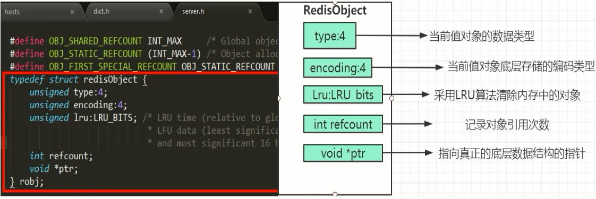
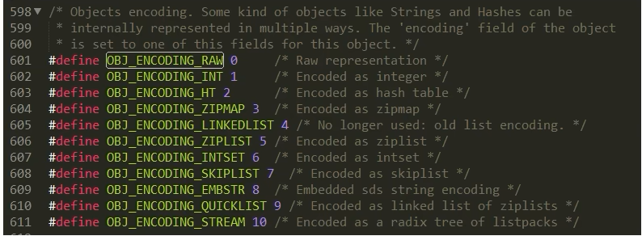
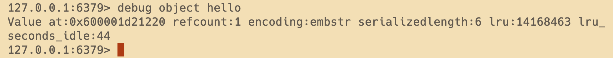
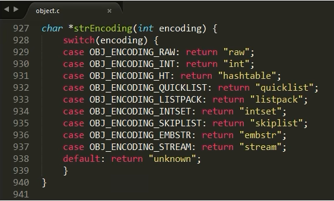
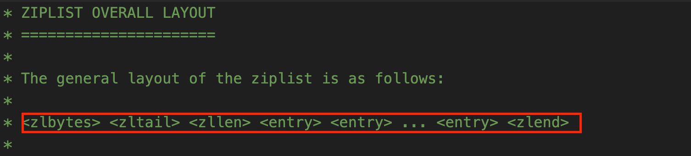

# Redis源码学习

### 1. Redis是怎样实现键值对数据库(Key，Value)的呢？

Redis是Key-Value存储系统，key一般都是String类型字符串对象，而value的类型则是各种**Redis对象**，所以这个Value可以使String类型，也可以是集合类型，比如List，Hash，Set和Zset等，如图所示：

### 2.Redis的十大数据类型：

传统的5大类型

- String
- List
- Hash
- Set
- ZSet

新介绍的5大类型

- bitmap -> 实质String
- HyperLogLog -> 实质String
- GEO -> 实质ZSet
- Stream -> 实质Stream
- bitfield -> 看具体key

Redis上帝视角：

### 3.Redis定义了redisObject结构体来表示string、hash、list、set、zset等数据类型

- C语言struct结构体语法简介

- 对于Redis客户端而言，Redis中每个对象都是一个redisObject结构，而在Redis的底层设计中，Redis实际上是一个由K-V键值对组成的字典，从上帝视角那张图中可以看出，server启动加载相关配置就开始生成K-V键值对的字典，然后这个字典使用hash映射到dictEntry。这里我们可以参看源码dict.h中对K-V键值对的具体定义:

- 再从dictEntry到redisObject，我们可以这样来看，在Redis底层K-V字典中的元素被设计成了dictEntry但是对外暴露给客户端是使用的redisObject. 

- redisObject +Redis数据类型+Redis 所有编码方式(底层实现)三者之间的关系

  

### 4. Redis源码分析

每个键值对都会有一个dictEntry，set hello word为例，因为Redis是KV键值对的数据库，每个键值对都会有一个dictEntry(源码位置:dict.h)，里面指向了key和value的指针,next 指向下一个dictEntry。key是字符串，但是 Redis没有直接使用C的字符数组，而是存储在redis自定义的SDS中。value 既不是直接作为字符串存储，也不是直接存储在 SDS中，而是存储在redisobject中。实际上五种常用的数据类型的任何一种，都是通过 redisobject来存储的。

- 看看类型：type 键

- 看看编码：object encoding hello

##### redisObject结构的作用

为了便于操作，Redis采用redisObjec结构来统一五种不同的数据类型，这样所有的数据类型就都可以以相同的形式在函数间传递而不用使用特定的类型结构。同时，为了识别不同的数据类型，redisObjec中定义了type和encoding字段对不同的数据类型加以区别。简单地说，redisObjec就是string、hash、list、set、zset的父类，可以在函数间传递时隐藏具体的类型信息，所以作者抽象了redisObjec结构来到达同样的目的。

- redisObject各字段的含义

  

- 4位的type表示具体的数据类型 (String, Set, Zset, Hash, Stream)
- 4位的encoding表示该类型的物理编码方式，同一种数据类型可能有不同的编码方式。(比如String就提供了3种:int embstr raw)

- lru字段表示当内存超限时采用LRU算法清除内存中的对象。

- refcount表示对象的引用计数。 

- ptr指针指向真正的底层数据结构的指针。

- 使用`debug object key`命令来查看redisOjbect的具体值：

  

  Value at：内存地址，refcount：引用次数，encoding：物理编码类型，serializedlength：序列化后的长度（注意这里的长度是序列化后的长度，保存为rdb文件时使用了该算法，不是真正存储在内存的大小)，会对字串做一些压缩以便底层优化，lru：记录最近使用时间戳，lru_seconds_idle：空闲时间（每get一次，最近使用时间戳和空闲时间都会刷新）。

##### 各个类型的数据结构的编码映射和定义

##### String数据结构介绍

RedisObject内部对应三大物理编码：

1. 整数 int

   - 保存long 型（长整型）的64位（8个字节）有符号整数；
   - 最多19位数据；
   - 只有整数才会使用int，如果是浮点数，Redis内部其实先将浮点数转化为字符串值，然后再保存。

2. 嵌入式 embstr

   代表embstr格式的SDS(Simple Dynamic String简单动态字符串)，保存长度小于44字节的字符串。EMBSTR顾名思义即：embedded string，表示嵌入式的String。

3. 未加工数据 raw

   保存长度大于44字节的字符串。

Redis没有直接复用C语言的字符串，而是新建了属于自己的结构-----SDS 在Redis数据库里，包含字符串值的键值对都是由SDS实现的(Redis中所有的键都是由字符串对象实现的即底层是由SDS实现，Redis中所有的值对象中包含的字符串对象底层也是由SDS实现)。

##### SDS简单动态字符串

- sds.h源码分析

  

- 说明

  

  - Redis中字符串的实现,SDS有多种结构( sds.h) : sdshdr5、(2^5=32byte)，但是不会使用，是redis团队内部测试使用 sdshdr8、(2^8=256byte) sdshdr16、(2^16=65536byte=64KB) sdshdr32、(2 ^32byte=4GB) sdshdr64，2的64次方byte=17179869184G用于存储不同的长度的字符串。

  - len表示SDS的长度，使我们在获取字符串长度的时候可以在o(1)情况下拿到，而不是像C那样需要遍历一遍字符串。

  - alloc可以用来计算 free就是字符串已经分配的未使用的空间，有了这个值就可以引入预分配空间的算法了，而不用去考虑内存分配的问题。

  - buf表示字符串数组，真实存数据的。

- Redis为什么要重新设计一个SDS数据结构？

  |                | C语言                                                        | SDS                                                          |
  | :------------: | ------------------------------------------------------------ | ------------------------------------------------------------ |
  | 字符串长度处理 | 需要从头开始遍历,直到遇到'\O'为止，时间复杂度O(N)            | 记录当前字符串的长度，直接读取即可，时间复杂度O(1)           |
  |  内存重新分配  | 分配内存空间超过后，会导致数组下标越级或者内存分配溢出       | 空间预分配：SDS修改后，len长度小于1M，那么将会额外分配与 len相同长度的未使用空间。如果修改后长度大于1M，那么将分配1M的使用空间。 惰性空间释放：有空间分配对应的就有空间释放。SDS缩短时并不会回收多余的内存空间,而是使用free字段将多出来的空间记录下来。如果后续有变更操作，直接使用free中记录的空间，减少了内存的分配。 |
  |   二进制安全   | 二进制数据并不是规则的字符串格式，可能会包含一些特殊的字符，比如 '\0'等。前面提到过，C中字符串遇到'\0'会结束,那'\0'之后的数据就读取不上了 | 根据len长度来判断字符串结束的，二进制安全的问题就解决了      |

- NT编码格式

  命令示例: set k1 123

  当字符串键值的内容可以用一个64位有符号整形来表示时，Redis会将键值转化为long型来进行存储，此时即对应 OB_ENCODING_INT 编码类型。内部的内存结构表示如下:

  

  EMBSTR编码格式

  

  对于长度小于 44的字符串，Redis 对键值采用OBJ_ENCODING_EMBSTR 方式，EMBSTR 顾名思义即: embedded string，表示嵌入式的String。从内存结构上来讲即字符串sds结构体与其对应的redisObject对象分配在同一块连续的内存空间，字符串sds嵌入在redisObiect对象之中一样。

- RAW编码格式

  当字符串的键值为长度大于44的超长字符串时，Redis 则会将键值的内部编码方式改为OBJ_ENCODING_RAW格式，这与OBJ_ENCODING_EMBSTR编码方式的不同之处在于，此时动态字符sds的内存与其依赖的redisobiect的内存不再连续了

- 明明没有超过阈值，为什么变成raw了

  

##### String数据结构总结

只有整数才会使用int,如果是浮点数, Redis内部其实先将浮点数转化为字符串值,然后再保存。embstr与raw类型底层的数据结构其实都是SDS(简单动态字符串，Redis内部定义sdshdr一种结构)

| int    | Long类型整数时，RedisObiect中的ptr指针直接赋值为整数数据，不再额外的指针再指向整数了，节省了指针的空间开销。 |
| ------ | ------------------------------------------------------------ |
| embstr | 当保存的是字符串数据且字符串小于等于44字节时，emstr类型将会调用内存分配函数，只分配一块连续的内存空间，空间中依次包含 redisObject 与 sdshdr 两个数据结构，让元数据、指针和SDS是一块连续的内存区域，这样就可以避免内存碎片 |
| raw    | 当字符串大于44字节时，SDS的数据量变多变大了，SDS和RedisObject布局分家各自过，会给SDS分配多的空间并用指针指SDS结构，raw类型将会调用两次内存分配函数，分配两块内存空间，一块用于包含redisObject结构，而另一块用于包含sdshdr结构 |

##### Hash数据结构介绍

首先我们查看关于Redis hash的配置，使用`config get hash*`来返回当前redis的hash配置：

下面我们来解析一下Redis hash的实现方式：在Redis7以前使用ziplist和hashtable来实现Redis hash而自从Redis7开始使用listpack和hashtable来实现Redis hash，至于为什么现在还留着ziplist的配置，我个人认为现在可能还在比较两种List的实际使用性能。

- 图中entries指的是Redis hash的元素个数，value指的是Redis hash的值的长度；

- 如果Redis hash的元素个数>=512并且每个值的长度>=64字节，那么使用ziplist或者listpack，否则则使用hashtable。如果有兴趣可以修改这两个配置的值，然后使用`object encoding key`来测试一下；

- 从上面的配置来看，绝大多数情况下是使用的list来存储hash，如果修改了Redis hash后，超过了图中配置范围，那么redis会升级为hashtable，这种升级时不可逆的。

ziplist压缩列表是一种紧凑编码格式，总体思想是多花时间来换取节约空间，以读写性能为代价来换取极高的内存利用率，所以仅适用于字段个数少且字段值小的情况，压缩列表的高内存利用率是与其连续内存的特性分不开的。ziplist是特殊编码的双向链表，它不像普通的链表以前每个节点需要存储指向前一个节点的指针和指向后一个节点的指针，而是存储上一个节点的长度和当前节点的长度，在内存中是一段连续的空间，我们可以在ziplist.c源码中找到对应的编码格式：

对这种编码形式做一个解释：

|  属性   |   类型    |      长度      | 用途                                                         |
| :-----: | :-------: | :------------: | :----------------------------------------------------------- |
| zlbytes | uint_32_t |     4字节      | 记录整个压缩列表占用内存的字节数，对压缩列表进行内存冲分配和计算zlend的位置时使用。 |
| zltail  | uint_32_t |     4字节      | 记录压缩列表表尾节点距离压缩列表起始地址的字节数，通过偏移量无需遍历列表就可以确定表尾节点的地址。 |
|  zllen  | uint_16_t |     2字节      | 记录了压缩列表的节点个数，当元素个数小于UINT16_MAX时表示节点的元素个数，当元素个数大于UINT16_MAX，节点个数需要遍历整个列表计算出来。 |
|  entry  | 列表节点  | 由每个节点决定 | 压缩列表包含的节点，节点的长度由节点的内容决定。             |
|  zlend  | uint_8_t  |     1字节      | 特殊标记oxFF，用于标记列表的末端。                           |

在源码中每个节点定义成zlentry如图：

