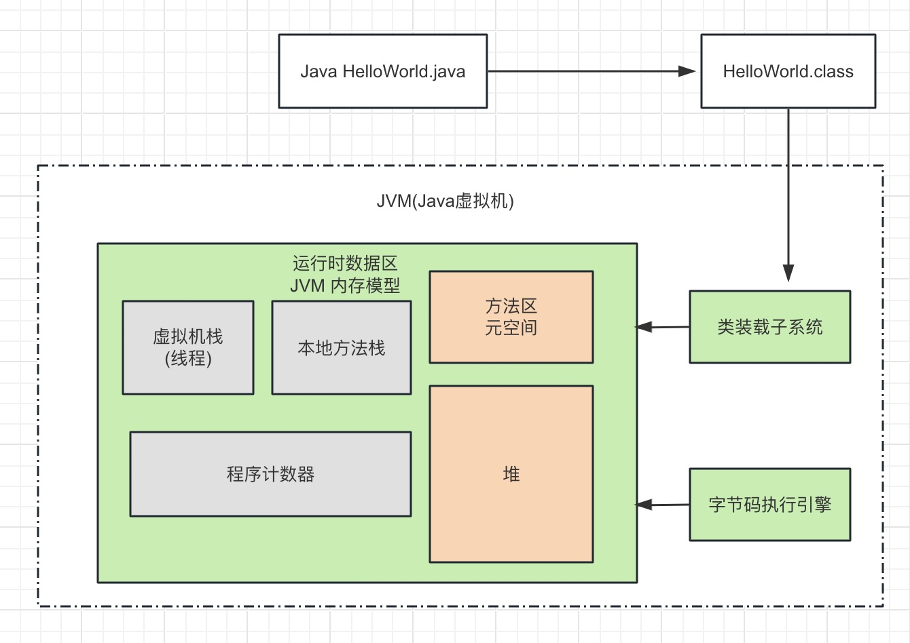

# JAVA 面试八股文

### 1. 虚拟机的组成部分：

- 类加载子系统；

- 运行时数据区；

- 字节码执行引擎；

  

对JVM运行时数据区即JVM内存模型的解释：

1. 堆：所有Java new出来的对象都存放在堆空间中，对于堆需要重点理解，这个应该是JVM调优的重点。
   - 堆的内部分为年轻代和老年代，它们的占比是1 : 2，而在年轻代内部又分成Eden区和survive区其中servive区又分成2块一样大小的区域，它们的占比是8 : 1 : 1。
   - 对象new出来后首先放Eden区，当Eden区存满后会触发minor GC，这时JVM会使用可达性分析算法从线程栈的本地变量、静态变量、本地方法栈变量等等作为GC Roots来扫描所有引用指针，当没有被扫描到的就会标记为垃圾对象就会在minor GC中回收，把扫描到有被引用的对象迁移到survive区中。 需要注意的是每次minor GC都会对Eden区和上次迁移的survive进行垃圾回收，把存活的对象迁移到另一个survive区域，这样在年轻代的对象会一直经历minor GC并且一直在survive区中两块相同块中迁移，每经历一次minor GC它自身的分代年龄就会加1，一般情况下，当对象的分代年龄达到15后就会迁移到老年代。一旦老年代也存储满时就会发生full GC，full GC将会扫描整个堆内存。
   - full GC会触发STW机制(stop the world)，当JVM full GC时，除了垃圾回收相关的线程在工作外，其它的线程都暂停执行了，所以就好像世界静止了一样。所以我们在JVM调优时应该尽量避免full GC的执行，提高JVM运行效率。
2. 栈：每个线程运行时JVM都会分配一个栈空间给当前线程使用，线程中调用的每个方法对应着一个存放在线程栈中的栈帧。数据结构中的栈是先进后出的设计，Java虚拟机栈也是用这种设计对应着方法的调用顺序。在Java虚拟机栈中又分为以下几个部分：
   - 局部变量表：存储方法中的局部变量；
   - 操作数栈：操作数栈是一个先进后出的栈结构，用于JVM执行字节码指令时存储和处理操作数，操作数栈用存储方法中的局部变量、方法参数以及中间结果，有了数据入栈后操作数栈将执行各种算术和逻辑指令；
   - 动态连接：简单地理解就是JVM在方法运行时，调用了另一个方法，这个方法名是一个符号它对应的一个方法代码块，那么动态连接就是存储符号和它对应的方法入口的地址。
   - 方法出口：记录着方法执行完后的下一个行政的指令位置。
3. 程序计数器：JVM虚拟机会为每个进程分配一个程序计数器，存储下一个运行JVM指令的内存地址，这个设计是为了多线程上下文切换时使用的。
4. 方法区：存储java程序中的常量，静态变量，类的元数据。
5. 本地方法栈：首先需要了解什么时本地方法，本地方法指的是JVM内置的使用C++语言编写的方法，作为Java开发使用这个栈的频率不高，需要了解的是当线程执行本地方法时，JVM就会给当前线程分配本地方法栈。

