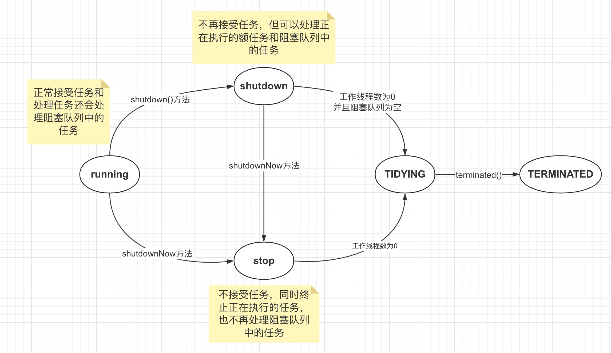

# JUC学习手册

### 1. Java多线程基本概念复习

##### java多线程相关概念：一把锁，两个并，三个程：

1. 一把锁指的是synchronized关键字；
2. 两个并指的是并发(concurrent)和并行(parallel):
   - 并发（concurrent）：是在同一实体上的多个事件，是在**一台机器**上“**同时**”处理多个任务，同一时刻，其实是**只有一个**事情再发生。
   - 并行（parallel）：是在不同实体上的多个事件，是在**多台处理器**上同时处理多个任务，同一时刻，大家都在做事情，你做你的，我做我的，各干各的。
3. 三个程指的是进程、线程和管程：
   - 进程：在系统中运行的一个应用程序，每个进程都有它自己的内存空间和系统资源
   - 线程：也被称为轻量级进程，在同一个进程内会有一个或多个线程，是大多数操作系统进行时序调度的基本单元。
   - 管程：Monitor（锁），也就是我们平时所说的锁。Monitor其实是一种**同步机制**，它的义务是保证（同一时间）只有一个线程可以访问被保护的数据和代码，JVM中同步是基于进入和退出监视器（Monitor管程对象）来实现的，每个对象实例都会有一个Monitor对象，Monitor对象和Java对象一同创建并销毁，底层由C++语言实现。

##### 重点理解管程的概念：

- 为什么要引入管程：管程（Monitor）是一种操作系统中的同步机制，它的引入是为了解决多线程或多进程环境下的并发控制问题。在传统的操作系统中，当多个进程或线程同时访问共享资源时，可能会导致数据的不一致性、竞态条件和死锁等问题。为了避免这些问题，需要引入一种同步机制来协调并发访问。管程提供了一种高级的同步原语，它将共享资源和对资源的操作封装在一个单元中，并提供了对这个单元的访问控制机制。相比于信号量机制，用管程编写程序更加简单，写代码更加轻松。在JVM中是基于进入和退出监控器对象（monitor, 管程对象）来实现的，每个对象都有一个管程对象。

- 1.管程的定义："管程是一种机制，用于强制并发线程对一组共享变量的互斥访问（或等效操作）。此外，管程还提供了等待线程满足特定条件的机制，并通知其他线程该条件已满足的方法"。这个定义描述了管程的两个主要功能：

  1. 互斥访问：管程确保多个线程对共享变量的访问互斥，即同一时间只有一个线程可以访问共享资源，以避免竞态条件和数据不一致性问题。

  2. 条件等待和通知：管程提供了等待线程满足特定条件的机制，线程可以通过条件变量等待某个条件满足后再继续执行，或者通过条件变量通知其他线程某个条件已经满足。

  > 可以将管程理解为一个房间，这个房间里有一些共享的资源，比如变量、队列等。同时，房间里有一个门，只有一把钥匙。多个线程或进程需要访问房间内的资源时，它们需要先获得这把钥匙，一次只能有一个线程或进程持有钥匙，进入房间并访问资源。其他线程或进程必须等待，直到当前持有钥匙的线程或进程释放钥匙，才能获得钥匙进入房间。
  >
  > 此外，管程还提供了条件变量，类似于房间内的提示牌。线程在进入房间后，如果发现某个条件不满足（比如队列为空），它可以通过条件变量来知道自己需要等待，暂时离开房间，并将钥匙交给下一个等待的线程。当其他线程满足了等待的条件（比如向队列中添加了元素），它可以通过条件变量通知告诉正在等待的线程，使其重新获得钥匙进入房间，并继续执行。

##### 管程由以下几个主要部分组成：

1. 共享变量：管程中包含了共享的变量或数据结构，多个线程或进程需要通过管程来访问和修改这些共享资源。
2. 互斥锁（Mutex）：互斥锁是管程中的一个关键组成部分，用于确保在同一时间只有一个线程或进程可以进入管程。一旦一个线程或进程进入管程，其他线程或进程必须等待，直到当前线程或进程退出管程。
3. 条件变量（Condition Variables）：条件变量用于实现线程或进程之间的等待和通知机制。当一个线程或进程需要等待某个条件满足时（比如某个共享资源的状态），它可以通过条件变量进入等待状态。当其他线程或进程满足了这个条件时，它们可以通过条件变量发送信号来唤醒等待的线程或进程。
4. 管程接口（对管程进行操作的函数）：管程还包括了一组操作共享资源的接口或方法。这些接口定义了对共享资源的操作，并且在内部实现中包含了互斥锁和条件变量的管理逻辑。其他线程或进程通过调用这些接口来访问共享资源，从而确保了对共享资源的有序访问。

##### 管程的基本特征包括：

1. 互斥性（Mutual Exclusion）：管程提供了互斥访问共享资源的机制，同一时间只允许一个线程或进程进入管程并执行操作，以避免数据竞争和冲突。
2. 封装性（Encapsulation）：管程将共享资源和对资源的操作封装在一起，对外部提供了一组抽象的接口或方法，使得其他线程或进程只能通过这些接口来访问和修改共享资源。
3. 条件等待（Condition Wait）：管程提供了条件变量，允许线程或进程在某个条件不满足时等待，并在条件满足时被唤醒继续执行。条件等待能够避免忙等待，提高系统的效率。
4. 条件通知（Condition Signal）：管程允许线程或进程在某个条件发生变化时发出通知，唤醒等待的线程或进程继续执行。条件通知使得线程或进程之间能够有效地进行协作和同步。
5. 可阻塞性（Blocking）：当一个线程或进程尝试进入管程时，如果管程已经被其他线程或进程占用，它将被阻塞，直到管程可用。同样，当一个线程或进程等待某个条件满足时，如果条件不满足，它也会被阻塞，直到条件满足。
6. 公平性（Fairness）：管程通常会提供公平性保证，即线程或进程按照它们等待的顺序获得对管程的访问权限。这样可以避免某些线程或进程一直被其他线程或进程抢占，导致饥饿现象。

这些特征使得管程成为一种强大的并发编程机制，可以简化并发程序的编写和调试过程，并提供了良好的线程或进程间的协作方式。

##### 线程分类（一般不做特别说明配置，默认都是用户线程）：

- 用户线程：是系统的工作线程，它会完成这个程序需要完成的业务操作。
- 守护线程：是一种特殊的线程为其他线程服务的，在后台默默地完成一些系统性的任务，比如垃圾回收线程就是最典型的例子。守护线程作为一个服务线程，没有服务对象就没有必要继续运行了，如果用户线程全部结束了，意味着程序需要完成的业务操作已经结束了，系统可以退出了。所以假如当系统只剩下守护线程的时候，守护线程伴随着JVM一同结束工作。

### 2. CompletableFuture

##### Future接口理论知识复习

Future接口（FutureTask实现类）定义了操作异步任务执行一些方法，如获取异步任务的执行结果、取消异步任务的执行、判断任务是否被取消、判断任务执行是否完毕等。


举例：比如主线程让一个子线程去执行任务，子线程可能比较耗时，启动子线程开始执行任务后，主线程就去做其他事情了，忙完其他事情或者先执行完，过了一会再才去获取子任务的执行结果或变更的任务状态（老师上课时间想喝水，他继续讲课不结束上课这个主线程，让学生去小卖部帮老师买水完成这个耗时和费力的任务）。

Future是Java5新加的一个接口，它提供一种异步并行计算的功能，如果主线程需要执行一个很耗时的计算任务，我们会就可以通过Future把这个任务放进异步线程中执行，主线程继续处理其他任务或者先行结束，再通过Future获取计算结果。

##### Future接口相关架构

- 目的：异步多线程任务执行且返回有结果，三个特点：多线程、有返回、异步任务（班长为老师去买水作为新启动的异步多线程任务且买到水有结果返回）
- 代码实现：Runnable接口+Callable接口+Future接口和FutureTask实现类。


#####  Future编码实战和优缺点分析

```java
public class FutureApiDemo {
  public static void main(String[] args) throws ExecutionException, InterruptedException, TimeoutException {
    FutureTask<String> futureTask = new FutureTask<>(() -> {
      System.out.println(Thread.currentThread().getName() + "--------come in future task---------");
      try {
        TimeUnit.SECONDS.sleep(5);
      } catch (InterruptedException e) {
        e.printStackTrace();
      }
      return "task over";
    });

    Thread t1 = new Thread(futureTask, "t1");
    t1.start();

//        System.out.println(futureTask.get());//这样会有阻塞的可能，在程序没有计算完毕的情况下。
    System.out.println(Thread.currentThread().getName() + " ------忙其他任务");
//        System.out.println(futureTask.get(3,TimeUnit.SECONDS));//只愿意等待三秒，计算未完成直接抛出异常
    while (true) {//轮询
      if (futureTask.isDone()) {
        System.out.println(futureTask.get());
        break;
      } else {
        TimeUnit.MILLISECONDS.sleep(500);
        System.out.println("正在处理中。。。");
      }
    }
  }
}
```


优点：

- Future+线程池异步多线程任务配合，能显著提高程序的运行效率。

缺点：

- get()阻塞：一旦调用get()方法求结果，非要等到结果才会离开，不管你是否计算完成，如果没有计算完成容易程序堵塞。
- isDone()轮询：轮询的方式会耗费无谓的cpu资源，而且也不见得能及时得到计算结果，如果想要异步获取结果，通常会以轮询的方式去获取结果，尽量不要阻塞。

- 结论：Future对于结果的获取不是很友好，只能通过**阻塞或轮询**的方式得到任务的结果。

##### CompletableFuture为什么会出现

- get()方法在Future计算完成之前会一直处在阻塞状态下，阻塞的方式和异步编程的设计理念相违背；
- isDone()方法容易耗费cpu资源（cpu空转）；
- 对于真正的异步处理我们希望是可以通过传入回调函数，在Future结束时自动调用该回调函数，这样，我们就不用等待结果

jdk8设计出CompletableFuture，CompletableFuture提供了一种观察者模式类似的机制，可以让任务执行完成后通知监听的一方。

##### CompletableFuture和CompletionStage介绍

**类架构说明**：


- **接口CompletionStage**：
  - 代表异步计算过程中的某一个阶段，一个阶段完成以后可能会触发另外一个阶段。
  - 一个阶段的执行可能是被单个阶段的完成触发，也可能是由多个阶段一起触发

- **类CompletableFuture**
  - 提供了非常强大的Future的扩展功能，可以帮助我们简化异步编程的复杂性，并且提供了函数式编程的能力，可以通过回调的方式处理计算结果，也提供了转换和组合CompletableFuture的方法
  - 它可能代表一个明确完成的Future，也可能代表一个完成阶段（CompletionStage），它支持在计算完成以后触发一些函数或执行某些动作

##### 使用CompletableFuture的核心的四个静态方法，来创建一个异步任务


对于上述Executor参数说明：若没有指定，则使用默认的ForkJoinPoolcommonPool（）作为它的线程池执行异步代码，如果指定线程池，则使用我们自定义的或者特别指定的线程池执行异步代码:

```java
package com.vilin.future;

import java.util.concurrent.CompletableFuture;
import java.util.concurrent.ExecutionException;
import java.util.concurrent.ExecutorService;
import java.util.concurrent.Executors;
import java.util.concurrent.TimeUnit;
import lombok.extern.slf4j.Slf4j;

@Slf4j
public class CompletableFutureBuildDemo {
  public static void main(String[] args) throws ExecutionException, InterruptedException {
    ExecutorService executorService = Executors.newFixedThreadPool(3);

    CompletableFuture<Void> completableFuture = CompletableFuture.runAsync(() -> {
      log.debug(Thread.currentThread().getName());
      try {
        TimeUnit.SECONDS.sleep(1);
      } catch (InterruptedException e) {
        e.printStackTrace();
      }
    },executorService);

    log.debug("completableFuture.get() = {}", completableFuture.get()); //null


    CompletableFuture<String> objectCompletableFuture = CompletableFuture.supplyAsync(()->{
      log.debug(Thread.currentThread().getName());
      try {
        TimeUnit.SECONDS.sleep(1);
      } catch (InterruptedException e) {
        e.printStackTrace();
      }
      return "hello supplyAsync";
    },executorService);

    log.debug("completableFuture.get() = {}", objectCompletableFuture.get());//hello supplyAsync

    executorService.shutdown();

  }
}

```

CompletableFuture减少阻塞和轮询，可以传入回调对象，当异步任务完成或者发生异常时，自动调用回调对象的回调方法。

```java
public static void main(String[] args) throws ExecutionException, InterruptedException {
        ExecutorService executorService = Executors.newFixedThreadPool(3);
        CompletableFuture<Integer> completableFuture = CompletableFuture.supplyAsync(() -> {
            System.out.println(Thread.currentThread().getName() + "---come in");
            int result = ThreadLocalRandom.current().nextInt(10);
            try {
                TimeUnit.SECONDS.sleep(1);
            } catch (InterruptedException e) {
                e.printStackTrace();
            }
            if (result > 5) { //模拟产生异常情况
                int i = 10 / 0;
            }
            System.out.println("----------1秒钟后出结果" + result);
            return result;
        }, executorService).whenComplete((v, e) -> {
            if (e == null) {
                System.out.println("计算完成 更新系统" + v);
            }
        }).exceptionally(e -> {
            e.printStackTrace();
            System.out.println("异常情况：" + e.getCause() + " " + e.getMessage());
            return null;
        });
        System.out.println(Thread.currentThread().getName() + "先去完成其他任务");
        executorService.shutdown();
    }
```

CompletableFuture优点：

- 异步任务**结束**时，会自动回调某个对象的方法
- 主线程设置好回调后，不用关心异步任务的执行，异步任务之间可以顺序执行
- 异步任务**出错**时，会自动回调某个对象的方法

##### CompletableFuture常用方法

- **获得结果和触发计算**

  - 获取结果

    - public T get()

    - public T get(long timeout,TimeUnit unit)

    - public T join()：和get一样的作用，只是不需要抛出异常

    - public T getNow(T valuelfAbsent) ：计算完成就返回正常值，否则返回传入的参数，立即获取结果不阻塞

  - 主动触发计算
    - public boolean complete(T value)：是否打断get方法立即返回传入的参数

- **对计算结果进行处理**

  - thenApply ：计算结果存在依赖关系，这两个线程串行化，由于存在依赖关系（当前步错，不走下一步），当前步骤有异常的话就叫停，有点像try/catch

  - handle ：计算结果存在依赖关系，这两个线程串行化，有异常也可以往下走一步,

```java
public class CompletableFutureApiDemo1 {
  public static void main(String[] args) throws ExecutionException, InterruptedException, TimeoutException {
    ExecutorService threadPool = Executors.newFixedThreadPool(3);
    CompletableFuture<Integer> completableFuture = CompletableFuture.supplyAsync(() -> {
      try {
        TimeUnit.SECONDS.sleep(1);
      } catch (InterruptedException e) {
        e.printStackTrace();
      }
      return 1;
    }, threadPool).thenApply(f -> {
      log.debug("step 2");
      return f + 2;
    }).handle((f, e) -> {
      log.debug("step 3");
      int i=10/0;
      return f + 2;

//             thenApply(f -> {
//            System.out.println("step 3");
//            return f + 2;
    }).whenComplete((v, e) -> {
      if (e == null) {
        log.debug("calculate result : " + v);
      }
    }).exceptionally(e -> {
      log.error(Arrays.toString(e.getStackTrace()));
      return null;
    });

    threadPool.shutdown();
    log.debug("{}------主线程先去做其他事情", Thread.currentThread().getName());
  }
}
```


- **对计算结果进行消费**

  - thenAccept：接受任务的处理结果，并消费处理，无返回结果

  ```java
  public class CompletableFutureApiDemo2 {
    public static void main(String[] args) {
      ExecutorService threadPool = Executors.newFixedThreadPool(3);
      CompletableFuture.supplyAsync(() -> {
        return 1;
      }, threadPool).thenApply(f -> {
        return f + 2;
      }).thenApply(f -> {
        return f + 2;
      }).thenAccept(r -> {
        log.debug("result = {}", r);//5
      });
  
      threadPool.shutdown();
    }
  }
  ```

  

  - 对比补充

    - thenRun(Runnable runnable) :任务A执行完执行B，并且不需要A的结果

    - thenAccept(Consumer action): 任务A执行完执行B，B需要A的结果，但是任务B没有返回值

    - thenApply(Function fn): 任务A执行完执行B，B需要A的结果，同时任务B有返回值

  ```java
  public class CompletableFutureApiDemo3 {
    public static void main(String[] args) {
      System.out.println(CompletableFuture.supplyAsync(() -> "result").thenRun(() -> {}).join()); //null
      System.out.println(CompletableFuture.supplyAsync(() -> "result").thenAccept(r -> System.out.println(r)).join()); //result null
      System.out.println(CompletableFuture.supplyAsync(() -> "result").thenApply(f -> f + 2).join()); //result2
    }
  }
  ```

  

  - CompletableFuture和线程池说明

    - 如果没有传入自定义线程池，都用默认线程池ForkJoinPool

    - 传入一个线程池，如果你执行第一个任务时，传入了一个自定义线程池

    - 调用thenRun方法执行第二个任务时，则第二个任务和第一个任务时共用同一个线程池

    - 调用thenRunAsync执行第二个任务时，则第一个任务使用的是你自定义的线程池，第二个任务使用的是ForkJoin线程池

  - 备注：可能是线程处理太快，系统优化切换原则， 直接使用main线程处理，thenAccept和thenAcceptAsync，thenApply和thenApplyAsync等，之间的区别同理。

- **对计算速度进行选用**
  - applyToEither：谁快用谁

```java
public class CompletableFutureApiDemo4 {
  public static void main(String[] args) {
    ExecutorService threadPool = Executors.newFixedThreadPool(3);
    CompletableFuture<String> playA = CompletableFuture.supplyAsync(() -> {
      try {
        log.debug("A come in");
        TimeUnit.SECONDS.sleep(2);
      } catch (InterruptedException e) {
        log.error(Arrays.toString(e.getStackTrace()));
      }
      return "playA";
    }, threadPool);


    CompletableFuture<String> playB = CompletableFuture.supplyAsync(() -> {
      try {
        log.debug("B come in");
        TimeUnit.SECONDS.sleep(3);
      } catch (InterruptedException e) {
        log.error(Arrays.toString(e.getStackTrace()));
      }
      return "playB";
    }, threadPool);

    CompletableFuture<String> result = playA.applyToEither(playB, f -> {
      return f + " is winner";
    });

    threadPool.shutdown();

    /**
     * A come in
     * B come in
     * main-----------winner:playA is winner
     */
    log.debug("{}-----------winner: {}", Thread.currentThread().getName(), result.join());
  }
}
```


- **对计算结果进行合并**

  - 两个CompletableStage任务都完成后，最终能把两个任务的结果一起交给thenCombine来处理

  - 先完成的先等着，等待其他分支任务

```java
public class CompletableFutureApiDemo5 {

  public static void main(String[] args) {
    CompletableFuture<Integer> completableFuture1 = CompletableFuture.supplyAsync(() -> {
      log.debug("{} start", Thread.currentThread().getName());
      try {
        TimeUnit.SECONDS.sleep(1);
      } catch (InterruptedException e) {
        log.error(Arrays.toString(e.getStackTrace()));
      }
      return 10;
    });

    CompletableFuture<Integer> completableFuture2 = CompletableFuture.supplyAsync(() -> {
      log.debug("{} start", Thread.currentThread().getName());
      try {
        TimeUnit.SECONDS.sleep(2);
      } catch (InterruptedException e) {
        log.error(Arrays.toString(e.getStackTrace()));
      }
      return 20;
    });

    CompletableFuture<Integer> finalResult = completableFuture1.thenCombine(completableFuture2,
        (x, y) -> {
          System.out.println("----------merge two completable future results...");
          return x + y;
        });
    log.debug("result = {}", finalResult.join());

  }
}
```

### 3. 线程池(ThreadPoolExecutor)源码分析

使用ThreadPoolExecutor构造函数  创建线程池的7个参数：


线程池的执行流程：


线程池核心属性和成员方法：

```java
// 使用一个32位长度的原子Integer来表示线程池的状态，高3位是线程池的状态，低29位表示线程池中的线程数
private final AtomicInteger ctl = new AtomicInteger(ctlOf(RUNNING, 0));
private static final int COUNT_BITS = Integer.SIZE - 3;
// 使用位运算计算出线程池最大线程数 0001 1111 1111 1111 1111 1111 1111 1111
private static final int COUNT_MASK = (1 << COUNT_BITS) - 1;

// runState is stored in the high-order bits
private static final int RUNNING    = -1 << COUNT_BITS; // 111代表线程池为running状态，可以正常接受任务。
private static final int SHUTDOWN   =  0 << COUNT_BITS; // 000代表线程池为shutdown状态, 不接受新任务，但是内部                                                         // 任务正常处理。
private static final int STOP       =  1 << COUNT_BITS; // 001代表线程池为stop状态，不接受新任务，而且也不会处理                                                         // 阻塞队列中的任务，同时中断正在处理的任务。
private static final int TIDYING    =  2 << COUNT_BITS; // 010代表线程池为tidying状态，过渡状态，表示线程池即将                                                         // 变成terminated状态。
private static final int TERMINATED =  3 << COUNT_BITS; // 011代表线程池变成terminated状态。

// Packing and unpacking ctl
private static int runStateOf(int c)     { return c & ~COUNT_MASK; } //得到线程池状态
private static int workerCountOf(int c)  { return c & COUNT_MASK; } //得到线程池的线程数量

// 计算ctl的值，等于运行状态“加上”线程数量
// 通过或运算，将高3位和低29位的值都保留，合并为ctl并返回
private static int ctlOf(int rs, int wc) { return rs | wc; }


// runStateLessThan方法用于判断线程池的状态是否小于某个状态
private static boolean runStateLessThan(int c, int s) {
    return c < s;
}
// runStateAtLeast方法用于判断线程池的状态是否大于等于某个状态
private static boolean runStateAtLeast(int c, int s) {
    return c >= s;
}
// isRunning方法用于判断线程池的状态是否是RUNNING状态
private static boolean isRunning(int c) {
    return c < SHUTDOWN;
}
// 该方法用于增加工作线程的数量，如果增加成功则返回true，否则返回false
private boolean compareAndIncrementWorkerCount(int expect) {
    return ctl.compareAndSet(expect, expect + 1);
}
// 该方法用于减少工作线程的数量，如果减少成功则返回true，否则返回false
private boolean compareAndDecrementWorkerCount(int expect) {
    return ctl.compareAndSet(expect, expect - 1);
}
// 该方法用于设置线程池的状态，如果设置成功则返回true，否则返回false
private void decrementWorkerCount() {
    do {} while (! compareAndDecrementWorkerCount(ctl.get()));
}
// 用于保存工作线程的集合
private final HashSet<Worker> workers = new HashSet<Worker>();
// 线程池的状态锁，对线程池状态（比如线程池大小、runState等）的改变都要使用这个锁
private final ReentrantLock mainLock = new ReentrantLock();
// 线程池的条件锁，用mainLock创建的，在线程池的状态发生改变时，会使用这个条件锁来通知所有等待的线程
private final Condition termination = mainLock.newCondition();

```

线程池状态变化



execute方法解析：1.通过execute的方法可以看到线程池的整体执行流程；2. 可以看到多次获取线程池的状态来处理线程安全问题；3. 要考虑SHUTDOWN状态中的阻塞队列中有未处理完成的任务。

```java
public void execute(Runnable command) {
  //费控判断
  if (command == null)
      throw new NullPointerException();
  // 获取ctl
  int c = ctl.get();
  // 工作线程是否小于核心线程
  if (workerCountOf(c) < corePoolSize) {
    // 添加核心线程数处理该任务
    if (addWorker(command, true))
        return;
    // 如果添加核心线程失败，再次获得ctl    
    c = ctl.get();
  }
  // 线程池是RUNING状态，将该任务添加到阻塞队列中
  if (isRunning(c) && workQueue.offer(command)) {
    // 重新检查线程池状态  
    int recheck = ctl.get();
      // 线程池不是RUNNING状态，将任务踢出阻塞队列
      if (! isRunning(recheck) && remove(command))
          // 执行拒绝策略
          reject(command);
      // 如果线程池状态是SHUTDOWN，必须保证阻塞队列为0   
      else if (workerCountOf(recheck) == 0)
          // 添加一个非核心的线程处理阻塞队列中的任务
          addWorker(null, false);
  }
  // 任务添加到工作队列失败，尝试创建非核心线程
  else if (!addWorker(command, false))
      // 添加非核心线程失败，执行拒绝策略
      reject(command);
}
```

addworker方法解析：添加工作线程并启动该线程

```java
private boolean addWorker(Runnable firstTask, boolean core) {
    // 对线程池和工作线程数进行一系列的判断
    retry:
    // 获取线程池的状态
    for (int c = ctl.get();;) {
        // 以下的判断成立则无法创建工作线程
        if (runStateAtLeast(c, SHUTDOWN)
            // 对应着SHUTDOWN状态时，阻塞队列里有任务，需要创建非核心线程来处理的情况
            && (runStateAtLeast(c, STOP) || firstTask != null || workQueue.isEmpty()))
            return false;

        for (;;) {
            // 获取线程池的线程数，是够满足核心和非核心线程数的设置
            if (workerCountOf(c)
                >= ((core ? corePoolSize : maximumPoolSize) & COUNT_MASK))
                return false;
            // 以CAS的方式添加工作线程数
            if (compareAndIncrementWorkerCount(c))
                break retry;
            // 如果添加失败，证明有并发线程同时添加工作线程数，需要重新判线程池状态
            c = ctl.get();  // Re-read ctl
            if (runStateAtLeast(c, SHUTDOWN))
                continue retry;
            // else CAS failed due to workerCount change; retry inner loop
        }
    }
    // 创建线程并启动任务
    boolean workerStarted = false;
    boolean workerAdded = false;
    Worker w = null;
    try {
        // 构建工作线程，并且将任务作为入参
        w = new Worker(firstTask);
        // 获取Worker中创建的线程
        final Thread t = w.thread;
        if (t != null) {
            // 加锁，线程池的锁
            final ReentrantLock mainLock = this.mainLock;
            mainLock.lock();
            try {
                // 防止高并发shutdown线程池，重新获取线程池状态
                int c = ctl.get();

                // 如果线程池是RUNNING就添加线程
                if (isRunning(c) ||
                    // 还是对应的SHUTDOWN状态但是阻塞队列不为空
                    (runStateLessThan(c, STOP) && firstTask == null)) {
                    if (t.getState() != Thread.State.NEW)
                        throw new IllegalThreadStateException();
                    workers.add(w);
                    workerAdded = true;
                    int s = workers.size();
                    // 记录线程池最大创建过的线程数
                    if (s > largestPoolSize)
                        largestPoolSize = s;
                }
            } finally {
                mainLock.unlock();
            }
            if (workerAdded) {
                container.start(t);
                workerStarted = true;
            }
        }
    } finally {
        // 如果任务启动失败，进行补救
        if (! workerStarted)
            addWorkerFailed(w);
    }
    return workerStarted;
}

private void addWorkerFailed(Worker w) {
    final ReentrantLock mainLock = this.mainLock;
    mainLock.lock();
    try {
        if (w != null)
            // 移除启动失败的任务
            workers.remove(w);
        // 以CAS的方式工作线程数减一，尝试将线程池状态变为TIDYING
        decrementWorkerCount();
        tryTerminate();
    } finally {
        mainLock.unlock();
    }
}
```

Worker对象：ThreadPoolExecutor中的一个重要内部类，继承了AOS并且实现了Runnable，Worker对象最核心的内容是：

```java
// 工作线程对象，初始化时构建的对象 
final Thread thread;

// 需要执行的任务
Runnable firstTask;

volatile long completedTasks;

Worker(Runnable firstTask) {
    setState(-1); // 刚刚初始化的对象不允许被中断
    this.firstTask = firstTask;
    // 给Worke对象创建Thread
    this.thread = getThreadFactory().newThread(this);
}

// 启动任务
public void run() {
    runWorker(this);
}

// 所谓的中断不是立刻让线程停止，而是将Thread的中断标识设置为true.
```

runWorker方法解析：线程池执行的真正的方法，任务执行的流程，并且通过加锁进行了中断判断

```java
final void runWorker(Worker w) {
    // 获取当前线程
    Thread wt = Thread.currentThread();
    // 获取Worker对象中封装的任务
    Runnable task = w.firstTask;
    w.firstTask = null;
    // 将worker的State设置为0，允许被中断
    w.unlock(); // allow interrupts
    // 钩子函数是否抛出异常
    boolean completedAbruptly = true;
    try {
        //两种获取任务的方式，1. 当前任务不为空，2. 从阻塞队列中获取任务
        while (task != null || (task = getTask()) != null) {
            // SHUTDOWN状态下，线程是不能被中断的。Worker内部的锁时不可重入的
            // 所以在线程中断时，也需要获取锁，如果不能获取锁则代表线程正在执行。
            w.lock();
            // 如果线程池是STOP状态那么直接中断
            // 并发线程导致线程池变成了STOP状态，所以无论什么情况导致线程池变成了STOP状态，那么需要设置中断标识
            if ((runStateAtLeast(ctl.get(), STOP) ||
                 (Thread.interrupted() &&
                  runStateAtLeast(ctl.get(), STOP))) &&
                !wt.isInterrupted())
                wt.interrupt();
            try {
                // 钩子函数
                beforeExecute(wt, task);
                try {
                    task.run();
                    // 钩子函数
                    afterExecute(task, null);
                } catch (Throwable ex) {
                    // 钩子函数
                    afterExecute(task, ex);
                    throw ex;
                }
            } finally {
                task = null;
                // 设置完成任务数
                w.completedTasks++;
                // 将state设置为0
                w.unlock();
            }
        }
        completedAbruptly = false;
    } finally {
        processWorkerExit(w, completedAbruptly);
    }
}
```

getTask方法解析：

```java
private Runnable getTask() {
    boolean timedOut = false; // Did the last poll() time out?

    for (;;) {
        int c = ctl.get();

        // 如果线程池是STOP状态或者SHUTDOWN状态并且阻塞队列为空则移除工作线程
        if (runStateAtLeast(c, SHUTDOWN)
            && (runStateAtLeast(c, STOP) || workQueue.isEmpty())) {
            decrementWorkerCount();
            return null;
        }

        int wc = workerCountOf(c);

        // 是否启用核心线程超时配置，或者工作线程数大于核心线程数
        boolean timed = allowCoreThreadTimeOut || wc > corePoolSize;

        // 首先工作线程数不会大于最大线程数，allowCoreThreadTimeout也不会为true，也就是说只有当前线程去阻塞队列中获取任务超时
        // 并且工作线程数大于1或者阻塞队列为空，就可以删除当前线程   
        if ((wc > maximumPoolSize || (timed && timedOut))
            && (wc > 1 || workQueue.isEmpty())) {
            if (compareAndDecrementWorkerCount(c))
                return null;
            continue;
        }

        try {
            // 在一定阻塞时间内获取任务或者一直阻塞获取任务
            Runnable r = timed ?
                workQueue.poll(keepAliveTime, TimeUnit.NANOSECONDS) :
                workQueue.take();
            if (r != null)
                return r;
            timedOut = true;
        } catch (InterruptedException retry) {
            timedOut = false;
        }
    }
}
```

processWorkerExit：worker退出方法分析：

```java
```

### 3. Java的锁

##### Java悲观锁和乐观锁：

- 悲观锁： 认为自己在使用数据的时候一定有别的线程来修改数据，因此在获取数据的时候会先加锁，确保数据不会被别的线程修改，synchronized和Lock的实现类都是悲观锁，适合写操作多的场景，先加锁可以保证写操作时数据正确，显示的锁定之后再操作同步资源；
- 乐观锁： 认为自己在使用数据的时候不会有别的线程修改数据或资源，不会添加锁，Java中使用无锁编程来实现，只是在更新的时候去判断，之前有没有别的线程更新了这个数据，如果这个数据没有被更新，当前线程将自己修改的数据成功写入，如果已经被其他线程更新，则根据不同的实现方式执行不同的操作，比如：放弃修改、重试抢锁等等。判断规则有：版本号机制Version，最常采用的是CAS算法，Java原子类中的递增操作就通过CAS自旋实现的。适合读操作多的场景，不加锁的特性能够使其读操作的性能大幅提升，乐观锁则直接去操作同步资源，是一种无锁算法，得之我幸不得我命。

##### synchronized有三种应用方式：主要看synchronized锁的到底是什么

- 对于普通同步方法，锁的是当前实例对象，通常指this，所有的同步方法用的都是同一把锁--->实例对象本身；
- 对于静态同步方法，锁的时当前类的Class对象；
- 对于同步方法块，锁的时synchronized括号内的对象。

##### 从字节码角度分析synchronized实现

- synchronized同步代码块：实现使用的是monitorenter和monitorexit指令


- synchronized普通同步方法：调用指令将会检查方法的ACC_SYNCHRONIZED访问标志是否被设置，如果设置了，执行线程会先持有monitor锁，然后再执行该方法，最后在方法完成（无论是否正常结束）时释放monitor


- synchronized静态同步方法：ACC_STATIC、ACC_SYNCHRONIZED访问标志区分该方法是否是静态同步方法


**每个对象天生都带着一个对象监视器，每一个被锁住的对象都会和Monitor关联起来**，指针指向Monitor对象（也称为管程或监视器）的真实地址。每个对象都存在着一个monitor与之关联，当一个monitor被某个线程持有后，它便处于锁定状态。在Java虚拟机（HotSpot）中，monitor是由OnjectMonitor实现的，其主要的数据结构如下（位于HotSpot虚拟机源码ObjectMonitor.hpp文件，C++实现）：


##### Java公平锁和非公平锁

- 公平锁：是指多个线程按照申请锁的顺序来获取锁，这里类似于排队买票，先来的人先买，后来的人再队尾排着，这是公平的`Lock lock = new ReentrantLock(true)`表示公平锁，先来先得。
- 非公平锁：是指多个线程获取锁的顺序并不是按照申请的顺序，有可能后申请的线程比先申请的线程优先获取锁，在高并发环境下，有可能造成优先级反转或者饥饿的状态（某个线程一直得不到锁）`Lock lock = new  ReentrantLock(false)`表示非公平锁，后来的也可能先获得锁，默认为非公平锁。

适用场景：

- 恢复挂起的线程到真正锁的获取还是有时间差的，从开发人员来看这个时间微乎其微，但是从CPU的角度来看，这个时间差存在的还是很明显的。所以非公平锁能更充分地利用CPU的时间片，尽量减少CPU空间状态时间。
- 使用多线程很重要的考量点是线程切换的开销，当采用非公平锁时，当一个线程请求锁获取同步状态，然后释放同步状态，所以刚释放锁的线程在此刻再次获取同步状态的概率就变得很大，所以就减少了线程的开销。

- 如果为了更高的吞吐量，很显然非公平锁是比较合适的，因为节省了很多线程切换的时间，吞吐量自然就上去了；否则就用公平锁，大家公平使用。

##### Java可重入锁

是指在同一线程在外层方法获取到锁的时侯，在进入该线程的内层方法会自动获取锁（前提，锁对象的是同一个对象），不会因为之前已经获取过还没释放而阻塞，优点之一就是可一定程度避免死锁。

- 隐式锁（即synchronized关键字使用的锁），默认是可重入锁。在一个synchronized修饰的方法或者代码块的内部调用本类的其他synchronized修饰的方法或者代码块时，是永远可以得到锁。

- 显式锁（即Lock）也有ReentrantLock这样的可重入锁。

对于可重入锁的概念不得不提管程（monitor），当一个线程使用monitorenter进入monitor后，ObjectMonitor中就会记录当前线程，并且将recursions加1，count也加1，recursions加1。每次从monitorexit退出monitor时会将recursions减1，count将1。这样来标记锁的重入结果，**这里需要注意的是显示的调用ReentrantLock加锁时，每次加锁必须释放锁，否则有可能会导致死锁问题**。

##### Java死锁

死锁是指两个或两个以上的线程在执行过程中，因抢夺资源而造成的一种互相等待的现象，若无外力干涉，则它们无法再继续推进下去。产生原因：

- 系统资源不足
- 进程运行推进顺序不合适
- 系统资源分配不当


使用Java命令来查看死锁：1. `jps -l`：查看Java进程；2. `jstack '进程号'`：查看Java堆栈信息。


### 4.中断机制

##### 中断机制

- 首先，一个线程不应该由其他线程来强制中断或停止，而是应该由线程自己自行停止，自己来决定自己的命运，所以，Thread.stop,Thread.suspend,Thread.resume都已经被废弃了

- 其次，在Java中没有办法立即停止一条线程，然而停止线程却显得尤为重要，如取消一个耗时操作。因此，Java提供了一种用于停止线程的协商机制----中断，也即中断标识协商机制

  - 中断只是一种协作协商机制，Java没有给中断增加任何语法，中断的过程完全需要程序员自行实现。若要中断一个线程，你需要手动调用该线程interrupt方法，该方法也仅仅是将该线程对象的中断标识设置为true，接着你需要自己写代码不断检测当前线程的标识位，如果为true，表示别的线程请求这条线程中断，此时究竟应该做什么需要你自己写代码实现。

  - 每个线程对象都有一个中断标识位，用于表示线程是否被中断；该标识位为true表示中断，为false表示未中断；通过调用线程对象的interrupt方法将该线程的标识位设置为true；可以在别的线程中调用，也可以在自己的线程中调用。

##### 中断的相关API方法之三大方法说明

- public void interrupt()：实例方法仅仅是设置线程的中断状态为true，发起一个协商而不会立刻停止线程

- public static boolean interrupted()：静态方法判断线程是否被中断并清除当前中断状态（做了两件事情）

  - 1.返回当前线程的中断状态，测试当前线程是否已被中断

  - 2.将当前线程的中断状态清零并重新设置为false，清除线程的中断状态

  - 3.这个方法有点不好理解在于如果连续两次调用此方法，则第二次返回false，因为连续调用两次的结果可能不一样

- public boolean isInterrupted()：实例方法判断当前线程是否被中断（通过检查中断标志位）

##### 如何停止中断运行中的线程

- 通过一个volatile变量实现

```java
public class InterruptDemo01 {
  static volatile boolean isStop = false; //volatile表示的变量具有可见性

  public static void main(String[] args) {
    new Thread(() -> {
      while (true) {
        if (isStop) {
          System.out.println(Thread.currentThread().getName() + " isStop的值被改为true，t1程序停止");
          break;
        }
        System.out.println("-----------hello volatile");
      }
    }, "t1").start();
    try {
      TimeUnit.MILLISECONDS.sleep(10);
    } catch (InterruptedException e) {
      e.printStackTrace();
    }

    new Thread(() -> {
      isStop = true;
    }, "t2").start();

  }
}
```

- 通过AutomicBoolean

```java
public class InterruptDemo02 {
  static AtomicBoolean atomicBoolean = new AtomicBoolean(false);

  public static void main(String[] args) {
    new Thread(() -> {
      while (true) {
        if (atomicBoolean.get()) {
          System.out.println(Thread.currentThread().getName() + " atomicBoolean的值被改为true，t1程序停止");
          break;
        }
        System.out.println("-----------hello atomicBoolean");
      }
    }, "t1").start();
    try {
      TimeUnit.MILLISECONDS.sleep(10);
    } catch (InterruptedException e) {
      e.printStackTrace();
    }

    new Thread(() -> {
      atomicBoolean.set(true);
    }, "t2").start();

  }
}
```

- 通过Thread类自带的中断API实例方法实现----在需要中断的线程中不断监听中断状态，一旦发生中断，就执行相应的中断处理业务逻辑stop线程。

```java
public class InterruptDemo03 {
  public static void main(String[] args) {
    Thread t1 = new Thread(() -> {
      while (true) {
        if (Thread.currentThread().isInterrupted()) {
          System.out.println(Thread.currentThread().getName() + " isInterrupted()的值被改为true，t1程序停止");
          break;
        }
        System.out.println("-----------hello isInterrupted()");
      }
    }, "t1");
    t1.start();

    try {
      TimeUnit.MILLISECONDS.sleep(10);
    } catch (InterruptedException e) {
      e.printStackTrace();
    }

    //t2向t1放出协商，将t1中的中断标识位设为true，希望t1停下来
    new Thread(() -> t1.interrupt(), "t2").start();

    // 当然，也可以t1自行设置
    // t1.interrupt();

  }
}
```

- 当前线程的中断标识为true，是不是线程就立刻停止？答案是不立刻停止，具体来说，当对一个线程，调用interrupt时：如果线程处于正常活动状态，那么会将该线程的中断标志设置为true，仅此而已，被设置中断标志的线程将继续正常运行，不受影响，所以interrupt()并不能真正的中断线程，需要被调用的线程自己进行配合才行，对于不活动的线程没有任何影响。
- 如果线程处于阻塞状态（例如sleep,wait,join状态等），在别的线程中调用当前线程对象的interrupt方法，那么线程将立即退出被阻塞状态（interrupt状态也将被清除），并抛出一个InterruptedException异常。

```java
public class InterruptDemo06 {
  public static void main(String[] args) {
    Thread t1 = new Thread(() -> {
      while (true) {
        if (Thread.currentThread().isInterrupted()) {
          System.out.println(Thread.currentThread().getName() + " 中断标志位为：" + Thread.currentThread().isInterrupted() + " 程序停止");
          break;
        }
        //sleep方法抛出InterruptedException后，中断标识也被清空置为false，如果没有在
        //catch方法中调用interrupt方法再次将中断标识置为true，这将导致无限循环了
        try {
          Thread.sleep(200);
        } catch (InterruptedException e) {
          Thread.currentThread().interrupt();
          e.printStackTrace();
        }
        System.out.println("-------------hello InterruptDemo3");

      }
    }, "t1");
    t1.start();

    try {
      TimeUnit.SECONDS.sleep(1);
    } catch (InterruptedException e) {
      e.printStackTrace();
    }

    new Thread(() -> {
      t1.interrupt();
    }, "t2").start();
  }
}
```

### 5. LockSupport

LockSupport是用来创建锁和其他同步类的基本线程阻塞原语，其中park()和unpack()而作用分别是阻塞线程和解除阻塞线程。要深入理解LockSupport对线程阻塞和唤醒的优化，我们先回顾一下Java的线程状态与切换状态的方法：


线程共包括以下 5 种状态:

1. 新建状态(New): 线程对象被创建后，就进入了新建状态。例如，Thread thread = new Thread()。

2. 就绪状态(Runnable): 也被称为“可执行状态”。线程对象被创建后，其它线程调用了该对象的start()方法，从而来启动该线程。例如，thread.start()。处于就绪状态的线程，随时可能被CPU调度执行。

3. 运行状态(Running): 线程获取CPU权限进行执行。需要注意的是，线程只能从就绪状态进入到运行状态。

4. 阻塞状态(Blocked): 阻塞状态是线程因为某种原因放弃CPU使用权，暂时停止运行。直到线程进入就绪状态，才有机会转到运行状态。阻塞的情况分三种：

   - (01) 等待阻塞 -- 通过调用线程的wait()方法，让线程等待某工作的完成。

   - (02) 同步阻塞 -- 线程在获取synchronized同步锁失败(因为锁被其它线程所占用)，它会进入同步阻塞状态。

   - (03) 其他阻塞 -- 通过调用线程的sleep()或join()或发出了I/O请求时，线程会进入到阻塞状态。当sleep()状态超时、join()等待线程终止或者超时、或者I/O处理完毕时，线程重新转入就绪状态。

5. 死亡状态(Dead):线程执行完了或者因异常退出了run()方法，该线程结束生命周期。

##### Object类中的wait和notify方法实现线程等待和唤醒

- wait和notify方法必须要在同步代码块或者方法里面，且成对出现使用；
- notify在wait前面执行，wait的线程将无法唤醒。

```java
public class ObjectWaitAndNotify {
  public static void main(String[] args) {
    Object objectLock = new Object();
    
    new Thread(() -> {
      synchronized (objectLock) {
        System.out.println(Thread.currentThread().getName() + "\t -----------come in");
        try {
          objectLock.wait();
        } catch (InterruptedException e) {
          e.printStackTrace();
        }
        System.out.println(Thread.currentThread().getName() + "\t -------被唤醒");
      }
    }, "t1").start();

    try {
      TimeUnit.SECONDS.sleep(1);
    } catch (InterruptedException e) {
      e.printStackTrace();
    }

    new Thread(() -> {
      synchronized (objectLock) {
        objectLock.notify();
        System.out.println(Thread.currentThread().getName() + "\t -----------发出通知");
      }

    }, "t2").start();
  }
}
```

##### Condition接口中的await和signal方法实现线程的等待和唤醒

- Condition中的线程等待和唤醒方法，需要先获取锁；
- 一定要先await后signal，不能反了。

```java
public class ReentrantLockCondition {
  public static void main(String[] args) {
    Lock lock = new ReentrantLock();
    Condition condition = lock.newCondition();

    new Thread(() -> {
      lock.lock();
      try {
        System.out.println(Thread.currentThread().getName() + "\t -----------come in");
        condition.await();
        System.out.println(Thread.currentThread().getName() + "\t -----------被唤醒");
      } catch (InterruptedException e) {
        e.printStackTrace();
      } finally {
        lock.unlock();
      }
    }, "t1").start();

    try {
      TimeUnit.SECONDS.sleep(1);
    } catch (InterruptedException e) {
      e.printStackTrace();
    }

    new Thread(() -> {
      lock.lock();
      try {
        condition.signal();
        System.out.println(Thread.currentThread().getName() + "\t -----------发出通知");
      } finally {
        lock.unlock();
      }
    }, "t2").start();

  }
}
```

##### LockSupport类中的park等待和unpark唤醒

LockSupport的定义：LockSupport 是用于创建锁和其他同步类的基本线程阻塞原语，LockSupport类使用了一种名为Permit（许可）的概念来做到阻塞和唤醒线程的功能，每个线程都有一个许可（Permit），**许可证只能有一个，累加上限是1**。

- 主要方法

  - 阻塞: Peimit许可证默认没有不能放行，所以一开始调用park()方法当前线程会阻塞，直到别的线程给当前线程发放peimit，park方法才会被唤醒。
    - park/park()-------阻塞当前线程/阻塞传入的具体线程

  - 唤醒: 调用unpack(thread)方法后 就会将thread线程的许可证peimit发放，会自动唤醒park线程，即之前阻塞中的LockSupport.park()方法会立即返回。
    - unpark(Thread thread)------唤醒处于阻塞状态的指定线程

- 重点说明（重要）

  - LockSupport是用来创建锁和其他同步类的基本线程阻塞原语，所有的方法都是静态方法，可以让线程再任意位置阻塞，阻塞后也有对应的唤醒方法。归根结底，LockSupport时调用Unsafe中的native代码

  - LockSupport提供park()和unpark()方法实现阻塞线程和解除线程阻塞的过程，LockSupport和每个使用它的线程都有一个许可（Peimit）关联，每个线程都有一个相关的permit，peimit最多只有一个，重复调用unpark也不会积累凭证。

  - 形象理解：线程阻塞需要消耗凭证（Permit），这个凭证最多只有一个

    - 当调用park时，如果有凭证，则会直接消耗掉这个凭证然后正常退出。如果没有凭证，则必须阻塞等待凭证可用；

    - 当调用unpark时，它会增加一个凭证，但凭证最多只能有1各，累加无效。

### 6. Java内存模型(JMM)

CPU的运行并不是直接操作内存而是先把内存里面的数据读到缓存，而内存的读和写操作的时候会造成不一致的问题。JVM规范中试图定义一种Java内存模型来屏蔽掉各种硬件和操作系统的内存访问差异，以实现让Java程序再各种平台下都能达到一致性的内存访问效果。

JMM（Java内存模型Java Memory Model）本身是一种抽象的概念并不真实存在，它仅仅描述的是一组约定或规范，通过这组规范定义了程序中（尤其是多线程）各个变量的读写访问方式并决定一个线程对共享变量的写入以及如何变成对另一个线程可见，关键技术点都是围绕多线程的原子性、可见性和有序性展开的。

- 通过JMM来实现线程和主内存之间的抽象关系
- 屏蔽各个硬件平台和操作系统的内存访问差异以实现让Java程序再各种平台下都能达到一致性的内存访问效果。

##### JMM规范下三大特性

- **可见性**：是指当一个线程修改了某一个共享变量的值，其他线程是否能够立即知道该变更，JMM规定了所有的变量都存储在主内存中。


系统中主内存共享变量数据修改被写入的时机是不确定的，多线程并发下很可能出现“脏读”，所以每个线程都有自己的工作内存，线程自己的工作内存中保存了该线程使用到的变量的主内存副本拷贝，线程对变量的所有操作（读取、赋值等）都必须在线程自己的工作内存中进行，而不能够直接写入主内存中的变量，不同线程之间也无法直接访问对方工作内存中的变量，线程间变量值的传递均需要通过主内存来完成。

线程脏读

| 主内存中有变量X，初始值为0                                   |
| ------------------------------------------------------------ |
| 线程A要将X加1，先将X=0拷贝到自己的私有内存中，然后更新X的值  |
| 线程A将更新后的X值回刷到主内存的时间是不固定的               |
| 刚好在线程A没有回刷x到主内存时，线程B同样从主内存中读取X，此时为0，和线程A一样的操作，最后期盼的X=2就会变成X=1 |

- **原子性：**指一个操作是不可被打断的，即多线程环境下，操作不能被其他线程干扰

- **有序性：**对于一个线程的执行代码而言，我们总是习惯性地认为代码的执行总是从上到下，有序执行。但为了提升性能，编译器和处理器通常会对指令序列进行重新排序。Java规范规定JVM线程内部维持顺序化语义，即只要程序的最终结果与它顺序话执行的结果相等，那么指令的执行顺序可以与代码顺序不一致，此过程叫指令的重排序。

  - 优缺点：

    - JVM能根据处理器特性（CPU多级缓存系统、多核处理器等）适当的对机器指令进行重排序，使机器指令更符合CPU的执行特性，最大限度的发挥机器性能。

    - 但是指令重排可以保证串行语义一致，但没有义务保证多线程的语义也一致（即可能产生“脏读”），简单而言就是两行以上不相干的代码在执行的时候有可能先执行的不是第一条，不见得是从上到下顺序执行，执行顺序会被优化。

从源码到最终执行示例图：


- 单线程环境里确实能够保证程序最终执行结果和代码顺序执行的结果一致；
- 处理器在进行重排序时必须考虑到指令之间的**数据依赖性**；
- 多线程环境中线程交替执行，由于编译器优化重排的存在，可能出现乱序现象，两个线程使用的变量能否保证一致性是无法确定的，结果无法预测。

##### JMM规范下多线程对变量的读写过程

由于JVM运行程序的实体是线程，而每个线程创建时JVM都会为其创建一个工作内存（有的地方成为栈空间），工作内存是每个线程的私有数据区域，而Java内存模型中规定所有变量都存储在主内存，主内存是共享内存区域，所有线程都可以访问，但线程对变量的操作（读写赋值等）必须在工作内存中进行，首先要将变量从主内存拷贝到线程自己的工作内存空间，然后对变量进行操作，操作完成后再将变量写回主内存，不能直接操作主内存中的变量，各个线程中的工作内存存储着主内存中的变量副本拷贝，因此不同的线程无法访问对方的工作内存，线程间的通信（传值）必须通过主内存来完成，其简要访问过程如下图：


JMM定义了线程和主内存之间的抽象关系：

- 线程之间的共享变量存储在主内存中（从硬件角度讲就是内存条）
- 每个线程都有一个自己的本地工作内存，本地工作内存中存储了该线程用来读写共享变量的副本（从硬件角度来说就是CPU的缓存）

小总结：

- 我们定义的所有共享变量都储存在物理主内存中
- 每个线程都有自己独立的工作内存，里面保证该线程使用到的共享变量的副本（主内存中该变量的一份拷贝）
- 线程对共享变量所有的操作都必须先在线程自己的工作内存中进行后写回主内存，不能直接从主内存在读写（不能越级）
- 不同线程之间也无法直接访问其他线程的工作内存中的变量，线程间变量值的传递需要通过主内存来进行（同级不能互相访问）。

##### JMM规范下多线程先行发生原则之happens-before

在JVM中，如果一个操作执行的结果需要对另一个操作可见或者代码重排序，那么这两个操作之间必须存在happens-before（先行发生）原则，逻辑上的先后关系。

##### x,y案例说明

| x=5                | 线程A执行 |
| ------------------ | --------- |
| y=x                | 线程B执行 |
| 上述称之为：写后读 |           |

y是否等于5呢？如果线程A的操作（x=5）happens-before（先行发生）线程B的操作(y=x)，那么可以确定线程B执行y=5一定成立；如果他们不存在happens-before原则，那么y=5不一定成立这就是happens-before原则的为例----------->包含可见性和有序性的约束

##### 先行并发原则说明

如果Java内存模型中所有的有序性都仅靠volatile和synchronized来完成，那么有很多操作都将变得非常罗嗦，但是我们在编写Java并发代码的时候并没有察觉到这一点。我们没有时时、处处、次次，添加volatile和synchronized来完成程序，这是因为Java语言中JMM原则下，有一个“先行发生”（happens-before）的原则限制和规矩，给你理好了规矩！这个原则非常重要：它是判断数据是否存在竞争，线程是否安全的非常有用的手段。依赖这个原则，我们可以通过几条简单规则一揽子解决并发环境下两个操作之间是否可能存在冲突的所有问题，而不需要陷入Java内存模型晦涩难懂的底层编译原理之中。

##### happens-before总原则

- 如果一个操作happens-before另一个操作，那么第一个操作的执行结果将对第二个操作可见，而且第一个操作的执行顺序排在第二个操作之前
- 如果两个操作之间存在happens-before关系，并不意味着一定要按照happens-before原则制定的顺序来执行。如果重排之后的执行结果与按照happens-before关系来执行的结果一致，**那么这种重排序并不非法**。

##### 8条happens-before原则

从JDK 5开始，Java使用新的JSR-133内存模型，提供了 happens-before 原则来辅助保证程序执行的原子性、可见性以及有序性的问题，它是判断数据是否存在竞争、线程是否安全的依据，happens-before 原则内容如下：

1. 次序规则：一个线程内，按照代码的顺序，写在前面的操作先行发生于写在后面的操作，也就是说前一个操作的结果可以被后续的操作获取（保证语义串行性，按照代码顺序执行）。比如前一个操作把变量x赋值为1，那后面一个操作肯定能知道x已经变成了1。

2. 锁定规则：一个unLock操作先行发生于后面对同一个锁的lock操作（后面指时间上的先后）。

3. volatile变量规则：对一个volatile变量的写操作先行发生于后面对这个变量的读操作，前面的写对后面的读是可见的，这里的后面同样指时间上的先后。

4. 传递规则：如果操作A先行发生于操作B，而操作B又先行发生于操作C，则可以得出操作A先行发生于操作C。

5. 线程启动规则（Thread start Rule）：Thread对象的start()方法先行发生于此线程的每一个动作。

6. 线程中断规则（Thread Interruption Rule）：

   - 对线程interrupt()方法的调用先行发生于被中断线程的代码检测到中断事件的发生

   - 可以通过Thread.interrupted()检测到是否发生中断

   - 也就是说你要先调用interrupt()方法设置过中断标志位，我才能检测到中断发生

7. 线程终止规则（Thread Termination Rule）：线程中的所有操作都优先发生于对此线程的终止检测，我们可以通过isAlive()等手段检测线程是否已经终止执行。

8. 对象终结规则（Finalizer Rule）：一个对象的初始化完成（构造函数执行结束）先行发生于它的finalize(）方法的开始------->对象没有完成初始化之前，是不能调用finalized()方法的。

##### happens-before总结

在Java语言里面，Happens-before的语义本质上是一种可见性A happens-before B ,意味着A发生过的事情对B而言是可见的，无论A事件和B事件是否发生在同一线程里

JVM的设计分为两部分：

- 一部分是面向我们程序员提供的，也就是happens-before规则，它通俗易懂的向我们程序员阐述了一个强内存模型，我们只要理解happens-before规则，就可以编写并发安全的程序了
- 另一部分是针对JVM实现的，为了尽可能少的对编译器和处理器做约束从而提升性能，JMM在不影响程序执行结果的前提下对其不做要求，即允许优化重排序，我们只要关注前者就好了，也就是理解happens-before规则即可，其他繁杂的内容由JMM规范结合操作系统给我们搞定，我们只写好代码即可。

### 7. volatile关键字

- vilatile两大特性：

  - **可见**：写完后立即刷新回主内存并及时发出通知，大家可以去主内存拿最新版，前面的修改对后面所有线程可见

  - **有序性（禁重排）**：重排序是指编译器和处理器为了优化程序性能而对指令序列进行重新排序的一种手段，有时候会改变程序语句的先后顺序，若不存在数据依赖关系，可以重排序；存在数据依赖关系，禁止重排序；但重排后的指令绝对不能改变原有的串行语义！这点在并发设计中必须要重点考虑！

- 内存语义：

  - 当写一个volatile变量时，JMM会把该线程对应的本地内存中的共享变量值立即刷新回主内存中；

  - 当读一个volatile变量时，JMM会把该线程对应的本地内存设置为无效，重新回到主内存中读取最新共享变量的值；

所以volatile的写内存语义是直接刷新到主内存中，读的内存语义是直接从主内存中读取。

##### 内存屏障

内存屏障（也称内存栅栏，屏障指令等）是一类同步屏障指令，是CPU或编译器在对内存随机访问的操作中的一个同步点，使得此点之前的所有读写操作都执行后才可以开始执行此点之后的操作，避免代码重排序。内存屏障其实就是一种JVM指令，Java内存模型的重排规则会要求Java编译器在生成JVM指令时插入特定的内存屏障指令，通过这些内存屏障指令，volatile实现了Java内存模型中的可见性和有序性（禁重排），但volatile无法保证原子性。

- 内存屏障之前的所有写操作都要回写到主内存
- 内存屏障之后的所有读操作都能获得内存屏障之前的所有写操作的最新结果（实现了可见性）

写屏障(Store Memory Barrier)：告诉处理器在写屏障之前将所有存储在缓存(store buffers)中的数据同步到主内存，也就是说当看到Store屏障指令，就必须把该指令之前的所有写入指令执行完毕才能继续往下执行；

读屏障(Load Memory Barrier)：处理器在读屏障之后的读操作，都在读屏障之后执行。也就是说在Load屏障指令之后就能够保证后面的读取数据指令一定能够读取到最新的数据。

因此重排序时，不允许把内存屏障之后的指令重排序到内存屏障之前。一句话：对一个volatile变量的写，先行发生于任意后续对这个volatile变量的读，也叫写后读。

##### 内存屏障在JVM中的分类：禁止指令重排

| **屏障类型** | **指令示例**             | **说明**                                                     |
| ------------ | ------------------------ | ------------------------------------------------------------ |
| LoadLoad     | Load1;LoadLoad;Load2     | 保证Load1的读取操作在Load2及后续读取操作之前执行             |
| StoreStore   | Store1;StoreStore;Store2 | 在store2及其后的写操作执行前，保证Store1的写操作已经刷新到主内存 |
| LoadStore    | Load1;LoadStore;Store2   | 在Store2及其后的写操作执行前，保证Load1的读操作已经结束      |
| StoreLoad    | Store1;StoreLoad;Load2   | 保证Store1的写操作已经刷新到主内存后，Load2及其后的读操作才能执行 |

什么叫保证有序性？----->通过内存屏障禁重排

- 重排序有可能影响程序的执行和实现，因此，我们有时候希望告诉JVM别自动重排序，我这里不需要重排序，一切听我的。
- 对于编译器的重排序，JMM会根据重排序的规则，禁止特定类型的编译器重排序
- 对于处理器的重排序，Java编译器在生成指令序列的适当位置，插入内存屏障指令，来禁止特定类型的处理器排序。

happens-before之volatile变量规则

| 第一个操作 | 第二个操作：普通读写 | 第二个操作：volatile读 | 第二个操作：volatile写 |
| ---------- | -------------------- | ---------------------- | ---------------------- |
| 普通读写   | 可以重排             | 可以重排               | 不可以重排             |
| volatile读 | 不可以重排           | 不可以重排             | 不可以重排             |
| volatile写 | 可以重排             | 不可以重排             | 不可以重排             |

| 当第一个操作为volatile读时，不论第二个操作是什么，都不能重排序，这个操作保证了volatile读之后的操作不会被重排到volatile读之前。 |
| ------------------------------------------------------------ |
| 当第一个操作为volatile写时，第二个操作为volatile读时，不能重排 |
| 当第二个操作为volatile写时，不论第一个操作是什么，都不能重排序，这个操作保证了volatile写之前的操作不会被重排到volatile写之后 |

JMM就将内存屏障插入策略分为4种规则

- 读屏障：在每个volatile读操作的**后面**插入一个LoadLoad屏障或者LoadStore屏障


- 写屏障：在每个volatile写操作的**前面**插入StoreStore屏障；在每个volatile写操作的**后面**插入StoreLoad屏障；


##### volatile没有原子性

volatile变量的符合操作不具有原子性

- 对于voaltile变量具备可见性，JVM只是保证从主内存加载到线程工作内存的值是最新的，也仅仅是数据加载时是最新的。但是多线程环境下，“数据计算”和“数据赋值”操作可能多次出现，若数据在加载之后，若主内存volatile修饰变量发生修改之后，线程工作内存的操作将会作废去读主内存最新值，操作出现写丢失问题。即各线程私有内存和主内存公共内存中变量不同步，进而导致数据不一致。由此可见volatile解决的是变量读时的可见性问题，但无法保证原子性，对于多线程修改主内存共享变量的场景必须加锁同步。

- 至于怎么去理解这个写丢失的问题，就是再将数据读取到本地内存到写回主内存中有三个步骤：数据加载---->数据计算---->数据赋值，如果第二个线程在第一个线程读取旧值与写回新值期间读取共享变量的值，那么第二个线程将会与第一个线程一起看到同一个值，并执行自己的操作，一旦其中一个线程对volatile修饰的变量先行完成操作刷回主内存后，另一个线程会作废自己的操作，然后重新去读取最新的值再进行操作，这样的话，它自身的那一次操作就丢失了，这就造成了 线程安全失败，因此，这个问题需要使用synchronized修饰以保证线程安全性。

- 结论：volatile变量不适合参与到依赖当前值的运算，如i++，i=i+1之类的，通常用来保存某个状态的boolean值或者int值，也正是由于volatile变量只能保证可见性，在不符合以下规则的运算场景中，我们仍然要通过加锁来保证原子性：

  - 运算结果并不依赖变量的当前值，或者能够确保只有单一的线程修改变量的值

  - 变量不需要与其他的状态变量共同参与不变约束

- 对于volatile变量，JVM只是保证从主内存加载到线程工作内存的值是最新的，也就是数据加载时是最新的，如果第二个线程在第一个线程读取旧值和写回新值期间读取i的域值，也就造成了线程安全问题。

  

##### 指令禁重排

- 在每一个volatile写操作前面插入一个StoreStore屏障--->StoreStore屏障可以保证在volatile写之前，其前面所有的普通写操作都已经刷新到主内存中。
- 在每一个volatile写操作后面插入一个StoreLoad屏障--->StoreLoad屏障的作用是避免volatile写与后面可能有的volatile读/写操作重排序
- 在每一个volatile读操作后面插入一个LoadLoad屏障--->LoadLoad屏障用来禁止处理器把上面的volatile读与下面的普通读重排序
- 在每一个volatile读操作后面插入一个LoadStore屏障--->LoadTore屏障用来禁止处理器把上面的volatile读与下面的普通写重排序

### 9. CAS

CAS(compare and swap)，中文翻译为比较并交换，实现并发算法时常用到的一种技术，用于保证共享变量的原子性更新，它包含三个操作数---内存位置、预期原值与更新值。执行CAS操作的时候，将内存位置的值与预期原值进行比较：

- 如果相匹配，那么处理器会自动将该位置更新为新值；
- 如果不匹配，处理器不做任何操作，多个线程同时执行CAS操作只有一个会成功。

##### 底层汇编


JDK提供的CAS机制，在汇编层级会禁止变量两侧的指令优化，然后使用compxchg指令比较并更新变量值（原子性）

总结：

- CAS是靠硬件实现的从而在硬件层面提升效率，最底层还是交给硬件来保证原子性和可见性；
- 实现方式是基于硬件平台的汇编指令，在inter的CPU中，使用的是汇编指令compxchg指令；
- 核心思想就是比较要更新变量V的值和预期值E，相等才会将V的值设为新值N，如果不相等自旋再来。

##### CAS底层原理--Unsafe类

Unsafe类是CAS的核心类，由于Java方法无法直接访问底层系统，需要通过本地（native）方法来访问，Unsafe相当于一个后门，基于该类可以直接操作特定内存数据。Unsafe类存在于sun.misc包中，其内部方法操作可以像C的指针一样直接操作内存，因此Java中CAS操作的执行依赖于Unsafe类的方法。注意：Unsafe类中的所有方法都是native修饰的，也就是说Unsafe类中的所有方法都直接调用操作系统底层资源执行相应任务。问题：我们知道i++是线程不安全的，那AtomicInteger.getAndIncrement()如何保证原子性？AtomicInteger类主要利用CAS+volatile和native方法来保证原子操作，从而避免synchronized的高开销，执行效率大为提升。

CAS并发原语体现在Java语言中就是sun.misc.Unsafe类中的各个方法。调用Unsafe类中的CAS方法，JVM会帮我们实现出CAS汇编指令。这是一种完全依赖于硬件的功能，通过它实现了原子操作。再次强调，由于CAS是一种系统原语，原语属于操作系统用语范畴，是由若干条指令组成的，用于完成某个功能的一个过程，并且原语的执行必须是连续的，在执行过程中不允许被中断，也就是说CAS是一条CPU的原子指令，不会造成所谓的数据不一致问题。

##### 原子引用 AtomicReference

```java
public class AtomicReferenceDemo {
  public static void main(String[] args) {
    AtomicReference<User> atomicReference = new AtomicReference<>();
    User z3 = new User("z3", 22);
    User li4 = new User("li4", 25);

    atomicReference.set(z3);
    System.out.println(atomicReference.compareAndSet(z3, li4) + "\t" + atomicReference.get().toString());//true	User(userName=li4, age=25)
    System.out.println(atomicReference.compareAndSet(z3, li4) + "\t" + atomicReference.get().toString());//false	User(userName=li4, age=25)

  }
}

@Data
@AllArgsConstructor
class User {
  String userName;
  int age;
}
```

##### CAS与自旋锁

CAS是实现自旋锁的基础，CAS利用CPU指令保证了操作的原子性，以达到锁的效果，至于自旋锁---字面意思自己旋转。是指尝试获取锁的线程不会立即阻塞，而是采用循环的方式去尝试获取锁，当线程发现锁被占用时，会不断循环判断锁的状态，直到获取。这样的好处是减少线程上下文切换的消耗，缺点是循环会消耗CPU。尝试自己实现自旋锁：

```java
public class SpinLockDemo {

  AtomicReference<Thread> atomicReference = new AtomicReference<>();
  public void lock() {
    Thread thread = Thread.currentThread();
    System.out.println(Thread.currentThread().getName() + "\t --------come in");
    while (!atomicReference.compareAndSet(null, thread)) {

    }
  }

  public void unLock() {
    Thread thread = Thread.currentThread();
    atomicReference.compareAndSet(thread, null);
    System.out.println(Thread.currentThread().getName() + "\t --------task over,unLock.........");
  }

  public static void main(String[] args) {
    SpinLockDemo spinLockDemo = new SpinLockDemo();
    new Thread(() -> {
      spinLockDemo.lock();
      try {
        TimeUnit.SECONDS.sleep(5);
      } catch (InterruptedException e) {
        e.printStackTrace();
      }
      spinLockDemo.unLock();
    }, "A").start();


    try {
      TimeUnit.MILLISECONDS.sleep(500);
    } catch (InterruptedException e) {
      e.printStackTrace();
    }

    new Thread(() -> {
      spinLockDemo.lock();
      spinLockDemo.unLock();
    }, "B").start();
  }
}
```

##### CAS缺点

1. 循环时间长开销很大：如果CAS失败，会一直进行尝试，如果CAS长时间一直不成功，可能会给CPU带来很大开销；
2. CAS算法实现一个重要前提需要提取出内存中某时刻的数据并在当下时刻比较并替换，那么在这个时间差类会导致数据的变化；比如说一个线程1从内存位置V中取出A，这时候另一个线程2也从内存中取出A，并且线程2进行了一些操作将值变成了B，然后线程2又将V位置的数据变成A，这时候线程1进行CAS操作发现内存中仍然是A，预期ok，然后线程1操作成功--------尽管线程1的CAS操作成功，但是不代表这个过程就是没有问题的。

### 10. 原子操作类

##### 基本类型原子类

- `AtomicInteger`：整型原子类
- `AtomicBoolean`：布尔型原子类
- `AtomicLong`：长整型原子类

常用API：

```java
public final int get() //获取当前的值
public final int getAndSet(int newValue)//获取当前的值，并设置新的值
public final int getAndIncrement()//获取当前的值，并自增
public final int getAndDecrement() //获取当前的值，并自减
public final int getAndAdd(int delta) //获取当前的值，并加上预期的值
boolean compareAndSet(int expect, int update) //如果输入的数值等于预期值，则以原子方式将该值设置为输入值（update）
public final void lazySet(int newValue)//最终设置为newValue,使用 lazySet 设置之后可能导致其他线程在之后的一小段时间内还是可以读到旧的值。
```

##### 数组类型原子类

- `AtomicIntegerArray`：整型数组原子类
- `AtomicLongrArray`：长整型数组原子类
- `AtomicReferenceArray`：用类型数组原子类

常用API：

```java
public final int get(int i) //获取 index=i 位置元素的值
public final int getAndSet(int i, int newValue)//返回 index=i 位置的当前的值，并将其设置为新值：newValue
public final int getAndIncrement(int i)//获取 index=i 位置元素的值，并让该位置的元素自增
public final int getAndDecrement(int i) //获取 index=i 位置元素的值，并让该位置的元素自减
public final int getAndAdd(int i, int delta) //获取 index=i 位置元素的值，并加上预期的值
boolean compareAndSet(int i, int expect, int update) //如果输入的数值等于预期值，则以原子方式将 index=i 位置的元素值设置为输入值（update）
public final void lazySet(int i, int newValue)//最终 将index=i 位置的元素设置为newValue,使用 lazySet 设置之后可能导致其他线程在之后的一小段时间内还是可以读到旧的值。
```

##### 引用类型原子类

- `AtomicReference` :引用类型原子类。
- `AtomicStampedReference`：原子更新带有版本号的引用类型。该类将整数值与引用关联起来，可用于解决原子的更新数据和数据的版本号，可以解决使用 CAS 进行原子更新时可能出现的 ABA 问题。**解决修改过几次**。

- `AtomicMarkableReference`：原子更新带有标记的引用类型。该类将 boolean 标记与引用关联起来，**解决是否修改过，它的定义就是将标记戳简化为true/false，类似于一次性筷子**。

##### 对象的属性修改原子类

- `AtomicIntegerFieldUpdater`：原子更新对象中int类型字段的值；
- `AtomicLongFieldUpdater`：原子更新对象中Long类型字段的值；
- `AtomicReferenceFieldUpdater`：原子更新对象中引用类型字段的值。

以一种线程安全的方式操作非线程安全对象内的某些字段：

- 更新的对象属性必须使用public volatile修饰符；
- 因为对象的属性修改类型原子类都是抽象类，所以每次使用都必须使用静态方法newUpdater()创建一个更新器，并且需要设置想要更新的类和属性。

##### 原子操作增强类原理深度解析

- `DoubleAccumulator`：一个或多个变量，它们一起保持运行double使用所提供的功能更新值
- `DoubleAdder`：一个或多个变量一起保持初始为零double总和
- `LongAccumulator`：一个或多个变量，一起保持使用提供的功能更新运行的值long ，提供了自定义的函数操作
- `LongAdder`：一个或多个变量一起维持初始为零long总和（重点），只能用来计算加法，且从0开始计算

##### 源码、原理分析:

- LongAdder是Striped64的子类

- Striped64的基本结构

  

  

- cell：是java.util.concurrent.atomic下Striped64的一个内部类

- LongAdder为什么这么快

  - LongAdder的基本思路就是分散热点，将value值分散到一个Cell数组中，不同线程会命中到数组的不同槽中，各个线程只对自己槽中的那个值进行CAS操作，这样热点就被分散了，冲突的概率就小很多，如果要获取真正的long值，只要将各个槽中的变量值累加返回
  - sum()会将所有的Cell数组中的value和base累加作为返回值，核心的思想就是将之前AtomicLong一个value的更新压力分散到多个value中去，从而降级更新热点。
  - 内部有一个base变量，一个Cell[]数组
  - base变量：低并发，直接累加到该变量上
  - Cell[]数组：高并发，累加进各个线程自己的槽Cell[i]中


##### 源码解读深度分析

- LongAdder在无竞争的情况下，跟AtomicLong一样，对同一个base进行操作，当出现竞争关系时则是采用化整为零分散热点的做法，用空间换时间，用一个数组cells，将一个value值拆分进这个数组cells。多个线程需要同时对value进行操作的时候，可以对线程id进行hash得到hash值，再根据hash值映射到这个数组cells的某个下标，再对该下标所对应的值进行自增操作。当所有线程操作完毕，将数组cells的所有值和base都加起来作为最终结果

- add(1L)方法分析：

  

- 1 如果Cells表为空，尝试用CAS更新base字段，成功则退出

- 2 如果Cells表为空，CAS更新base字段失败，出现竞争，uncontended为true，调用longAccumulate（新建数组）

- 3 如果Cells表非空，但当前线程映射的槽为空，uncontended为true，调用longAccumulate（初始化）

- 4 如果Cells表非空，且当前线程映射的槽非空，CAS更新Cell的值，成功则返回，否则，uncontended设为false，调用longAccumulate（扩容）

  longAccumulate方法分析：

  

- sum()会将所有Cell数组中的value和base累加作为返回值。核心思想就是将之前AtomicLong一个value的更新压力分散到多个value中去，从而降级更新热点。
- sum执行时，并没有限制对base和cells的更新，所以LongAdder不是强一致性的，它是最终一致性的，对cell的读取无法保证是最后一次写入的值，所以在没有并发的场景下，可以获得正确的结果。
- 使用总结
- AtomicLong线程安全，可允许一些性能损耗，要求高精度时可使用，保证精度，多个线程对单个热点值value进行了原子操作-----保证精度，性能代码
- LongAdder当需要在高并发场景下有较好的性能表现，且对值得精确度要求不高时，可以使用，LongAdder时每个线程拥有自己得槽，各个线程一般只对自己槽中得那个值进行CAS操作---保证性能，精度代价

##### 使用总结

- AtomicLong线程安全，可允许一些性能损耗，要求高精度时可使用，保证精度，多个线程对单个热点值value进行了原子操作-----保证精度，性能代码
- LongAdder当需要在高并发场景下有较好的性能表现，且对值得精确度要求不高时，可以使用，LongAdder时每个线程拥有自己得槽，各个线程一般只对自己槽中得那个值进行CAS操作---保证性能，精度代价

### 11.ThreadLocal简介

ThreadLocal提供线程局部变量。这些变量与正常的变量不同，因为每一个线程在访问ThreadLocal实例的时候（通过其get或set方法）都有自己的、独立初始化的变量副本。ThreadLocal实例通常是类中的私有静态字段，使用它的目的是希望将状态（例如，用户ID或事物ID）与线程关联起来。

实现每一个线程都有自己专属的本地变量副本。主要解决了让每个线程绑定自己的值，通过使用get()和set()方法，获取默认值或将其改为当前线程所存的副本值从而避免了线程安全问题。

##### Thread、ThreadLocal、ThreadLocalMap关系

- 三者总概括


- ThreadLocalMap实际上就是一个以ThreadLocal实例为Key，任意对象为value的Entry对象
- 当我们为ThreadLocal变量赋值，实际上就是以当前ThreadLocal实例为Key，值为value的Entry往这个ThreadLocalMap中存放

- 强软弱虚引用


- 强引用：
  - 对于强引用的对象，就算是出现了OOM也不会对该对象进行回收，死都不收，当一个对象被强引用变量引用时，它处于可达状态，是不可能被垃圾回收机制回收的，即使该对象以后永远都不会被用到，JVM也不会回收，因此强引用是造成Java内存泄露的主要原因之一。

- 软引用：
  - 是一种相对强引用弱化了一些的引用，对于只有软引用的对象而言，当系统内存充足时，不会被回收，当系统内存不足时，他会被回收，软引用通常用在对内存敏感的程序中，比如高速缓存，内存够用就保留，不够用就回收。

- 弱引用：
  - 比软引用的生命周期更短，对于只有弱引用的对象而言，只要垃圾回收机制一运行，不管JVM的内存空间是否足够，都会回收该对象占用的内存。
    - 软引用和弱引用的使用场景----->假如有一个应用需要读取大量的本地图片：如果每次读取图片都从硬盘读取则会严重影响性能，如果一次性全部加载到内存中又可能会造成内存溢出，此时使用软应用来解决，设计思路时：用一个HashMap来保存图片的路径和与相应图片对象关联的软引用之间的映射关系，在内存不足时，JVM会自动回收这些缓存图片对象所占用的空间，有效避免了OOM的问题。

- 虚引用：

  - 虚引用必须和引用队列联合使用，如果一个对象仅持有虚引用，那么它就和没有任何引用一样，在任何时候都有可能被垃圾回收器回收，它不能单独使用也不能通过它访问对象。

  - 虚引用的主要作用是跟踪对象被垃圾回收的状态。仅仅是提供了一种确保对象被finalize后，做某些事情的通知机制。换句话说就是在对象被GC的时候会收到一个系统通知或者后续添加进一步的处理，用来实现比finalize机制更灵活的回收操作。

##### 为什么要用弱引用

- 为什么要用弱引用：

  - 当方法执行完毕后，栈帧销毁，强引用t1也就没有了，但此时线程的ThreadLocalMap里某个entry的Key引用还指向这个对象，若这个Key是强引用，就会导致Key指向的ThreadLocal对象即V指向的对象不能被gc回收，造成内存泄露

  - 若这个引用时弱引用就大概率会减少内存泄漏的问题（当然，还得考虑key为null这个坑），使用弱引用就可以使ThreadLocal对象在方法执行完毕后顺利被回收且entry的key引用指向为null

- 这里有个需要注意的问题：

  - ThreadLocalMap使用ThreadLocal的弱引用作为Key，如果一个ThreadLocal没有外部强引用引用他，那么系统gc时，这个ThreadLocal势必会被回收，这样一来，ThreadLocalMap中就会出现Key为null的Entry，就没有办法访问这些Key为null的Entry的value，如果当前线程迟迟不结束的话（好比正在使用线程池），这些key为null的Entry的value就会一直存在一条强引用链

  - 虽然弱引用，保证了Key指向的ThreadLocal对象能够被及时回收，但是v指向的value对象是需要ThreadLocalMap调用get、set时发现key为null时才会去回收整个entry、value，因此弱引用不能100%保证内存不泄露，我们要在不使用某个ThreadLocal对象后，手动调用remove方法来删除它，尤其是在线程池中，不仅仅是内存泄漏的问题，因为线程池中的线程是重复使用的，意味着这个线程的ThreadLocalMap对象也是重复使用的，如果我们不手动调用remove方法，那么后面的线程就有可能获取到上个线程遗留下来的value值，造成bug。

##### 最佳实践

- ThreadLocal一定要初始化，避免空指针异常。

  ```java
  ThreadLocal<Integer> saleVolume = ThreadLocal.withInitial(() -> 0);
  ```

  

- 建议把ThreadLocal修饰为static

- 用完记得手动remove

##### ThreadLocal总结

- ThreadLocal并不解决线程间共享数据的问题
- ThreadLocal适用于变量在线程间隔离且在方法间共享的场景
- ThreadLocal通过隐式的在不同线程内创建独立实例副本避免了实例线程安全的问题
- 每个线程持有一个只属于它自己的专属map并维护了ThreadLocal对象与具体实例的映射，该Map由于只被持有他的线程访问，故不存在线程安全以及锁的问题
- ThreadLocalMap的Entry对ThreadLocal的引用为弱引用。避免了ThreadLocal对象无法被回收的问题
- 都会通过expungeStaleEntry，cleanSomeSlots，replaceStaleEntry这三个方法回收键为null的Entry对象的值（即为具体实例）以及entry对象本身从而防止内存泄漏，属于安全加固的方法

### Java对象内存布局和对象头

  在HotSpot虚拟机里，对象在堆内存的存储布局可以划分为三个部分：对象头（Header）、实例数据（Instance Data） 和对齐填充（Padding）。


##### 再说对象头的MarkWord


##### 对象在堆内存中的存储布局

- **对象头**（在64位系统中，Mark Word占了8个字节，类型指针占了8个字节，一共是16个字节）

  - 对象标记（Mark Word）

    - 默认存储对象的HashCode、分代年龄和锁标志等信息。

    - 这些信息都是与对象自身定义无关的数据，所以Mark Word被设计成一个非固定的数据结构以便在极小的空间内存存储尽量多的数据。

    - 它会根据对象的状态复用自己的存储空间，也就是说在运行期间MarkWord里存储的数据会随着锁标志位的变化而变化。

  - 类元信息（类型指针）
    - 对象指向它的类元数据的指针，虚拟机通过这个指针来确定这个对象哪个类的实例。

- **实例数据**
  - 存放类的属性（Field）数据信息，包括父类的属性信息。

- **对齐填充**（保证8个字节的倍数）
  - 虚拟机要求对象起始地址必须是8字节的整数倍，填充数据不是必须存在的，仅仅是为了字节对齐，这部分内存按8字节补充对齐。

##### 压缩指针

- Java -XX:+PrintCommandLineFlags -version 查看当前虚拟机信息
- 默认开启压缩指针，开启后将上述类型指针压缩为4字节，以节约空间


- 手动关闭压缩指针： -XX: -UseCompressedClassPointers


### Synchronized与锁升级

- Java5以前，只有Synchronized，这个是操作系统级别的重量级操作

  - 重量级锁，假如锁的竞争比较激烈的话，性能下降

  - Java 5之前 用户态和内核态之间的转换

- Java6 之后为了减少获得锁和释放锁所带来的性能消耗，引入了轻量级锁和偏向锁

##### Synchronized锁种类及升级步骤

- Synchronized用的锁是存在Java对象头里的MarkWord中，锁升级功能主要依赖MarkWord中锁标志位和释放偏向锁标志位；

- 锁指向，请牢记

  - 偏向锁：MarkWord存储的是偏向的线程ID

  - 轻量锁：MarkWord存储的是指向线程栈中Lock Record的指针

  - 重量锁：MarkWord存储的是指向堆中的monitor对象（系统互斥量指针）

##### 偏锁

偏向锁：单线程竞争，当线程A第一次竞争到锁时，通过修改MarkWord中的偏向线程ID、偏向模式。如果不存在其他线程竞争，那么持有偏向锁的线程将永远不需要进行同步。

主要作用：

- 当一段同步代码一直被同一个线程多次访问，由于只有一个线程那么该线程在后续访问时便会自动获得锁
- 同一个老顾客来访，直接老规矩行方便

结论：

- HotSpot的作者经过研究发现，大多数情况下：在多线程情况下，锁不仅不存在多线程竞争，还存在由同一个线程多次获得的情况，偏向锁就是在这种情况下出现的，它的出现是为了解决只有一个线程执行同步时提高性能。
- 偏向锁会偏向于第一个访问锁的线程，如果在接下来的运行过程中，该锁没有被其他线程访问，则持有偏向锁的线程将永远不需要出发同步。也即偏向锁在资源在没有竞争情况下消除了同步语句，懒得连CAS操作都不做了，直接提高程序性能。

##### 偏向锁的撤销：

- 当有另外一个线程逐步来竞争锁的时候，就不能再使用偏向锁了，要升级为轻量级锁，使用的是等到竞争出现才释放锁的机制

- 竞争线程尝试CAS更新对象头失败，会等到全局安全点（此时不会执行任何代码）撤销偏向锁，同时检查持有偏向锁的线程是否还在执行：

  - 第一个线程正在执行Synchronized方法（处于同步块），它还没有执行完，其他线程来抢夺，该偏向锁会被取消掉并出现锁升级，此时轻量级锁由原来持有偏向锁的线程持有，继续执行同步代码块，而正在竞争的线程会自动进入自旋等待获得该轻量级锁

  - 第一个线程执行完Synchronized（退出同步块），则将对象头设置为无所状态并撤销偏向锁，重新偏向。

##### 轻锁

概念：多线程竞争，但是任意时候最多只有一个线程竞争，即不存在锁竞争太激烈的情况，也就没有线程阻塞。

自旋一定程度和次数（Java8 之后是自适应自旋锁------意味着自旋的次数不是固定不变的）：

- 线程如果自旋成功了，那下次自旋的最大次数会增加，因为JVM认为既然上次成功了，那么这一次也大概率会成功
- 如果很少会自选成功，那么下次会减少自旋的次数甚至不自旋，避免CPU空转

轻量锁和偏向锁的区别：

- 争夺轻量锁失败时，自旋尝试抢占锁
- 轻量级锁每次退出同步块都需要释放锁，而偏向锁是在竞争发生时才释放锁

##### 重锁

有大量线程参与锁的竞争，冲突性很高。

##### JIT

Just In Time Compiler 即时编译器，当发现加锁时无效操作时，JIT将不会加锁。

##### 锁粗化

当同一个方法中很多地方加了同一个锁时，会把所有的锁范围合并成同一个锁范围。

### AbstractQueuedSynchronizer之AQS

##### 前置知识

  

- 公平锁和非公平锁

  - 公平锁：锁被释放以后，先申请的线程先得到锁。性能较差一些，因为公平锁为了保证时间上的绝对顺序，上下文切换更频繁

  - 非公平锁：锁被释放以后，后申请的线程可能会先获取到锁，是随机或者按照其他优先级排序的。性能更好，但可能会导致某些线程永远无法获取到锁

- 可重入锁
  - 也叫做递归锁，指的是线程可以再次获取自己的内部锁，比如一个线程获取到了对象锁，此时这个对象锁还没有释放，当其想再次获取这个对象锁的时候还是可以获取的，如果不可重入的话，会导致死锁。

- 自旋思想
  - 当线程请求锁时，如果锁已经被其他线程持有，那么该线程会不断地重试获取锁，而不是被挂起等待，这种不断尝试获取锁的行为称为自旋

- LockSupport

  - 一个工具类，用于线程的阻塞和唤醒操作，类似于wait()和notify()方法，但是更加灵活和可控

  - 提供了park()和unpark()两个静态方法用于线程阻塞和唤醒操作。

  - 优点在于可以在任意时刻阻塞和唤醒线程而不需要事先获取锁或监视器对象。

- 数据结构之双向链表

  - 双向链表（Doubly Linked List）是一种常见的数据结构，它是由一系列结点（Node）组成的，每个结点包含三个部分：数据域、前驱指针和后继指针。其中，数据域存储结点的数据，前驱指针指向前一个结点，后继指针指向后一个结点。通过这种方式，双向链表可以实现双向遍历和插入、删除操作。

- 设计模式之模板设计模式

  - 模板设计模式是一种行为型设计模式，定义了一种算法的框架，并将某些步骤延迟到子类中事先，这种设计模式的主要目的是允许子类在不改变算法结构的情况下重新定义算法中的某些步骤。

  - 优点是能够提高代码复用性和可维护性。

##### AQS入门级别理论知识

抽象的队列同步器，技术解释

- 是用来实现锁或者其他同步器组件的公共基础部分的抽象实现
- 是重量级基础框架及整个JUC体系的基石，只要用于解决锁分配给”谁“的问题。
- 整体就是一个抽象的FIFO队列来完成资源获取线程的排队工作，并通过一个int类变量表示持有锁的状态

进一步理解锁和同步器的关系

- 锁，面向锁的使用者：定义了程序员和锁交互的使用层API，隐藏了实现细节，你调用即可
- 同步器，面向锁的实现者：Java并发大神DoungLee，提出了统一规范并简化了锁的实现，将其抽象出来，屏蔽了同步状态管理、同步队列的管理和维护、阻塞线程排队和通知、唤醒机制等，是一切锁和同步组件实现的----公共基础部分

##### ReentrantReadWriteLock

- 读写锁说明
  - 一个资源能够被多个读线程访问，或者被一个写线程访问，但是不能同时存在读写线程

- 再说说演变
  - 无锁无序->加锁->读写锁->邮戳锁

- 读写锁意义和特点

  - 它只允许读读共存，而读写和写写依然是互斥的，大多实际场景是”读/读“线程间不存在互斥关系，只有”读/写“线程或者”写/写“线程间的操作是需要互斥的，因此引入了 ReentrantReadWriteLock

  - 一个ReentrantReadWriteLock同时只能存在一个写锁但是可以存在多个读锁，但是不能同时存在写锁和读锁，也即资源可以被多个读操作访问，或一个写操作访问，但两者不能同时进行。

  - 只有在读多写少情景之下，读写锁才具有较高的性能体现。

- 可重入

- 读写兼顾

- 结论：一体两面，读写互斥，读读共享，读没有完成的时候其他线程写锁无法获得

- 锁降级：

  - 将写锁降级为读锁------>遵循获取写锁、获取读锁再释放写锁的次序，写锁能够降级为读锁

  - 如果一个线程持有了写锁，在没有释放写锁的情况下，它还可以继续获得读锁。这就是写锁的降级，降级成为了读锁。

  - 如果释放了写锁，那么就完全转换为读锁

  - 如果有线程在读，那么写线程是无法获取写锁的，是悲观锁的策略

##### 乐观读模式Code演示
