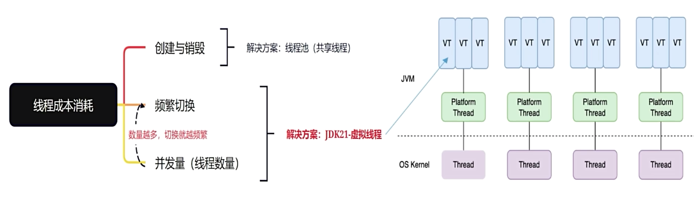

### Java9-21新特性

1. ##### Java模块化的优势

   - JDK重构了JRE，将原来的rt.jar进行了拆分，而且在JDK中直接删除了JRE目录，Java9之前运行Java程序需要使用JRE来运行Java程序，每次都将rt.jar这个50M的jar包加载到内存，即使编写的程序没有引用rt.jar中的大多数类都会将整个jar加载到内存，这样使得内存效率大大降低。从Java9开始使用模块化来管理依赖这样可以提高内存的使用效率。
   - 引入包级别的依赖管理，当需要引用特定模块中的类，可以在模块中创建module-info.java来申明对模块中类的引用。在JDK9之后使用jmod包来组织JDK的运行时所需的依赖，一般对外还是通过jar包的方式来提供依赖，而module-info.java的访问控制是在package和jar之间添加了一层各个模块之间的访问控制描述。
   - 开发效率的提升，Java9带来的最大的变化就是模块化，比如之前的rt.jar被拆成了71一个包，这样如果针对单个包来开发、维护、测试就比之前的范围就小了很多。这样做带来的好处就是负责单个模块的开发人员不会相互影响，加快了独立模块的更新速度，这个从Java8之后的Java release的速度也可以看出来。
   - 提升了加载速度，随着项目的不断推进，依赖的增多，项目的启动速度也在不断变慢。这主要是Java的类加载机制导致的，在没有引入模块化之前，Java启动时会将整个class path下的所有类全部加载到JVM中，而且查找也是线性的。在Java9之后有了模块化的依赖管理，这样类的查找就有迹可寻，这样类的加载就是定向查询。

2. ##### Java String底层存储结构升级

   在Java9中正式发布了JEP 254号提案，其目的是为了对字符串采用更节省空间的内部表达，以提高字符串的内部表示中使用代码编码。提高了内存空间的使用率和减少JVM垃圾回收工作量。String类将字符存储在一个char数组中，每个字符使用两个字节(16 bit)。从许多不同应用程序收集的数据表明，字符串主要存储在堆中，而且大多数String对象仅仅包含Latin-1字符，因此使用char数组有一半的空间未被使用。所以在Java9中使用byte数组来存储String对象，这样做带来的好处是提高了String类和相关类的空间效率，同时在大多数场景下保持性能，并保持堆所有相关Java和本机接口的完全兼容。

3. ##### 多版本兼容Jar

   扩展JAR文件格式允许多个特定于Java发行版的类文件在单个存档中共存，第三方库和框架通常支持一系列Java平台版本，为了对Java低版本的长期支持，不得不提供多个版本来保持向下兼容的特性，这样对于开发第三方类库的开发者使用Java新特性带来了复杂的版本维护工作。而多版本兼容的Jar提供了针对Java版本的目录结构声明，这样可以将支持不同版本的class的同名文件一起打包在同一个jar中，减少了包版本维护工作。

4. ##### Java接口私有方法

   在Java8中接口提供了静态方法和默认方法，而Java9有提供了私有静态方法和私有方法两个新特性。在Java9以后接口进一步替代抽象类的职责，接口针对抽象类最大的优势在于多继承。那么如何选择使用接口还是抽象类，如果有多重继承的需求应该优先考虑使用接口实现，但是有大量模板代码可以优先考虑抽象类，毕竟接口在定义参数时局限性比较大。

5. ##### JShell

   JShell API和工具将提供一种在JShell状态下以交互方式评估Java编程语言的声明、语句和表达式的方法。JShell状态包括不断发展的代码和执行状态。为了便于快速查询和编码，语句和表达式不需要出现在方法中，变量和方法不需要出现在类中。JShell是一个命令行工具，具有简化交互的功能。包括：编辑历史记录、制表符完成、自动添加所需的终端分号以及可配置的预定义导入和定义。

6. ##### 增强try-with-resource

   在Java 7时候JDK带来了try-with-resource语句，在Java 7以前使用try-catch语言在关闭资源时需要使用finally语句，这样带来的问题是开发过程中经常忘记关闭资源。语法如下：

   ```java
   Connection conn = factory.getConnection();
   try {
     PrepareStatement ps = conn.getPrapareStatement();
   } catch (Exception e) {
     log.error("get prepare statement error!");
   } finally {
     if (conn != null) {
       try{
         conn.close();
       } catch (Exception e){
         log.error("close connection error!")
       }
     }
   }
   ```

   这是最原始的try-catch方式，代码复杂而且容易忘记关闭资源，所以JDK7提供了try-with-resource语句，语法如下：

   ```java
   try(Connection conn = factory.getConnection()) {
     PrepareStatement ps = conn.getPrapareStatement();
   } catch (Exception e) {
     log.error("get prepare statement error!");
   } 
   ```

   当Connection实现了AutoCloseable或者Closeable就可以在try括号中声明，并且可以确保资源自动关闭。从Java9带来了try-catch-resource语句的增强，即任何一个之前声明的资源都可以放在try的括号中，编译器会检查该变量是否是一个final或等效一个final的变量。

7. ##### 局部变量推导

   该提案来自JEP-286号文件，Java10中正式发布，其目的是为了省略不必要的局部变量类型的声明。该功能并不是一把万能钥匙，还需要因地制宜的去使用它，可以减少代码，但是也可能带来阅读性很差的代码。

8. ##### 简化启动单个源代码文件的方法

   该提案来自JEP-330号文件，Java11中正式发布，其目的是增强Java启动器以运行作为单个Java源代码文件，整个程序放在一个源文件中，在这种情况下，在运行程序之前必须编译程序是存粹的仪式。此外，单个源文件可能会编译成多个类文件，这给"运行这个程序"的简单目标增加了打包开销。希望使用java启动器直接从源代码运行程序。在Java11还提供一个"shebang"文件和相关技术在脚本中使用。

9. ##### 改进的NullPointerExceptions

   该提案来自JEP-358号文件，在Java14中正式发布，其目的是通过准确描述哪个变量为空来提高JVM生成的NullPointerExceptions的可用性。

10. ##### 文字块

    该提案来自JEP-378号文件，在Java15中正式发布，其目的是为了支持多行字符串文字，避免大多数转义、换行、拼接操作，以可预测的方式自动格式化字符串，并在需要的时候让开发人员控制格式。实际在项目中需要写一段SQL脚本，拼接返回JSON串等等。这种新的特性能够给我们提升效率，同事在可读性上的支持非常好。

11. ##### instanceof模式匹配

    该提案来自JEP-394号文件，在Java16中正式发布，其目的就是为了从对象中提取组件，可以更加简洁和安全的表达。在实际使用中就是对instanceof语法上的提升，而且性能上也得到了提升。之前使用instanceof需要对比类型之后再强制转换到所需类型，这样就可以使用所需类型来访问属性和方法，代码如下：

    ```java
    Fruit apple = new Apple();
    if(apple instanceof Apple){
      Apple a = (Apple) apple;
      a.exec();
    }
    ```

    而现在Java16之后对instanceof进行增强后，除了语法上更加简洁其性能也有所提升，不需要类型强制装换就可以得到所需的类型代码如下：

    ```java
    if(apple instanceof Apple a){
      a.exec();
    }
    ```

12. ##### 档案类

    在Java16中正式发布，其目的是为了充当不可变数据的透明载体的类。Record类就是为了解决这个问题，避免我们去写这些重复的代码，并且拥有不可变的特性可以天然支持我们的高并发操作，因为它是线程安全的。如果没有Record类之前我们写这种透明类代码如下：

    ```java
    public final class RecordTest {
      
      private final String name;
      
      private final Integer age;
      
      public RecordTest(String name, Integer age) {
        this.name = name;
        this.age = age;
      }
    
      @Override
      public boolean equals(Object o) {
        if (this == o) {
          return true;
        }
        if (o == null || getClass() != o.getClass()) {
          return false;
        }
        RecordTest that = (RecordTest) o;
        return Objects.equals(name, that.name) && Objects.equals(age, that.age);
      }
    
      @Override
      public int hashCode() {
        return Objects.hash(name, age);
      }
    }
    ```

    而Java16中使用record关键字可以提高代码可读性，代码如下：

    ```java
    public record RecordClass(String name, Integer age) {
    
      public RecordClass {
        System.out.println("my name is " + name);
      }
    
      public static void main(String[] args) {
        RecordClass recordClass = new RecordClass("Leo", 38);
        Integer age = recordClass.age();
        String name = recordClass.name();
        System.out.println("my name is " + name + ", I am " + age + " years old.");
      }
    
    }
    ```

13. ##### 封闭类

    该提案来自JEP-397号文件，在Java16中正式发布，其目的是为了解决在可扩展上实现更细粒度的控制，这种更细粒度的扩展性限制可以防止调用进行无限扩展。从而造成不可预计的bug出现。代码如下：

    ```java
    public sealed class Fruit permits Apple {
    
    }
    public sealed class Apple extends Fruit permits GreenApple{
    
    }
    public final class GreenApple extends Apple{
    
    }
    ```

14. ##### Switch表达式

    该提案来自JEP-361号文件，在Java16中正式发布，其目的是为了解决switch语句的一些不规则性成为障碍。比如说case标签之间的默认控制流行为，case块中的默认范围，无意义的break语句。

15. ##### 简单的Web服务器

    该提案来自JEP-408号文件，在Java18中正式发布，其目的是提供命令行工具来启动静态文件的最小Web服务器。没有可用的CGI或类似Servlet的功能。该工具可用于原型设计、临时编码和测试目的，尤其是在教育环境中。目标提供HTTP文件服务器，设置简单，功能最少；降低开发人员使用成本，使JDK更便于使用。通过命令行提供实现以及用于编程创建和自定义的小型API。

16. ##### 虚拟线程

    Virtual Threads提供了一种更高效、更轻量级的线程模型。在Java中线程和系统线程是一一对应的，虚拟线程跟系统线程可不是一一对应的关系。如下图所示：

    

线程的新能消耗主要在创建与销毁，这个问题可以通过线程池化技术来解决，基本上所有的网络客户端连接都采用了该技术，池化类比于需要使用线程时的临时租用，好比共享单车。还有一个主要的性能消耗在于线程的频繁切换，而Java21的虚拟线程实际上在一个线程里运行，所以没有线程切换带来的性能消耗。需要提出的是，tomcat11已经支持虚拟线程池，而且是早于Java21就提供了虚拟线程，Java21在2023年9月发布，而Tomcat11早在6月份就提供了虚拟线程池，所以Java21的虚拟线程应该是一个重要的更新，后面需要大量采用该技术来提高系统的处理性能。

17. ##### Sequenced Collections

    Java的集合框架缺少表示具有已定义顺序的元素序列，它也缺少一个适用于此类集合的统一操作集。在Java21提供了统一的接口来定义一系列的跟有序集合相关的操作，所有的集合类都实现了该接口的方法，主要定义了如下的方法：

    ```java
    		SequencedCollection<E> reversed();
    
        
        default void addFirst(E e) {
            throw new UnsupportedOperationException();
        }
    
        default void addLast(E e) {
            throw new UnsupportedOperationException();
        }
    
        default E getFirst() {
            return this.iterator().next();
        }
    
        default E getLast() {
            return this.reversed().iterator().next();
        }
    
        default E removeFirst() {
            var it = this.iterator();
            E e = it.next();
            it.remove();
            return e;
        }
    
        default E removeLast() {
            var it = this.reversed().iterator();
            E e = it.next();
            it.remove();
            return e;
        }
    ```

    

18. ##### 分代式的ZGC

    地频率地垃圾回收器，通过扩展ZGC垃圾回收器来提高应用程序性能，区分年轻代和老年代分开垃圾回收。对于通过高频率的垃圾回收可以迅速释放JVM内存，从而提升性能。
