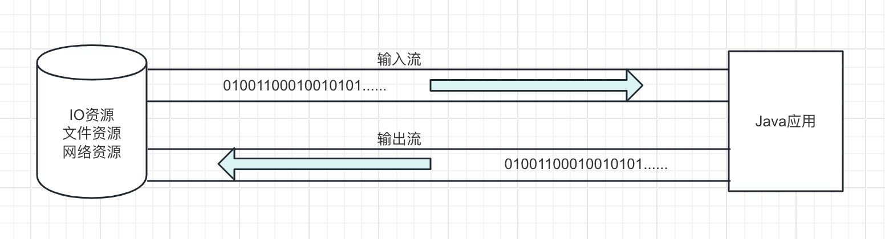
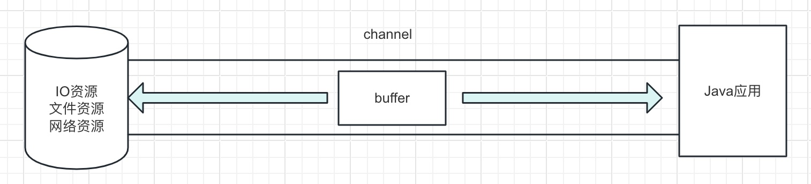
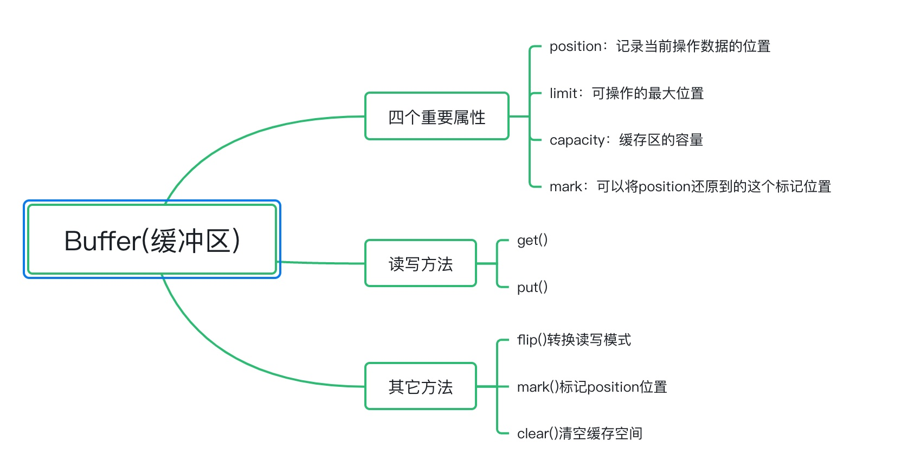
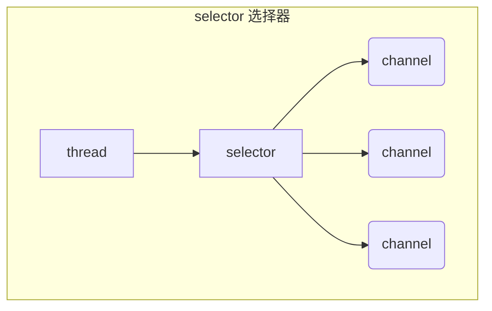

# NIO学习手册(Non-blocking IO)

Java IO流是一个庞大的生态环境，Java1.4之前的BIO其内部提供了很多不同的**输入流和输出流**，细分下去还有字节流和字符流，甚至还有**缓冲流**提高 IO 性能，转换流将字节流转换为字符流等等，这些都是传统的Java IO。

> （1）传统的 BIO 是以流为基本单位处理数据的，想象成水流，一点点地传输字节数据，IO 流传输的过程永远是以字节形式传输。
>
> （2）字节流和字符流的区别在于操作的数据单位不相同，字符流是通过将字节数据通过字符集映射成对应的字符，字符流本质上也是字节流。

 BIO 的最大痛点：**阻塞**。

- BIO 如果遇到 IO 阻塞时，线程将会被挂起，直到 IO 完成后才唤醒线程，线程切换带来了额外的开销。
- BIO 中每个 IO 都需要有对应的一个线程去专门处理该次 IO 请求，会让服务器的压力迅速提高。

我们希望做到的是**当线程等待 IO 完成时能够去完成其它事情，当 IO 完成时线程可以回来继续处理 IO 相关操作，不必一直等着 IO 完成。**在 IO 处理的过程中，能够有一个**专门的线程负责监听这些 IO 操作，通知服务器该如何操作**。

我们来看看 BIO 和 NIO 的区别，BIO 是**面向流**的 IO，它建立的通道都是**单向**的，所以输入和输出流的通道不相同，必须建立2个通道，通道内的都是传输0101001···的字节数据。



而在 NIO 中，不再是面向流的 IO 了，而是面向**缓冲区**，它会建立一个**通道（Channel）**，该通道我们可以理解为**铁路**，该铁路上可以运输各种货物，而通道上会有一个**缓冲区（Buffer）**用于存储真正的数据，缓冲区我们可以理解为**一辆火车**。

**通道（铁路）**只是作为运输数据的一个连接资源，而真正存储数据的是**缓冲区（火车）**。即**通道负责传输，缓冲区负责存储。**



### 1. 缓冲区（Buffer）

缓冲区是**存储数据**的区域，在 Java 中，缓冲区就是数组，为了可以操作不同数据类型的数据，Java 提供了许多不同类型的缓冲区，**除了布尔类型以外**，其它基本数据类型都有对应的缓冲区数组对象。



##### ByteBuffer的结构

一开始初始化ByteBuffer时，position=0, limit, capacity = buffer容量


写模式下，position 是写入位置，limit 等于容量，下图表示写入了 4 个字节后的状态: position=4， limit,capacity = buffer容量


flip 动作发生后，position 切换为读取位置，limit 切换为读取限制，position=0，limit=4，capacity = buffer容量


读取 4 个字节后，状态position,limit=4，capacity = buffer容量


clear 动作发生后，状态


compact 方法，是把未读完的部分向前压缩，然后切换至写模式


##### ByteBuffer常用的方法：

1. allocate()与allocateDirect()

```java
/**
     * class java.nio.HeapByteBuffer -> use JVM heap memory with low efficiency, JVM can GC this memory.
     * class java.nio.DirectByteBuffer -> use Direct system memory with high efficiency, Direct memory
     * invoke system kernel to allocate so need more cup time, and Direct memory must be collected when
     * no need to use.
     */
    log.debug("ByteBuffer.allocate() use heap memory. -> {}", ByteBuffer.allocate(16).getClass());
    log.debug("ByteBuffer.allocateDirect() use system memory. -> {}", ByteBuffer.allocateDirect(16).getClass());
```

2. get()与put()

```java
buffer.put((byte) 0x61); // write a into the buffer.
buffer.flip();
buffer.get(); // read a from from buffer
```

3. get(int i)，get(byte[] bytes)与rewind()

```java
		buffer.put(new byte[]{0x61, 0x62, 0x63, 0x64});  // put a, b, c, d
    byte[] bytes = new byte[4];
    buffer.flip(); // switch to read mode.
    buffer.get(bytes); // read a, b, c, d to byte array.
    
    buffer.rewind(); // reset position to 0

    buffer.get(new byte[2]); // read a, b from byte buffer.
    buffer.mark(); // mark index 2.

    bytes = new byte[2];
    buffer.get(bytes); // read c, d from byte buffer.
    
    buffer.reset(); // set index to mark.
    buffer.get(bytes); // read c, d from byte buffer.

    byte b = buffer.get(2); // read specify index byte, doesn't move position.
```

4. bytebuffer与字符串之间的转换

```java
		ByteBuffer buffer1 = ByteBuffer.allocate(10);
    // ---------String convert to ByteBuffer----------

    // 1. String.getBytes()
    buffer1.put("Hello".getBytes());

    // 2. StandardCharsets
    ByteBuffer buffer2 = StandardCharsets.UTF_8.encode("Hello");

    // 3. ByteBuffer.wrap()
    ByteBuffer buffer3 = ByteBuffer.wrap("Hello".getBytes());

    // ---------ByteBuffer convert to String----------
    buffer1.flip();
    CharBuffer decode1 = StandardCharsets.UTF_8.decode(buffer1);
    log.debug("decode byte buffer1 : {}", decode1);

    CharBuffer decode2 = StandardCharsets.UTF_8.decode(buffer2);
    log.debug("decode byte buffer2 : {}", decode2);

    CharBuffer decode3 = StandardCharsets.UTF_8.decode(buffer3);
    log.debug("decode byte buffer3 : {}", decode3);
```

5. scattering read与gathering write：理解**分散读取**和**集中写入**的思想，对于理解Netty源码很重要。

```java
    //------------scattering read---------------
    ByteBuffer buffer1 = ByteBuffer.allocate(3);
    ByteBuffer buffer2 = ByteBuffer.allocate(3);
    ByteBuffer buffer3 = ByteBuffer.allocate(5);

    channel.read(new ByteBuffer[]{buffer1, buffer2, buffer3});

    //------------scattering read---------------
```

6. 解决网络packet fragmentation问题，后面会有更好的办法来处理黏包和半包问题。

```java
public class ByteBufferPackageHandler {

  public static void main(String[] args) {
    ByteBuffer source = ByteBuffer.allocate(32);

    source.put("Hello,world\nI'm zhangsan\nHo".getBytes());
    split(source);

    source.put("w are you?\nhaha!\n".getBytes());
    split(source);
  }

  /**
   * handle the packet fragmentation in the network communications
   * @param source : network packet mock.
   */
  private static void split(ByteBuffer source) {
    source.flip();

    for(int i = 0; i < source.limit(); i++){

      if (source.get(i) == '\n') {

        int length = i + 1 - source.position();

        ByteBuffer target = ByteBuffer.allocate(length);

        for(int j = 0; j < length; j++){
          target.put(source.get());
        }

        debugAll(target);
      }
    }


    source.compact();
  }
}
```

### 2. NIO文件编程

FileChannel是对一个文件读，写，映射，操作的Channel。FileChannel是线程安全的，可以被多个线程并发使用。同一个进程中的多个FileChannel看到的同一个文件的视图是相同的，由于底层操作系统执行的缓存和网络文件系统协议引起的延迟，不同进程中在同一时间看到的文件视图可能会不同。

##### FileChannel的创建

获取FileChannel的方式有下面四种

- FileChannel.open()直接调用FileChannel的open()方法，传入Path即可获得FileChannel。

```java
// 直接传入Path默认是只读FileChannel
FileChannel fileChannel = FileChannel.open(Path.of("./tmp/test.txt"));
// 和直接传入Path相比，支持传入OpenOption数组
FileChannel channel = FileChannel.open(Path.of("./tmp/test.txt"), StandardOpenOption.WRITE);
```

OpenOption是一个空接口，我们可以传入StandardOpenOption枚举，StandardOpenOption有如下值：

```java
public enum StandardOpenOption implements OpenOption {
		// 可读Channel
    READ,
		// 可写Channel
    WRITE,
		// 如果Channel是可写(WRITE)的，缓冲中的数据会从文件末尾开始写，而不是从头开始写
    APPEND,
		// 如果Channel是可写(WRITE)的，文件的长度会被置为0
    TRUNCATE_EXISTING,
		// 如果文件不存在，则会创建一个新的文件，如果配置了CREATE，则CREATE_NEW会失效
    CREATE,
		// 创建换一个新的文件，如果文件已经存在，则会失败
    CREATE_NEW,
		// Channel关闭时删除
    DELETE_ON_CLOSE,
		// 稀疏文件
    SPARSE,
		// 要求对文件内容或元数据的每次更新都同步写入基础存储设备。
    SYNC,
		// 要求对文件内容的每次更新都同步写入基础存储设备。
    DSYNC;
}
```

- FileInputStream.getChannel()通过FileInputStream的getChannel()方法获取FileChannel，FileInputStream创建的FileChannel不可写，只能读：

```java
FileInputStream fileInputStream = new FileInputStream("./tmp/test.txt");
FileChannel fileChannel = fileInputStream.getChannel();
```

- FileOutputStream.getChannel()通过FileOutputStream的getChannel()方法获取FileChannel，FileOutputStream创建FileChannel不可读，只能写：

```java
FileOutputStream fileInputStream = new FileOutputStream("./tmp/test.txt");
FileChannel fileChannel = fileInputStream.getChannel();
```

- RandomAccessFile.getChannel()通过RandomAccessFile的getChannel()方法获取FileChannel：

```java
RandomAccessFile file = new RandomAccessFile("./tmp/test.txt", "rw");
FileChannel fileChannel = file.getChannel();
```

RandomAccessFile中的模式与OutputStream和InputStream不同的是创建RandomAccessFile需要传入模式，RandomAccessFile的模式也会影响到FileChannel，创建RandomAccessFile可以传入的模式有下面4种：

1. r：只读模式，创建的RandomAccessFile只能读，如果使用只读的RandomAccessFile创建的FileChannel写数据会抛出NonWritableChannelException

2. rw：读写模式，创建的RandomAccessFile即可读，也可写

3. rws：与rw一样，打开以进行读取和写入，并且还要求对文件内容或元数据的每次更新同步写入基础存储设备

4. rwd：与rw一样，打开以进行读取和写入，并且还要求对文件内容的每次更新都同步写入底层存储设备

Channel的读取和写入在前面讨论**分散读取**和**集中写入**已经演示过了，这里不再重复。需要注意的是Channel使用完后必须关闭，Channel本事实现了Closeable方法，所以使用JDK 1.7以后的try with resources语法就可以自动调用关闭Channel，如果是使用IO Stream来获得的Channel，在使用完毕后调用了IO Stream的close方法也会间接地调用 channel的close 方法。

Channel也有position属性，可以获取当前位置，也可以通过设置positon。

```java
long position = channel.position();
long newPosition = 10L;
channel.position(newPos);
```

设置当前位置时，如果设置为文件的末尾

* 这时读取会返回 -1；
* 这时写入，会追加内容，但要注意如果 position 超过了文件末尾，再写入时在新内容和原末尾之间会有空洞。

Channel可以使用size()方法来获取Channel的大小，操作系统出于性能的考虑，会将数据缓存，不是立刻写入磁盘。可以调用 force(true)  方法将文件内容和元数据（文件的权限等信息）立刻写入磁盘。

两个 Channel 传输数据：transferTo()方法和transferFrom()：

```java
	public static void main(String[] args) {
    try (FileChannel channelFrom = FileChannel.open(
        Path.of(ChannelTest.class.getClassLoader().getResource("data.txt").getPath()),
        StandardOpenOption.READ);
        FileChannel channelTo = FileChannel.open(
            Path.of(ClassLoader.getSystemResource("").getPath().concat("transfer.txt")),
            StandardOpenOption.CREATE, StandardOpenOption.WRITE)) {
      log.debug("channelFrom position = {}", channelFrom.position());
      log.debug("channelFrom size = {}", channelFrom.size());
      log.debug("channelTo position = {}", channelTo.position());
      log.debug("channelTo size = {}", channelTo.size());

      // use OS zero copy
      channelFrom.transferTo(0, channelFrom.size(), channelTo);

    } catch (IOException e) {
      log.error("ERROR : can not read byte from buffer.");
    }
```

JDK 1.7还引入了Path和Paths，Paths 是工具类，用来获取 Path 实例：

```java
Path source = Paths.get("test.txt"); // 相对路径 使用 user.dir 环境变量来定位 test.txt
Path source = Paths.get("d:\\test.txt"); // 绝对路径 代表了  d:\test.txt
Path source = Paths.get("d:/test.txt"); // 绝对路径 同样代表了  d:\test.txt
Path projects = Paths.get("d:\\tmp", "projects"); // 代表了  d:\tmp\projects
```

出了上面两个类以外，JDK还提供了一个工具类Files:

```java
Path path = Paths.get("test.txt");
System.out.println(Files.exists(path)); // 检查文件是否存在

/** 
 * 创建一级目录
 *   * 如果目录已存在，会抛异常 FileAlreadyExistsException
 *   * 不能一次创建多级目录，否则会抛异常NoSuchFileException
 **/
Files.createDirectory(path);

// 创建多级目录
Files.createDirectories(path);

/**
 * 拷贝文件
 * 如果文件已存在，会抛异常 FileAlreadyExistsException
 * 如果希望用 source 覆盖掉 target，需要用 StandardCopyOption 来控制
 **/
Path source = Paths.get("data.txt");
Path target = Paths.get("target.txt");
Files.copy(source, target);
Files.copy(source, target, StandardCopyOption.REPLACE_EXISTING);

/**
 * 移动文件
 * StandardCopyOption.ATOMIC_MOVE 保证文件移动的原子性
 **/
Files.move(source, target, StandardCopyOption.ATOMIC_MOVE);

/**
 * 删除目录
 * 如果目录还有内容，会抛异常 DirectoryNotEmptyException
 **/
Path target = Paths.get("test.txt");
Files.delete(target);
```

使用Files遍历目录文件夹，文件，jmod数：

```java
	public static void main(String[] args) throws IOException {
    Path path = Paths.get("/Library/Java/JavaVirtualMachines/jdk-21.jdk");
    AtomicInteger dirCount = new AtomicInteger();
    AtomicInteger fileCount = new AtomicInteger();
    AtomicInteger jmodCount = new AtomicInteger();
    Files.walkFileTree(path, new SimpleFileVisitor<Path>(){
      @Override
      public FileVisitResult preVisitDirectory(Path dir, BasicFileAttributes attrs)
          throws IOException {
        log.debug("Iterate Directory : {}", dir);
        dirCount.incrementAndGet();
        return super.preVisitDirectory(dir, attrs);
      }

      @Override
      public FileVisitResult visitFile(Path file, BasicFileAttributes attrs)
          throws IOException {
        log.debug("Iterate file : {}", file);
        fileCount.incrementAndGet();
        if (file.toFile().getName().endsWith(".jmod")) {
          jmodCount.incrementAndGet();
        }
        return super.visitFile(file, attrs);
      }
    });

    log.debug("Java 21 Directory count : {}", dirCount); // 91
    log.debug("Java 21 File count : {}", fileCount); // 395
    log.debug("Java 21 jmod count : {}", jmodCount);
  }
```

使用Files删除多级目录，**谨慎使用，一旦删除无法找回！！！**

```java
Path path = Paths.get("d:\\test");
Files.walkFileTree(path, new SimpleFileVisitor<Path>(){
    @Override
    public FileVisitResult visitFile(Path file, BasicFileAttributes attrs) 
        throws IOException {
        Files.delete(file);
        return super.visitFile(file, attrs);
    }

    @Override
    public FileVisitResult postVisitDirectory(Path dir, IOException exc) 
        throws IOException {
        Files.delete(dir);
        return super.postVisitDirectory(dir, exc);
    }
});
```

使用Files拷贝多级目录

```java
String source = "D:\\resource";
String target = "D:\\target";

Files.walk(Paths.get(source)).forEach(path -> {
  try {
    String targetName = path.toString().replace(source, target);
    // 是目录
    if (Files.isDirectory(path)) {
      Files.createDirectory(Paths.get(targetName));
    }
    // 是普通文件
    else if (Files.isRegularFile(path)) {
      Files.copy(path, Paths.get(targetName));
    }
  } catch (IOException e) {
    e.printStackTrace();
  }
});
```

### 3. 阻塞与非阻塞

* 阻塞模式下，相关方法都会导致线程暂停。
  * ServerSocketChannel.accept 会在没有连接建立时让线程暂停；
  * SocketChannel.read 会在没有数据可读时让线程暂停；
  * 阻塞的表现其实就是线程暂停了，暂停期间不会占用 cpu，但线程相当于闲置；
* 单线程下，阻塞方法之间相互影响，几乎不能正常工作，需要多线程支持。
* 但多线程下，有新的问题，体现在以下方面。
  * 32 位 jvm 一个线程 320k，64 位 jvm 一个线程 1024k，如果连接数过多，必然导致 OOM，并且线程太多，反而会因为频繁上下文切换导致性能降低。
  * 可以采用线程池技术来减少线程数和线程上下文切换，但治标不治本，如果有很多连接建立，但长时间 inactive，会阻塞线程池中所有线程，因此不适合长连接，只适合短连接。

### 4. 多路复用

单线程可以配合 Selector 完成对多个 Channel 可读写事件的监控，这称之为多路复用

* 多路复用仅针对网络 IO、普通文件 IO 没法利用多路复用；
* 如果不用 Selector 的非阻塞模式，线程大部分时间都在做无用功，而 Selector 能够保证：
  * 有可连接事件时才去连接；
  * 有可读事件才去读取；
  * 有可写事件才去写入；

限于网络传输能力，Channel 未必时时可写，一旦 Channel 可写，会触发 Selector 的可写事件。

### 5. Selector(选择器)




使用NIO Selector的优点：

* 一个线程配合 selector 就可以监控多个 channel 的事件，事件发生线程才去处理。避免非阻塞模式下CPU一直空转；
* 让这个线程能够被充分利用，节约了线程的数量，减少了线程上下文切换；

使用open()来创建Selector:

```java
Selector selector = Selector.open();
```

##### 绑定 Channel 事件:也称之为注册事件，绑定的事件 selector 才会关心 

```java
SelectionKey key = channel.register(selector, SelectionKey.OP_ACCEPT);
```

* channel 必须工作在**非阻塞模式**
* FileChannel 没有非阻塞模式，因此不能配合 selector 一起使用
* 绑定的事件类型可以有
  * connect - 客户端连接成功时触发
  * accept - 服务器端成功接受连接时触发
  * read - 数据可读入时触发，有因为接收能力弱，数据暂不能读入的情况
  * write - 数据可写出时触发，有因为发送能力弱，数据暂不能写出的情况

##### 监听 Channel 事件

可以通过下面三种方法来监听是否有事件发生，方法的返回值代表有多少 channel 发生了事件

方法1，阻塞直到绑定事件发生

```java
int count = selector.select();
```

方法2，阻塞直到绑定事件发生，或是超时（时间单位为 ms）

```java
int count = selector.select(long timeout);
```

方法3，不会阻塞，也就是不管有没有事件，立刻返回，自己根据返回值检查是否有事件

```java
int count = selector.selectNow();
```

##### 💡 select 何时不阻塞

> * 事件发生时
>   * 客户端发起连接请求，会触发 accept 事件
>   * 客户端发送数据过来，客户端正常、异常关闭时，都会触发 read 事件，另外如果发送的数据大于 buffer 缓冲区，会触发多次读取事件
>   * channel 可写，会触发 write 事件
>   * 在 linux 下 nio bug 发生时
> * 调用 selector.wakeup()
> * 调用 selector.close()
> * selector 所在线程 interrupt

使用NIO Selector来处理accept和read：

```java
@Slf4j
public class SelectorServer {

  public static void main(String[] args) {

    // 1. create server socket and selector.
    try (ServerSocketChannel ssc = ServerSocketChannel.open(); Selector selector = Selector.open()) {

      // 2. bind server socket on port 8888.
      ssc.bind(new InetSocketAddress(8888));

      // 3. set server socket non-blocking.
      ssc.configureBlocking(false);

      // 4. register ssc to selector and handler accept event.
      SelectionKey sscKey = ssc.register(selector, SelectionKey.OP_ACCEPT);
      log.debug("server socket register in selector and the selection key is  : {}", sscKey);

      while (true) {
        // 5. blocking method, listen to the registry event.
        int select = selector.select();
        log.debug("listen all registered event number : {}", select);

        Iterator<SelectionKey> iterator = selector.selectedKeys().iterator();
        while (iterator.hasNext()) {
          SelectionKey key = iterator.next();

          // 6. handle all event.
          switch (key.interestOps()) {
            case SelectionKey.OP_ACCEPT: {
              ServerSocketChannel channel = (ServerSocketChannel) key.channel();
              SocketChannel socketChannel = channel.accept();
              socketChannel.configureBlocking(false);
              SelectionKey scKey = socketChannel.register(selector, SelectionKey.OP_READ);
              log.debug("client socket register in selector and the selection key is  : {}", scKey);
              break;
            }
            case SelectionKey.OP_READ: {
              log.debug("server handle read event : {}", key);
              SocketChannel channel = (SocketChannel) key.channel();
              ByteBuffer buffer = ByteBuffer.allocate(16);
              int length = channel.read(buffer);
              if (length == -1) {
                key.cancel();
                channel.close();
              } else {
                buffer.flip();
                debugRead(buffer);
              }
              break;
            }
          }

          // 7. finished handle event must remove the selection key in selectedKeys.
          iterator.remove();
        }
      }


    } catch (IOException e) {
      log.error("open selector failed!");
    }
  }
}
```

##### 💡为何要 iter.remove()

> 因为 select 在事件发生后，就会将相关的 key 放入 selectedKeys 集合，但不会在处理完后从 selectedKeys 集合中移除，需要我们自己编码删除。例如
>
> * 第一次触发了 ssckey 上的 accept 事件，没有移除 ssckey 
> * 第二次触发了 sckey 上的 read 事件，但这时 selectedKeys 中还有上次的 ssckey ，在处理时因为没有真正的 serverSocket 连上了，就会导致空指针异常


##### 💡 cancel 的作用

> cancel 会取消注册在 selector 上的 channel，并从 keys 集合中删除 key 后续不会再监听事件


### 6. 处理消息边界问题


* 一种思路是固定消息长度，数据包大小一样，服务器按预定长度读取，这种设计选取一个较大的值来作为长度，缺点是浪费带宽；
* 另一种思路是按分隔符拆分，这种方式需要对比每个字节，缺点是效率低；
* TLV 格式，即 Type 类型、Length 长度、Value 数据，类型和长度已知的情况下，就可以方便获取消息大小，分配合适的 buffer，缺点是 buffer 需要提前分配，如果内容过大，则影响 server 吞吐量
  * Http 1.1 是 TLV 格式
  * Http 2.0 是 LTV 格式

上面三个思路，前面两个由于缺点明显，在实际的开发中很少使用，我们首先来使用第二种思路处理消息越界的问题：

```java
public static void main(String[] args) {

    // 1. create server socket and selector.
    try (ServerSocketChannel ssc = ServerSocketChannel.open(); Selector selector = Selector.open()) {

      // 2. bind server socket on port 8888.
      ssc.bind(new InetSocketAddress(8888));

      // 3. set server socket non-blocking.
      ssc.configureBlocking(false);

      // 4. register ssc to selector and handler accept event.
      SelectionKey sscKey = ssc.register(selector, SelectionKey.OP_ACCEPT);
      log.debug("server socket register in selector and the selection key is  : {}", sscKey);

      while (true) {
        // 5. blocking method, listen to the registry event.
        int select = selector.select();
        log.debug("listen all registered event number : {}", select);

        Iterator<SelectionKey> iterator = selector.selectedKeys().iterator();
        while (iterator.hasNext()) {
          SelectionKey key = iterator.next();

          // 6. handle all event.
          switch (key.interestOps()) {
            case SelectionKey.OP_ACCEPT: {
              ServerSocketChannel channel = (ServerSocketChannel) key.channel();
              SocketChannel socketChannel = channel.accept();
              socketChannel.configureBlocking(false);
              ByteBuffer byteBuffer = ByteBuffer.allocate(16);
              SelectionKey scKey = socketChannel.register(selector, SelectionKey.OP_READ, byteBuffer);
              log.debug("client socket register in selector and the selection key is  : {}", scKey);
              break;
            }
            case SelectionKey.OP_READ: {
              log.debug("server handle read event : {}", key);
              SocketChannel channel = (SocketChannel) key.channel();
              ByteBuffer buffer = (ByteBuffer) key.attachment();
              int length = channel.read(buffer);
              if (length == -1) {
                key.cancel();
                channel.close();
              } else {
                ByteBufferPackageHandler.split(buffer);
                if(buffer.position() == buffer.limit()){
                  ByteBuffer newBuffer = ByteBuffer.allocate(buffer.capacity() * 2);
                  buffer.flip();
                  newBuffer.put(buffer);
                  key.attach(newBuffer);
                }
              }
              break;
            }
          }

          // 7. finished handle event must remove the selection key in selectedKeys.
          iterator.remove();
        }
      }


    } catch (IOException e) {
      log.error("open selector failed!");
    }


  }
```

### 7. ByteBuffer 大小分配

* 每个 channel 都需要记录可能被切分的消息，因为 ByteBuffer 不能被多个 channel 共同使用，因此需要为每个 channel 维护一个独立的 ByteBuffer
* ByteBuffer 不能太大，比如一个 ByteBuffer 1Mb 的话，要支持百万连接就要 1Tb 内存，因此需要设计大小可变的 ByteBuffer
  * 一种思路是首先分配一个较小的 buffer，例如 4k，如果发现数据不够，再分配 8k 的 buffer，将 4k buffer 内容拷贝至 8k buffer，优点是消息连续容易处理，缺点是数据拷贝耗费性能，参考实现 [http://tutorials.jenkov.com/java-performance/resizable-array.html](http://tutorials.jenkov.com/java-performance/resizable-array.html)
  * 另一种思路是用多个数组组成 buffer，一个数组不够，把多出来的内容写入新的数组，与前面的区别是消息存储不连续解析复杂，优点是避免了拷贝引起的性能损耗

### 8. 写入大量数据

#### 一次无法写完例子

* 非阻塞模式下，无法保证把 buffer 中所有数据都写入 channel，因此需要追踪 write 方法的返回值（代表实际写入字节数）
* 用 selector 监听所有 channel 的可写事件，每个 channel 都需要一个 key 来跟踪 buffer，但这样又会导致占用内存过多，就有两阶段策略
  * 当消息处理器第一次写入消息时，才将 channel 注册到 selector 上
  * selector 检查 channel 上的可写事件，如果所有的数据写完了，就取消 channel 的注册
  * 如果不取消，会每次可写均会触发 write 事件

Server端代码：

```java
public static void main(String[] args) {

  try (ServerSocketChannel ssc = ServerSocketChannel.open(); Selector selector = Selector.open()) {

    ssc.bind(new InetSocketAddress(8888));
    ssc.configureBlocking(false);
    SelectionKey sscKey = ssc.register(selector, SelectionKey.OP_ACCEPT);
    log.debug("server socket register in selector and the selection key is  : {}", sscKey);

    while (true) {
      selector.select();
      Iterator<SelectionKey> iterator = selector.selectedKeys().iterator();

      while (iterator.hasNext()) {
        SelectionKey key = iterator.next();

        if (key.isAcceptable()) {
          SocketChannel channel = ssc.accept();
          channel.configureBlocking(false);
          SelectionKey scKey = channel.register(selector, SelectionKey.OP_READ);
          StringBuilder stringBuilder = new StringBuilder();
          for (int i = 0; i < 5000000; i++) {
            stringBuilder.append("a");
          }

          ByteBuffer buffer = StandardCharsets.UTF_8.encode(stringBuilder.toString());
          int length = channel.write(buffer);
          log.debug("server write byte count : {}", length);

          if (buffer.hasRemaining()) {
            scKey.interestOps(scKey.interestOps() | SelectionKey.OP_WRITE);
            scKey.attach(buffer);
          }

        } else if (key.isWritable()) {
          SocketChannel channel = (SocketChannel) key.channel();
          ByteBuffer buffer = (ByteBuffer) key.attachment();
          int length = channel.write(buffer);
          log.debug("server write byte count : {}", length);

          if(!buffer.hasRemaining()){
            key.attach(null);
            key.interestOps(key.interestOps() - SelectionKey.OP_WRITE);
          }
        }
        iterator.remove();
      }
    }

  } catch (IOException e) {
    throw new RuntimeException(e);
  }
}
```

client端代码：

```java
public static void main(String[] args) {
  try (Selector selector = Selector.open(); SocketChannel channel = SocketChannel.open(
      new InetSocketAddress("localhost", 8888))) {
    channel.configureBlocking(false);
    channel.register(selector, SelectionKey.OP_CONNECT | SelectionKey.OP_READ);
    int count = 0;

    while(true){
      selector.select();
      Iterator<SelectionKey> iterator = selector.selectedKeys().iterator();
      while (iterator.hasNext()) {
        SelectionKey key = iterator.next();
        iterator.remove();
        if (key.isConnectable()) {
          log.debug("client finished this connection : {}", channel.finishConnect());
        } else if (key.isReadable()) {
          ByteBuffer buffer = ByteBuffer.allocate(1024 * 1024);
          count += channel.read(buffer);
          buffer.clear();
          log.debug("client read from server byte count : {}", count);
        }
      }
    }
  } catch (IOException e) {
    log.error("can not read from server!");
  }
}
```

