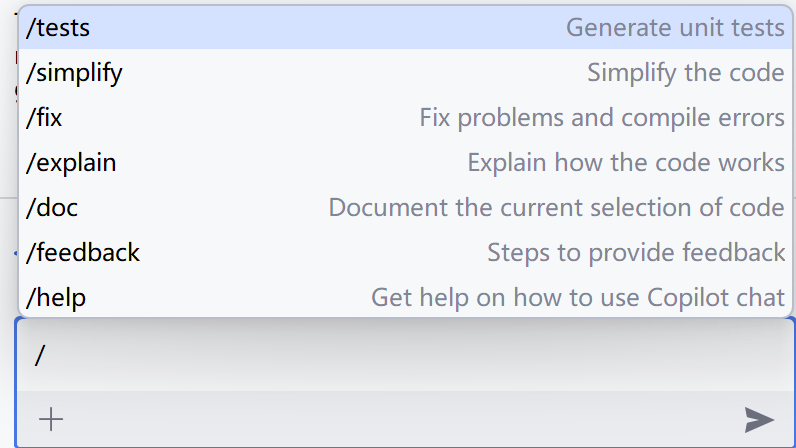

# GitHub Copilot学习手册

### 1. 简介

Github Copilot主要的形态是以编辑器插件的形式存在的，是有Github出品的目前支持主要的IDE比如：JetBrains IDEs、 VScode等。Github Copilot主要基于大语言模型LLM(OpenAI CodeX)，该模型主要是基于Github的代码来进行训练，同时它也能理解自然语言比如代码中的注释。它支持Github上几乎所有的语言，支持度最好的是Python、JS、TS。在实际使用中Github Copilot的建议接受度为30%-40%。

### 2. 产品线

1. Copilot：及时代码补齐；
2. Copilot Chat - IDE里面的编程助手；
3. Copilot CLI：命令行工具；
4. 企业级的安全、合规、隐私和管理方式；
5. IP归属于用户 & IP保护；

### 3. GitHub Copilot的常用命令：

首先GitHub Copilot的命令都是以/开头，并且当你输入/时有提示符：

/tests：生成测试用例；

/simplify：简化代码，使编辑框中的代码更加简洁；

/fix：修复代码中的bug；

/explain：解释代码；

/doc：生成代码中的文档注释；

/feedback：将给出Copilot关于你代码的feedback；

/help：使用帮助。

### 4. Github Copilot的原理

Github Copilot不仅仅是直接调用了Open AI的大语言模型，而是在IDE插件和GitHub Copilot服务之间做了很多工程工作，主要是以编辑框的鼠标位置的上下文来生成提示词片段，然后在GitHub Copilot服务上使用这些上下文然后在生成提示词来调用Open AI的大语言模型。那么怎样定义上下文呢？除了编辑框中的上下文之外，还有相邻的tab页里的内容也是上下文。在生成新的代码时，也会参考上下文的格式来生成代码。

核心能力：

- 在光标位置，根据上下文猜想Developer后 续要输入什么 
- 上下文（提示词）可以是：代码注释、一段逻辑代码的开头、一个字符/变量/语句等 
- 生成的内容可以是完整的函数/功能代码；后续的代码片段，可以是半行、一行、多行代码；注释

适用场景： 

- 结合上下文给出编码 
  - 生成函数（查询式，命令式），包括单元测试
  - 补齐代码，DevOps脚本，Shell脚本，SQL语句等
  - 补齐和上下文匹配的有规律的相似格式的代码
  - 正则表达式
  - 简化陌生框架/语言的使用
  - 按常识完善对象字段
- 编写测试代码
  - 包含各类边界条件验证、使用难以记忆关键字编写代 码等
- 注释补齐

### 5. 最佳实践

1. 打开和当前任务相关的代码文件（大约会提升5%-10%的代码接受率）
   - 如果相关的类库没有源码，可以打开元数据信息（metadata）
   - 如果没有元数据信息，当前编辑的文件里包含了相关类库的使用方式也可以
2. 保持良好的代码习惯，比如保持比较好的代码命名规范，好的命名可以让Copilot更准确的 理解上下文
3. 多使用快捷键Ctl+Enter
4. 不要追求每次都可以生成大段的代码，生成一行或者半行其实也很能节省时间
5. 可以适当的调整注释，使其清晰、具体、详细，没有模糊的描述
6. 不要花费过多时间在如何写代码注释上，Copilot提示的效果不好的时候，可以忽略当前提示的内容，自己写一段代码，之后就会就好了
7. Copilot的定位是个更好用的编程工具，而不是代替开发者思考
8. 使用原则：观察，思考，接受，验证，修改

### 6. 如果修复代码

可以使用GitHub Copilot Chat来输入问题，比如：这段代码有什么问题，该如何解决？如果你选中了一段代码，那么GitHub Copilot会以这段代码为上下文来回答。如果你没有选中则就使用屏幕中所有的代码作为上下文。