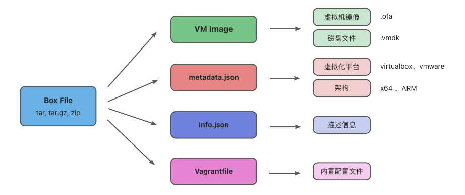
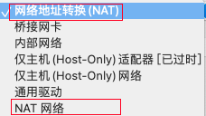
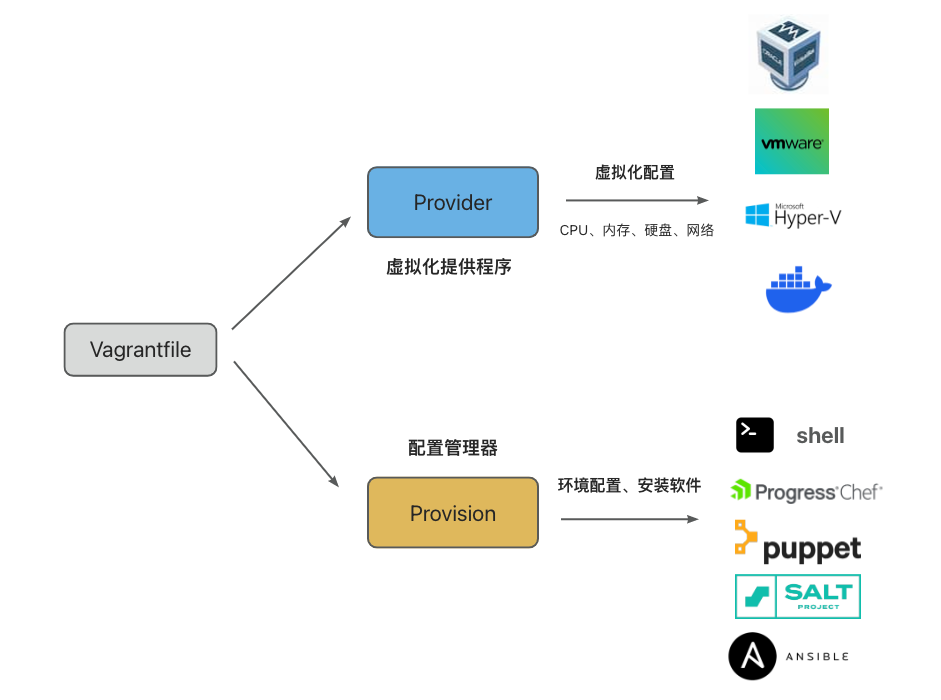

# Vagrant学习手册

Vagrant 是一个用于构建和管理虚拟机的工具，支持通过配置文件，自动化、批量的创建虚拟机。Vagrant是“流浪汉”的意思，流浪汉无依无靠，走哪都一样。我们的程序也是一样的，需要在哪运行都一样，避免“在我电脑上是好的，怎么到你那就不能用”的问题。Vagrant由HashiCorp出品，还有一个比较出名的产品Consul，广泛用于微服务的服务发现与配置，类似Nacos。agrant和Docker一样，都是用来创建可移植、一致的开发环境。Docker使用这么简单，为什么还有使用Vagrant？Docker适合单机环境的服务，而需要使用集群化的环境那么Vagrant更加合适。Vagrant早于docker，docker的一些理念借鉴了vagrant。Vagrant更像docker compose，他只提供编排能力，不提供虚拟化的功能。虚拟化需要借助其他虚拟化引擎，例如Virtual Box、VMware、Hyper-V等，Vagrant也可以使用Docker。


### 1. Vagrant box

Vagrant使用Box而不是ISO镜像创建虚拟机.Box相当于是虚拟机模版，类似docker中的image。`vagrant init`命令会将Box拉取到本地，并在当前目录下生成`Vagrantfile`。当然，我们也可以不使用init命令，自己编写vagrantfile。`vagrant up`命令根据配置文件中的内容创建虚拟机。

Box是Vagrant创建虚拟机使用的包格式，它是一个预先配置好的运行环境。Box File实际上是一个压缩文件(tar,zip,tar.gz),它通常包含了虚拟机镜像、元数据、描述信息、配置文件。不同的虚拟化平台需要使用不同的Box。如果在ARM架构下创建虚拟机，需要使用arm64架构的Box文件。我们可以从[Vagrant Cloud](https://app.vagrantup.com/boxes/search)网站上找到支持不同虚拟化平台的Box文件。像Ubuntu、Almalinux、Fedaro、Rocky等，官方都会发布支持Virtual Box的Box文件，其他平台的Box由大多第三方维护。几乎所有的Linux发行版本，都可以在[**generic**](https://app.vagrantup.com/generic)和[**bento**](https://app.vagrantup.com/bento)这两个组织下找到。bento一些box来源于generic。



### 2. Vagrant 创建过程

创建和启动虚拟机主要有下面几个步骤：

1. 配置网络
2. 转发SSH端口
3. 配置ssh用户和密钥对
4. 挂载共享目录

##### 配置网络

vagrant总是会将虚拟机的第一个网卡设置为NAT。NAT只能用于虚拟机向外访问，通常用来访问互联网，主机不能访问虚拟机，虚拟机与虚拟机之间也不能通信。



注意：网络地址转换(NAT)与NAT网络(NAT network)不一样，是两种不同的网络模式。NAT network也叫NAT service，可以在虚拟机与虚拟机之间互相访问。

##### 转发SSH端口

NAT无法从主机访问虚拟机，为什么可以使用`vagrant ssh`连接到虚拟机呢？这是因为vagrant将虚拟机的ssh端口`22`转发到宿主机`2222`端口。如果有多个虚拟机，每个虚拟机会转发到不同的端口。通过`vagrant ssh`连接到虚拟机跟使用下列命令是一样的。

```bash
ssh vagrant@localhost -p 2222
```

##### 配置SSH用户

vagrant默认为每个虚拟机创建一个`vagrant`用户，密码为`vagrant`。这个用户拥有`sudo`权限，默认情况下不启动`root`用户。

##### 配置SSH密钥对

vagrant ssh命令不需要输入密码，通过密钥对免密登录虚拟机。所有的虚拟机Box打包的时候都使用同一个公开的密钥对。这样子显然是不安全的。内置的密钥对仅用于第一次创建虚拟机的时候，vagrant会通过这个密钥对登录进虚拟机。然后生成一个新的密钥对，并替换公开的密钥对。

##### 挂载共享目录

最后，vagrant会将当前目录设置为共享目录，挂载到虚拟机的`/vagrant`目录下。

### 3. Vagrant file

Vagrantfile是用于配置和管理虚拟机文件，它使用ruby语法，用于定义虚拟机的配置选项，例如虚拟机的操作系统、网络设置、共享文件夹等。通过编辑Vagrantfile，可以创建不同规格、不同用途的虚拟机。当我们运行`vagrant init`命令时，会在当前目录生成`Vagrantfile`配置文件，默认的配置文件如下：

```ruby
Vagrant.configure("2") do |config|
  config.vm.box = "centos/7"
end
```

如果下载Box比较慢，很不幸，Vagrant Cloud不像Docker Hub，没有完整的镜像站。好在常用的Linux系统都会发布Box文件，可以从linux发行版本的国内的镜像站下载Box文件。（比如centos7的科大源）。

```ruby
Vagrant.configure("2") do |config|
  config.vm.box = "centos7"
  config.vm.box_url = "http://mirrors.ustc.edu.cn/centos-cloud/centos/7/vagrant/x86_64/images/CentOS-7-x86_64-Vagrant-2004_01.VirtualBox.box"
end
```

如果想离线使用，也可以将Box下载到本地使用。

```ruby
Vagrant.configure("2") do |config|
  config.vm.box = "ubuntu/jammy64"
  config.vm.box_url = "file://tmp/CentOS-7-x86_64-Vagrant-2004_01.VirtualBox.box"
end
```

##### 配置环境变量

```ruby
ENV["LC_ALL"] = "en_US.UTF-8"

Vagrant.configure("2") do |config|
  config.vm.box = "ubuntu/jammy64"
end  
```

##### Provider和Provision



`Vagrantfile`主要用来配置Provider(虚拟化提供者)和Provision(配置管理器)：Vagrant支持不同的虚拟化平台，默认使用VirtualBox，同时官方也支持Vmware(需要安装插件)、Hyper-V和Docker。`Provider`用来适配不同的虚拟化平台。在不同平台下创建虚拟机需要使用不同的Provider，不同的Provider功能有些差异，一些配置选项也有所不同。`Provision`是配置管理器，用于在虚拟机创建完成后，使用shell脚本或自动化运维工具配置环境、安装软件等。不同的配置工具需要使用不同的配置管理器。

### 4. Vagrant Provider 虚拟化提供者

Vagrant Provider默认使用Virtual Box。比如我们需要创建的虚拟机规格

- CPU：2核
- 内存：2G
- 系统盘：50G
- 存储盘：20G

```ruby
Vagrant.configure("2") do |config|
  
  config.vm.box = "ubuntu/jammy64"
  
  # 规格配置
  config.vm.provider :virtualbox do |vbox|
    vbox.name    = "ubuntu-22.04"
    vbox.cpus    = 2
    vbox.memory  = 2048
    vbox.customize ['modifyvm', :id, '--graphicscontroller', 'vmsvga']
  end

  # 修改hostname，更新/etc/hosts
  config.vm.hostname = "ubuntu-1"
  # 设置系统盘容量
	config.vm.disk :disk, size: "40GB", primary: true
  # 新建一个硬盘
  config.vm.disk :disk, size: "20GB", name: "extra_disk"

end
```

注意：primary disk默认是40G，硬盘容量不能比默认值小。

##### 常用命令

- **vagrant reload 重新配置虚拟机**
- **vagrant halt 关闭虚拟机**
- **vagrant destroy 删除虚拟机**
- **vagrant suspend 休眠**
- **vagrant resume 唤醒**

如果需要使用VMWare需要安装 [Vagrant VMware Utility ](https://developer.hashicorp.com/vagrant/downloads/vmware)和vagrant VMware provider plugin插件。安装插件使用`vagrant plugin install vagrant-vmware-desktop`。`Vagrantfile`中的provide需要设置成`vmware_desktop`，CPU和内存的配置也有所不同。

```ruby
config.vm.provider "vmware_desktop" do |v|
  v.vmx["memsize"] = "1024"
  v.vmx["numvcpus"] = "2"
end
```

也可以通过设置环境变量`export VAGRANT_DEFAULT_PROVIDER=vmware_desktop`将默认的provider修改为vmware。

### 5. Vagrant Provision 配置管理器

虚拟机创建完成后，通常无法直接满足我们的需求。Provision配置管理器可以在创建虚拟机的过程中修改配置、自动安装软件等。 这个是自动化的，不需要人工干预，只需一条命令就可以创建一个开箱即用的虚拟环境。配置管理器支持Chef、Ansible、Puppet、Salt等自动化工具，通常我们使用shell脚本就够了。

##### 修改密码

vagrant用户默认的密码是`vagrant`，这是不安全的，因此vagrant默认不启动SSH密码登录。通过`provision`修改密码并开启SSH密码登录。

```ruby
Vagrant.configure("2") do |config|
  
  config.vm.box = "ubuntu/jammy64"
  
  # 规格配置
  config.vm.provider :virtualbox do |vbox|
    vbox.name    = "ubuntu-22.04"
    vbox.cpus    = 2
    vbox.memory  = 2048
    vbox.customize ['modifyvm', :id, '--graphicscontroller', 'vmsvga']
  end

  # 修改hostname，更新/etc/hosts
  config.vm.hostname = "ubuntu-1"
  # 设置系统盘容量
	config.vm.disk :disk, size: "40GB", primary: true
  # 新建一个硬盘
  config.vm.disk :disk, size: "20GB", name: "extra_disk"

  # 修改vagrant用户密码
  config.vm.provision "shell", inline: "echo vagrant:Abc123 | sudo chpasswd"
  
end
```

##### 启动SSH密码登录

`provision`也可以执行shell脚步文件，比如我们创建一个bootstrap.sh的脚步文件。

```shell
# 启用ssh密码认证
echo "==> Enable ssh password authentication"
sed -i 's/^PasswordAuthentication .*/PasswordAuthentication yes/' /etc/ssh/sshd_config
systemctl reload sshd
```

```ruby
# 修改vagrant用户密码
config.vm.provision "shell", path: "bootstrap.sh"
```

##### 什么时候执行

- 配置管理器只在第一次使用`vagrant up`创建环境时执行。
- 如果虚拟机已经创建，`vagrant up`或`vagrant reload`不会再次运行配置管理器，需要显式调用。

```shell
vagrant up --provision
vagrant reload --provision
vagrant provision
```

### 6. Vagrant Network 网络

**Vagrant 网络：**

- NAT(默认)
- 私有网络
- 共有网络

##### NAT 网络地址转换（默认）

Vagrant总是将虚拟机的第一个网卡设置为NAT(网络地址转发)。NAT模式下，虚拟机只能单向访问外部网络(通常用来访问互联网)，虚拟机对外部互联网是不可见和无法访问的，虚拟机之间也是相互隔离的。

##### 端口转发

在NAT模式下，如果想访问虚拟机中的端口，可以使用端口转发。这种方式虽然可以访问虚拟机内的服务，但是不适合搭建分布式集群。

```ruby
config.vm.network "forwarded_port", guest: 80, host: 8080
```

##### 私有网络

私有网络可以实现虚拟机之间的网络访问，在Virtual Box下，Vagrant将网卡设置为仅主机访问(Host-only)模式。Host-only顾名思义，只能从宿主机访问虚拟机，无法从外部主机访问虚拟机。

```ruby
config.vm.network "private_network", ip: "192.168.56.20"
```

VirtualBox默认将192.168.56.0/21范围内的地址分配给虚拟机。可以使用`VBoxManage list hostonlynets`命令查看IP地址范围。

```shell
VBoxManage list hostonlynets
Name:            vagrantnet-vbox1
GUID:            bc907fa2-e158-4c1b-96fb-63b8765a64d8

State:           Enabled
NetworkMask:     255.255.255.0
LowerIP:         192.168.56.0
UpperIP:         192.168.56.0
VBoxNetworkName: hostonly-vagrantnet-vbox1
```

##### 外部网络

如果要从别的主机进行访问，也可以设置公有网络。在VirutualBox中，使用bridge网络实现。Bridge网络将虚拟机等同为网络中的真实主机，可以像访问其他主机一样访问虚拟机。使用`VBoxManage list bridgedifs`查看桥接网络接口：

```shell
VBoxManage list bridgedifs
Name:            en0: Wi-Fi
GUID:            00306e65-0000-4000-8000-3c22fb0e6181
DHCP:            Disabled
IPAddress:       10.0.0.229
NetworkMask:     255.255.248.0
IPV6Address:
IPV6NetworkMaskPrefixLength: 0
HardwareAddress: 3c:22:fb:0e:61:81
MediumType:      Ethernet
Wireless:        No
Status:          Up
VBoxNetworkName: HostInterfaceNetworking-en0

Name:            en5: USB Ethernet(?)
GUID:            00356e65-0000-4000-8000-acde48001122
DHCP:            Disabled
IPAddress:       0.0.0.0
NetworkMask:     0.0.0.0
IPV6Address:
IPV6NetworkMaskPrefixLength: 0
HardwareAddress: ac:de:48:00:11:22
MediumType:      Ethernet
Wireless:        No
Status:          Up
VBoxNetworkName: HostInterfaceNetworking-en5

Name:            ap1
GUID:            00317061-0000-4000-8000-3e22fb0e6181
DHCP:            Disabled
IPAddress:       0.0.0.0
NetworkMask:     0.0.0.0
IPV6Address:
IPV6NetworkMaskPrefixLength: 0
HardwareAddress: 3e:22:fb:0e:61:81
MediumType:      Ethernet
Wireless:        No
Status:          Down
VBoxNetworkName: HostInterfaceNetworking-ap1

Name:            awdl0
GUID:            6c647761-0030-4000-8000-26f03a934ce3
DHCP:            Disabled
IPAddress:       0.0.0.0
NetworkMask:     0.0.0.0
IPV6Address:
IPV6NetworkMaskPrefixLength: 0
HardwareAddress: 26:f0:3a:93:4c:e3
MediumType:      Ethernet
Wireless:        No
Status:          Up
VBoxNetworkName: HostInterfaceNetworking-awdl0

Name:            llw0
GUID:            30776c6c-0000-4000-8000-26f03a934ce3
DHCP:            Disabled
IPAddress:       0.0.0.0
NetworkMask:     0.0.0.0
IPV6Address:
IPV6NetworkMaskPrefixLength: 0
HardwareAddress: 26:f0:3a:93:4c:e3
MediumType:      Ethernet
Wireless:        No
Status:          Up
VBoxNetworkName: HostInterfaceNetworking-llw0

Name:            en1: 雷雳1
GUID:            00316e65-0000-4000-8000-82a549e42801
DHCP:            Disabled
IPAddress:       0.0.0.0
NetworkMask:     0.0.0.0
IPV6Address:
IPV6NetworkMaskPrefixLength: 0
HardwareAddress: 82:a5:49:e4:28:01
MediumType:      Ethernet
Wireless:        No
Status:          Up
VBoxNetworkName: HostInterfaceNetworking-en1

Name:            en2: 雷雳2
GUID:            00326e65-0000-4000-8000-82a549e42800
DHCP:            Disabled
IPAddress:       0.0.0.0
NetworkMask:     0.0.0.0
IPV6Address:
IPV6NetworkMaskPrefixLength: 0
HardwareAddress: 82:a5:49:e4:28:00
MediumType:      Ethernet
Wireless:        No
Status:          Up
VBoxNetworkName: HostInterfaceNetworking-en2

Name:            en4: 雷雳4
GUID:            00346e65-0000-4000-8000-82a549e42804
DHCP:            Disabled
IPAddress:       0.0.0.0
NetworkMask:     0.0.0.0
IPV6Address:
IPV6NetworkMaskPrefixLength: 0
HardwareAddress: 82:a5:49:e4:28:04
MediumType:      Ethernet
Wireless:        No
Status:          Up
VBoxNetworkName: HostInterfaceNetworking-en4

Name:            en3: 雷雳3
GUID:            00336e65-0000-4000-8000-82a549e42805
DHCP:            Disabled
IPAddress:       0.0.0.0
NetworkMask:     0.0.0.0
IPV6Address:
IPV6NetworkMaskPrefixLength: 0
HardwareAddress: 82:a5:49:e4:28:05
MediumType:      Ethernet
Wireless:        No
Status:          Up
VBoxNetworkName: HostInterfaceNetworking-en3
```

设置桥接网络，注意：bridge的名称中不能包含中文，Vagrant无法识别，需要修改网络的名称。

```ruby
config.vm.network "public_network", ip: "10.0.0.230", bridge: "en0: Wi-Fi"
```

### 7. Vagrant 批量创建虚拟机

Vagrant批量创建虚拟机

```ruby
Vagrant.configure("2") do |config|

  config.vm.box = "ubuntu/jammy64"
  
  (1..3).each do |i|
    config.vm.define "node-#{i}" do |node|
      node.vm.provision "shell",
      inline: "echo hello from node #{i}"
    end
  end
  
end
```

我们可以通过数组来定义多个虚拟机的配置。

```ruby
vm_list = [
  { # hash map
    "name" => "node-1",
    "cpu" => "2",
    "mem" => "2048",
    "ip_addr" => "192.168.56.10"
  },
  {
    "name" => "node-2",
    "cpu" => "1",
    "mem" => "1024",
    "ip_addr" => "192.168.56.11"
  },
  {
    "name" => "node-3",
    "cpu" => "1",
    "mem" => "1024",
    "ip_addr" => "192.168.56.12"
  }
]

Vagrant.configure(2) do |config|

   config.vm.box = "ubuntu/jammy64"

   vm_list.each do |item|
        config.vm.define item["name"] do |node|

            node.vm.provider "virtualbox" do |vbox|
              vbox.name = item["name"];  # 虚拟机名称
              vbox.memory = item["mem"]; # 内存
              vbox.cpus = item["cpu"];   # CPU
            end
            # 设置hostanme
            node.vm.hostname = item["name"]
            # 设置IP
            node.vm.network "private_network", ip: item["ip_addr"]

        end
    end

end
```

### 8. Vagrant 自动部署k3s集群

##### 集群规划

| **主机名** | **IP地址**    | **类型**               |
| ---------- | ------------- | ---------------------- |
| k3s-server | 192.168.56.10 | Control Plane 控制平面 |
| k3s-agent1 | 192.168.56.11 | 工作节点               |
| k3s-agent2 | 192.168.56.12 | 工作节点               |

##### Vagrantfile 配置文件

```ruby
vm_list = [
  { # hash map
    "name" => "k3s-server",
    "cpu" => "2",
    "mem" => "2048",
    "ip_addr" => "192.168.56.10"
  },
  {
    "name" => "k3s-agent1",
    "cpu" => "1",
    "mem" => "1024",
    "ip_addr" => "192.168.56.11"
  },
  {
    "name" => "k3s-agent2",
    "cpu" => "1",
    "mem" => "1024",
    "ip_addr" => "192.168.56.12"
  }
]

Vagrant.configure(2) do |config|

   config.vm.box = "ubuntu/jammy64"

   vm_list.each do |item|
        config.vm.define item["name"] do |node|
            node.vm.provider "virtualbox" do |vbox|
              vbox.name = item["name"];  #虚拟机名称
              vbox.memory = item["mem"]; #内存
              vbox.cpus = item["cpu"];   #CPU
            end
            # 设置hostname
            node.vm.hostname = item["name"]
            # 设置IP
            node.vm.network "private_network", ip: item["ip_addr"]

            # 执行shell脚本
            node.vm.provision "shell" do |script|
              script.path = "k3s-install.sh"   #脚本路径
              script.args = [ item["name"] ]   #传递参数
            end
        end
    end

end
```

##### 安装脚本

在安装脚本中，我们通过传入的参数，也就是虚拟机的名字，来执行不同的命令。

##### 环境变量

自动创建K3s集群，需要配置下面两个环境变量：

`K3S_TOKEN`：预先约定好token，工作节点自动加入。

`K3S_URL`：主节点API server的访问地址，由于预先分配了IP，所以可以确定API server的访问地址。

##### Flannel网络

K3s内置了`flannel`作为默认的网络插件(CNI)。`flannel`默认是选择第一个网卡进行网络通信，由于Vagrant虚拟机的第一个网卡是NAT模式，虚拟机之间无法互相访问。因此，在安装k3s时，需要使用`--flannel-iface`将第二个网卡`enp0s8`设置为默认网络。

```shell
echo "==> k3s cluster settings:"
K3S_TOKEN=NEIwQ0IxMEUtNTA2MS00RE
K3S_URL=https://192.168.56.10:6443
FLANNEL_IFACE="enp0s8"
echo "    TOKEN: ${TOKEN}"
echo "    API_SERVER:${API_SERVER}"
echo "    FLANNEL_IFACE:${FLANNEL_IFACE}"

echo "==> disable firewall"
ufw disable

if [ $1 == "k3s-server" ]; then
    echo "==> install $1"
    curl -sfL https://rancher-mirror.rancher.cn/k3s/k3s-install.sh | \
         INSTALL_K3S_MIRROR=cn \
         K3S_TOKEN=${TOKEN} \
         sh -s - server --flannel-iface ${FLANNEL_IFACE}
else
    echo "==> install $1"
    curl -sfL https://rancher-mirror.rancher.cn/k3s/k3s-install.sh | \
         INSTALL_K3S_MIRROR=cn \
         K3S_URL=https://${API_SERVER}:6443 \
         K3S_TOKEN=${TOKEN} \
         sh -s - --flannel-iface ${FLANNEL_IFACE}
fi
```

