# Nginx学习手册

### 1. nginx简介

Nginx是一款轻量级的Web服务器、反向代理服务器，由于它的内存占用少，启动极快，高并发能力强，在互联网项目中广泛应用。

### 2. 常用命令

```shell
#启动nginx
nginx 

#立即停止
nginx -s stop

#执行完当前请求再停止
nginx -s quit

#重新加载配置文件，相当于restart
nginx -s reload

#将日志写入一个新的文件
nginx -s reopen

#测试配置文件
nginx -t
```

### 3.静态网页配置

配置文件示例：

```nginx
server{
  
    listen 8000;
    server_name localhost;
    
    location / {
        root /home/AdminLTE-3.2.0;
        index index.html index2.html index3.html;
    }
  
}
```

虚拟主机server通过listen和server_name进行区分，如果有多个server配置，listen + server_name不能重复。

##### listen

监听可以配置成`IP`或`端口`或`IP+端口` 

```
listen 127.0.0.1:8000; 
listen 127.0.0.1;（ 端口不写,默认80 ） 
listen 8000; 
listen *:8000; 
listen localhost:8000;
```

##### server_name

server_name主要用于区分，可以随便起。也可以使用变量` $hostname `配置成主机名。或者配置成域名：` example.org ` ` www.example.org ` ` *.example.org `，如果多个server的端口重复，那么根据`域名`或者`主机名`去匹配 server_name 进行选择。

下面的例子中：

```
curl http://localhost:80`会访问`/usr/share/nginx/html
curl http://nginx-dev:80`会访问`/home/AdminLTE-3.2.0
```

```nginx
# curl http://localhost:80 会访问这个
server {
    listen       80;
    server_name  localhost;

    #access_log  /var/log/nginx/host.access.log  main;

    location / {
        root   /usr/share/nginx/html;
        index  index.html index.htm;
    }

 # curl http://nginx-dev:80 会访问这个
server{
    listen 80;
    server_name nginx-dev;#主机名
    
    location / {
        root /home/AdminLTE-3.2.0;
        index index.html index2.html index3.html;
    }
  
}
```

##### location

`/`请求指向 root 目录

location 总是从`/`目录开始匹配，如果有子目录，例如`/css`，他会指向`/static/css`，例如：

```nginx
location /css {
  root /static;
}
```

### 4. 反向代理配置

##### 正向代理与反向代理

- **正向代理**

在**客户端**代理转发请求称为**正向代理**。例如VPN。


- **反向代理**

在**服务器端**代理转发请求称为**反向代理**。例如nginx


手动实验一个反向代理：在github上找了一个开源的管理系统：https://github.com/yangzongzhuan/RuoYi，在本地的8088端口启动，使用nginx 8001端口代理这个服务。配置文件如下：

```nginx
server {
  
  listen 8001;
  
  server_name ruoyi.localhost;
  
  location / {
    proxy_pass http://localhost:8088;
  }

}
```

**proxy_pass配置说明：**

```nginx
location /some/path/ {
    proxy_pass http://localhost:8080;
}
```

如果`proxy-pass`的地址只配置到端口，不包含`/`或其他路径，那么location将被追加到转发地址中。如上所示，访问 `http://localhost/some/path/page.html` 将被代理到 `http://localhost:8080/some/path/page.html`

```nginx
location /some/path/ {
    proxy_pass http://localhost:8080/zh-cn/;
}
```

如果`proxy-pass`的地址包括`/`或其他路径，那么/some/path将会被替换，如上所示，访问 `http://localhost/some/path/page.html` 将被代理到 `http://localhost:8080/zh-cn/page.html`。‎

##### 设置代理请求headers

‎用户可以重新定义或追加header信息传递给后端[‎](http://nginx.org/en/docs/http/ngx_http_proxy_module.html#proxy_pass_request_headers)‎服务器。可以包含文本、变量及其组合。默认情况下，仅重定义两个字段：

```nginx
proxy_set_header Host       $proxy_host;
proxy_set_header Connection close;
```

由于使用反向代理之后，后端服务无法获取用户的真实IP，所以，一般反向代理都会设置以下header信息。

```nginx
server {
  
  listen 8001;
  
  server_name ruoyi.localhost;
  
  location / {
    #nginx的主机地址
    proxy_set_header Host $http_host;
    #用户端真实的IP，即客户端IP
    proxy_set_header X-Real-IP $remote_addr;
    proxy_set_header REMOTE-HOST $remote_addr;
    proxy_set_header X-Forwarded-For $proxy_add_x_forwarded_for;

    proxy_pass http://localhost:8088;
  }

}
```

常用变量的值：

`$host`：nginx主机IP，例如192.168.56.105

`$http_host`：nginx主机IP和端口，192.168.56.105:8001

`$proxy_host`：localhost:8088，proxy_pass里配置的主机名和端口

`$remote_addr`:用户的真实IP，即客户端IP。

### 5. 前后端分离

##### 前后端分离的好处

Apache Tocmat 严格来说是一款java EE服务器，主要是用来处理 servlet请求。处理css、js、图片这些静态文件的IO性能不够好，因此，将静态文件交给nginx处理，可以提高系统的访问速度，减少tomcat的请求次数，有效的给后端服务器降压。对于上面的项目我将static包整个拿到了nginx的html目录中，然后配置8002端口来做转发：

```nginx
server{
  
  listen 8002;
    
  server_name ruoyi.tomcat;

  location / {
    proxy_pass http://localhost:8088/;
  }
    
  location = /html/ie.html {
    root  /usr/local/Cellar/nginx/1.25.4/html/static;
  }
    
  location ^~ /fonts/ {
    root  /usr/local/Cellar/nginx/1.25.4/html/static;
  }
    
  location ~ \.(css|js|png|jpg|gif|ico) {
    root /usr/local/Cellar/nginx/1.25.4/html/static;
  }
}
```

##### location 修饰符

- location可以使用修饰符或正则表达式

修饰符：

=     等于，严格匹配 ，匹配优先级最高。

 ^~  表示普通字符匹配。使用前缀匹配。如果匹配成功，则不再匹配其它 location。优先级第二高。

~     区分大小写

 ~*  不区分大小写

- 优先级

优先级从高到低依次为：。

1. 精确匹配（=）
2. 前缀匹配（^~）
3. 正则匹配（~和～*）
4. 不写

### 6. 缓冲区和缓存

##### 缓冲（buffer）

缓冲一般放在内存中，如果不适合放入内存（比如超过了指定大小），则会将响应写入磁盘临时文件中。启用缓冲后，nginx先将后端的请求响应（response）放入缓冲区中，等到整个响应完成后，再发给客户端。

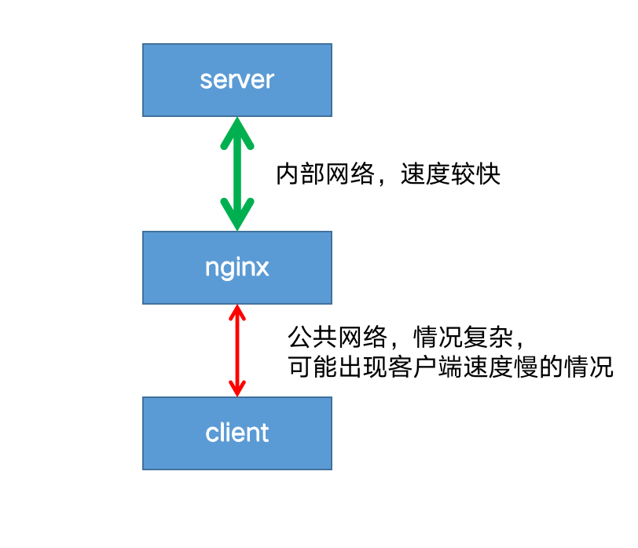

客户端往往是用户网络，情况复杂，可能出现网络不稳定，速度较慢的情况。而nginx到后端server一般处于同一个机房或者区域，网速稳定且速度极快。

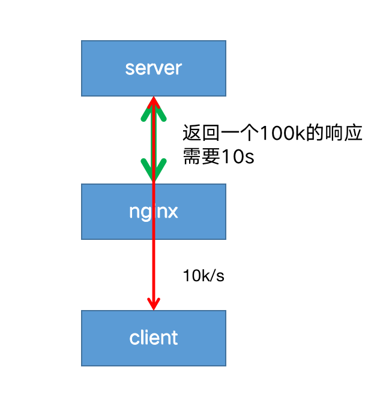

如果禁用了缓冲，则在客户端从代理服务器接收响应时，响应将同步发送到客户端。对于需要尽快开始接收响应的快速交互式客户端，此行为可能是可取的。这就会带来一个问题：因为客户端到nginx的网速过慢，导致nginx只能以一个较慢的速度将响应传给客户端；进而导致后端server也只能以同样较慢的速度传递响应给nginx，造成一次请求连接耗时过长。

在高并发的情况下，后端server可能会出现大量的连接积压，最终拖垮server端。

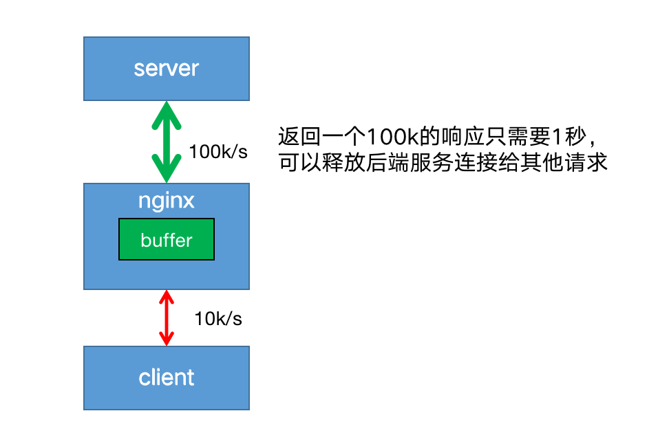

开启代理缓冲后，nginx可以用较快的速度尽可能将响应体读取并缓冲到本地内存或磁盘中，然后同时根据客户端的网络质量以合适的网速将响应传递给客户端。这样既解决了server端连接过多的问题，也保证了能持续稳定地像客户端传递响应。

使用[proxy_buffering](https://nginx.org/en/docs/http/ngx_http_proxy_module.html#proxy_buffering)启用和禁用缓冲，nginx默认为 on 启用缓冲，若要关闭，设置为 off  。

```nginx
proxy_buffering off;
```

[proxy_buffers](https://nginx.org/en/docs/http/ngx_http_proxy_module.html#proxy_buffers) 指令设置每个连接读取响应的缓冲区的`大小`和`数量` 。默认情况下，缓冲区大小等于一个内存页，4K 或 8K，具体取决于操作系统。来自后端服务器响应的第一部分存储在单独的缓冲区中，其大小通过 [proxy_buffer_size](https://nginx.org/en/docs/http/ngx_http_proxy_module.html#proxy_buffer_size) 指令进行设置，此部分通常是相对较小的响应headers，通常将其设置成小于默认值。

```nginx
location / {
    proxy_buffers 16 4k;
    proxy_buffer_size 2k;
    proxy_pass http://localhost:8088;
}
```

如果整个响应不适合存到内存里，则将其中的一部分保存到磁盘上的‎‎临时文件中‎‎。

‎[‎proxy_max_temp_file_size‎](https://nginx.org/en/docs/http/ngx_http_proxy_module.html#proxy_max_temp_file_size)‎设置临时文件的最大值。

‎[‎proxy_temp_file_write_size‎](https://nginx.org/en/docs/http/ngx_http_proxy_module.html#proxy_temp_file_write_size)‎设置一次写入临时文件的大小。

##### 缓存（cache）

启用缓存后，nginx将响应保存在磁盘中，返回给客户端的数据首先从缓存中获取，这样子相同的请求不用每次都发送给后端服务器，减少到后端请求的数量。

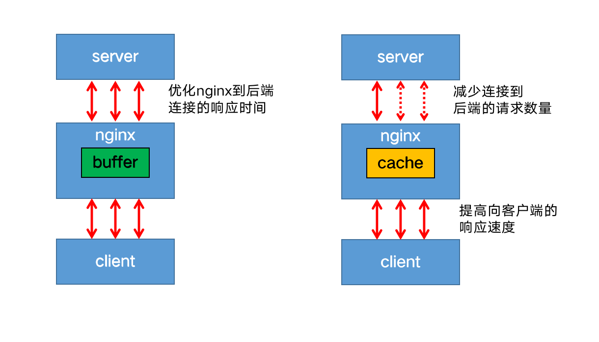

启用缓存，需要在http上下文中使用 [proxy_cache_path](https://nginx.org/en/docs/http/ngx_http_proxy_module.html#proxy_cache_path) 指令，定义缓存的本地文件目录，名称和大小。缓存区可以被多个server共享，使用[proxy_cache](https://nginx.org/en/docs/http/ngx_http_proxy_module.html#proxy_cache) 指定使用哪个缓存区。

```nginx
http {
    proxy_cache_path /data/nginx/cache keys_zone=mycache:10m;
    server {
        proxy_cache mycache;
        location / {
            proxy_pass http://localhost:8000;
        }
    }
}
```

使用缓存的案例：

```nginx
proxy_cache_path /usr/local/var/cache/nginx keys_zone=mycache:10m;

server {

    listen 8001;
    server_name ruoyi.localhost;
    
    location / {
        #设置buffer
        proxy_buffers 16 4k;
        proxy_buffer_size 2k;
        proxy_pass http://localhost:8088;        

    }


    location ~ \.(js|css|png|jpg|gif|ico) {
        #设置cache
        proxy_cache mycache;
        proxy_cache_valid 200 302 10m;
        proxy_cache_valid 404      1m;
        proxy_cache_valid any 5m;

        proxy_pass http://localhost:8088;  
    }

    location = /html/ie.html {

        proxy_cache mycache;
        proxy_cache_valid 200 302 10m;
        proxy_cache_valid 404      1m;
        proxy_cache_valid any 5m;

        proxy_pass http://localhost:8088;  
    }

    location ^~ /fonts/ {

        proxy_cache mycache;
        proxy_cache_valid 200 302 10m;
        proxy_cache_valid 404      1m;
        proxy_cache_valid any 5m;

        proxy_pass http://localhost:8088;  
    }

}
```

### 7. 负载均衡

跨多个应用程序实例的负载平衡是一种常用技术，用于优化资源利用率、最大化吞吐量、减少延迟和确保容错配置。‎使用nginx作为非常有效的HTTP负载平衡器，将流量分配到多个应用程序服务器，可以提升Web应用程序的性能，提高扩展性和可靠性。

 配置服务组 

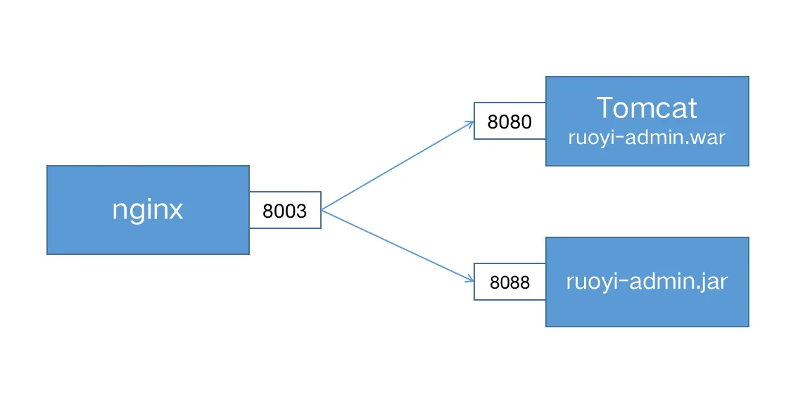


使用 upstream定义一组服务 。注意：upstream 位于 http上下文中，与server 并列，不要放在server中。

```nginx
upstream ruoyi-apps {
    #不写，采用轮循机制
    server localhost:8080;
    server localhost:8088;
  
}

server {
  
  listen 8003;
  server_name ruoyi.loadbalance;
  
  location / {
    proxy_pass http://ruoyi-apps;
  }

}
```

##### 负载均衡策略

##### 1.轮循机制（round-robin）

默认机制，以轮循机制方式分发。

##### 2.[最小连接](https://nginx.org/en/docs/http/ngx_http_upstream_module.html#least_conn)（least-connected ）

将下一个请求分配给活动连接数最少的服务器（较为空闲的服务器）。‎

```nginx
upstream backend {
    least_conn;
    server backend1.example.com;
    server backend2.example.com;
}
```

请注意，使用轮循机制或最少连接的负载平衡，每个客户端的请求都可能分发到不同的服务器。不能保证同一客户端将始终定向到同一服务器。‎

##### 3.[ip-hash](https://nginx.org/en/docs/http/ngx_http_upstream_module.html#ip_hash) 

客户端的 IP 地址将用作哈希键，来自同一个ip的请求会被转发到相同的服务器。

```nginx
upstream backend {
    ip_hash;
    server backend1.example.com;
    server backend2.example.com;
}
```

此方法可确保来自同一客户端的请求将始终定向到同一服务器，除非此服务器不可用。‎

##### [‎4.hash](https://nginx.org/en/docs/http/ngx_http_upstream_module.html#hash) 

通用hash，允许用户自定义hash的key，key可以是字符串、变量或组合。例如，key可以是配对的源 IP 地址和端口，也可以是 URI，如以下示例所示：‎

```nginx
upstream backend {
    hash $request_uri consistent;
    server backend1.example.com;
    server backend2.example.com;
}
```

请注意：基于 IP 的哈希算法存在一个问题，那就是当有一个上游服务器宕机或者扩容的时候，会引发大量的路由变更，进而引发连锁反应，导致大量缓存失效等问题。

`consistent`参数启用 ‎[‎ketama‎](http://www.last.fm/user/RJ/journal/2007/04/10/rz_libketama_-_a_consistent_hashing_algo_for_memcache_clients)‎ 一致哈希算法，如果在上游组中添加或删除服务器，只会重新映射部分键，从而最大限度地减少缓存失效。‎假设我们基于 key 来做 hash，现在有 4 台上游服务器，如果 hash 算法对 key 取模，请求根据用户定义的哈希键值均匀分布在所有上游服务器之间。

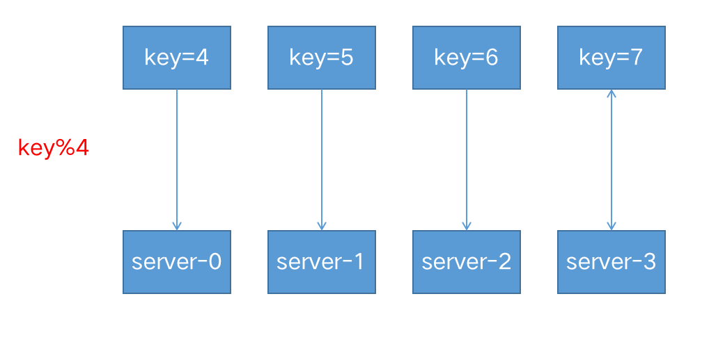当有一台服务器宕机的时候，就需要重新对 key 进行 hash，最后会发现所有的对应关系全都失效了，从而会引发缓存大范围失效。

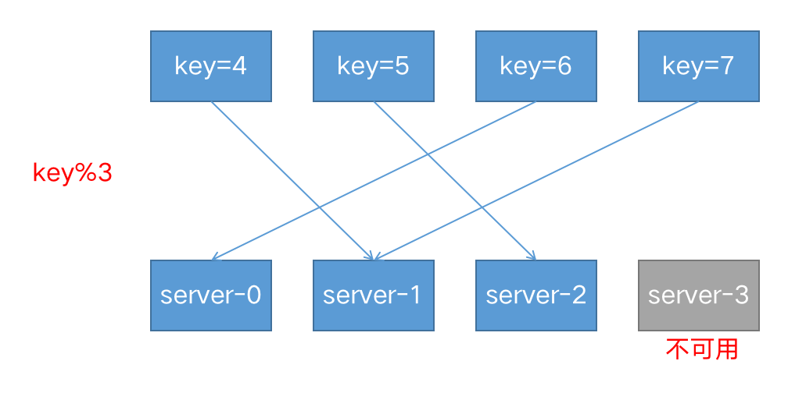

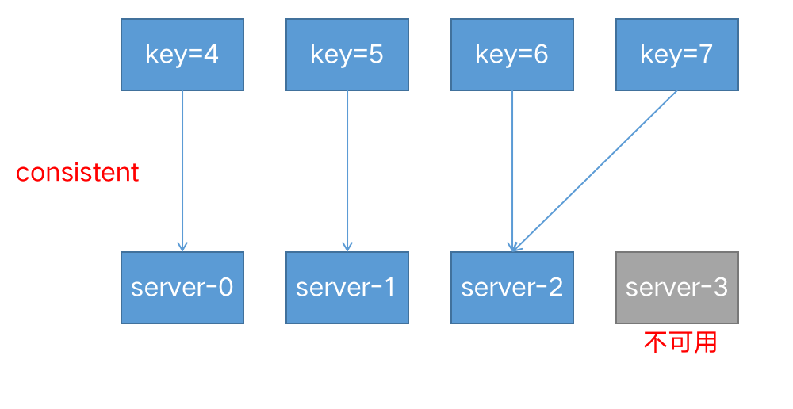


##### 5.[‎随机‎](https://nginx.org/en/docs/http/ngx_http_upstream_module.html#random)‎  (random）

每个请求都将传递到随机选择的服务器。two是可选参数，NGINX 在考虑服务器权重的情况下随机选择两台服务器，然后使用指定的方法选择其中一台，默认为选择连接数最少（least_conn‎）的服务器。

```nginx
upstream backend {
    random two least_conn;
    server backend1.example.com;
    server backend2.example.com;
    server backend3.example.com;
    server backend4.example.com;
}
```


##### 6.权重（weight）

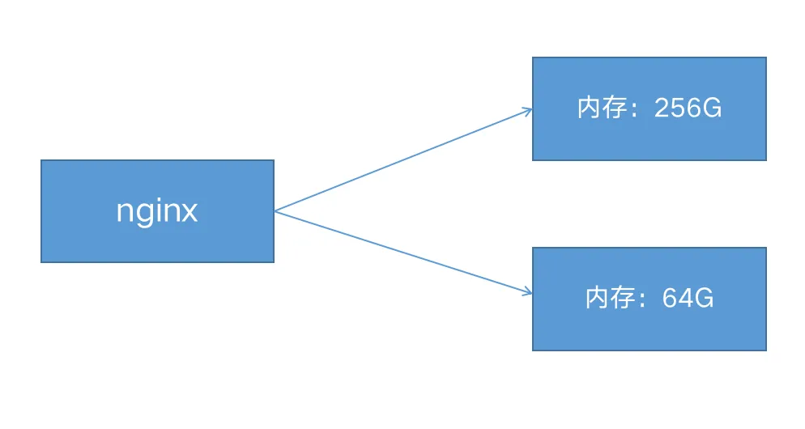

```nginx
upstream my-server {
  
    server performance.server weight=3;
    server app1.server;
    server app2.server;

}
```

如上所示，每 5 个新请求将按如下方式分布在应用程序实例中：3 个请求将定向到performance.server，一个请求将转到app1.server，另一个请求将转到app2.server。‎

##### 7.健康检查

在反向代理中，如果后端服务器在某个周期内响应失败次数超过规定值，nginx会将此服务器标记为失败，并在之后的一个周期不再将请求发送给这台服务器。‎

通过[fail_timeout‎](https://nginx.org/en/docs/http/ngx_http_upstream_module.html#fail_timeout)‎ 来设置检查周期，默认为10秒。

通过[max_fails‎](https://nginx.org/en/docs/http/ngx_http_upstream_module.html#max_fails)来设置检查失败次数，默认为1次。‎

‎在以下示例中，如果NGINX无法向服务器发送请求或在30秒内请求失败次数超过3次，则会将服务器标记为不可用30秒。

```nginx
upstream backend {
  server backend1.example.com;
  server backend2.example.com max_fails=3 fail_timeout=30s; 
} 
```

### 8.HTTPS配置

##### 生成证书

```shell
openssl genrsa -des3 -out server.key 2048
openssl req -new -key server.key -out server.csr
openssl x509 -req -days 365 -in server.csr -signkey server.key -out server.crt
```

##### 配置ssl

```nginx
server {
    listen              443 ssl;
    server_name         ruoyi.https;
    ssl_certificate     /home/ssl/server.crt;
    ssl_certificate_key /home/ssl/server.key;
    ssl_protocols       TLSv1 TLSv1.1 TLSv1.2;
    ssl_ciphers         HIGH:!aNULL:!MD5;
  
    location / {
        proxy_pass http://localhost:8088;
    }
}
```

如果设置了密码，需要加上

```nginx
server{
  ……
  ssl_password_file   /home/ssl/cert.pass;
  ……
} 
```

##### https优化

SSL 操作会消耗额外的 CPU 资源。CPU 占用最多的操作是 SSL 握手。有两种方法可以最大程度地减少每个客户端的这些操作数：

- 使保持活动连接能够通过一个连接发送多个请求
- 重用 SSL 会话参数以避免并行连接和后续连接的 SSL 握手

会话存储在工作进程之间共享并由 [ssl_session_cache](https://nginx.org/en/docs/http/ngx_http_ssl_module.html#ssl_session_cache) 指令配置的 SSL 会话缓存中。一兆字节的缓存包含大约 4000 个会话。默认缓存超时为 5 分钟。可以使用 [ssl_session_timeout](https://nginx.org/en/docs/http/ngx_http_ssl_module.html#ssl_session_timeout) 指令增加此超时。以下是针对具有 10 MB 共享会话缓存的多核系统优化的示例配置：

```nginx
ssl_session_cache   shared:SSL:10m;
ssl_session_timeout 10m;
```

### 9.TCP反向代理

nginx除了可以代理HTTP请求外，还可以代理TCP请求，例如Mysql，Redis都可以使用nginx代理：

```nginx
#HTTP代理
http {
  server {
    listen 8002;
    proxy_pass http://localhost:8080/;
  }
}

#TCP代理mysql 3306端口
stream {
  server {
    listen 13306;
    proxy_pass localhost:3306;
  }
}
```

##### tcp负载均衡

```nginx
stream {
  
  upstream backend-mysql {
  
    server localhost:3306;
    server localhost:3307;
    
    keepalive 8;
  }
  
  server {
    listen 13306;
    proxy_pass backend-mysql;
  }
}
```

使用`keepalive`定义连接池里空闲连接的数量。

`keepalive_timeout` 默认60s。如果连接池里的连接空闲时间超过这个值，则连接关闭。

在最简单的 HTTP 实现中，客户端打开新连接，写入请求，读取响应，然后关闭连接以释放关联的资源。

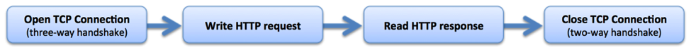

在客户端读取响应后，保持连接处于打开状态，因此可以将其重新用于后续请求。


使用 [keepalive](https://nginx.org/en/docs/http/ngx_http_upstream_module.html#keepalive) 指令启用从 NGINX Plus 到上游服务器的保持活动连接，定义在每个工作进程的缓存中保留的与上游服务器的空闲保持活动连接的最大数量。当超过此数字时，将关闭最近最少使用的连接。如果没有 keepalives，您将增加更多的开销，并且连接和临时端口都效率低下。现代 Web 浏览器通常会打开 6 到 8 个保持连接。

### 10. 重写(return和rewrite)

nginx有两个重写指令：`return`和`rewrite`

##### return

服务端停止处理并将状态码status code返回给客户端

```
return *code* *URL*
return *code* *text*
return *code*
return *URL*
```

##### 强制所有请求使用Https

错误写法

```nginx
server {

    listen 8003;
    server_name ruoyi.loadbalance;

    return 301 https://localhost:8004;
}
```

正确写法

```nginx
server {

    listen 8003;
    server_name ruoyi.loadbalance;

    return 301 https://192.168.56.105:8004;
}
```

## 转发和重定向

转发是服务端行为，重定向是客户端行为。

#### 转发

发向代理proxy_pass属于转发，浏览器的访问栏输入的地址不会发生变化。

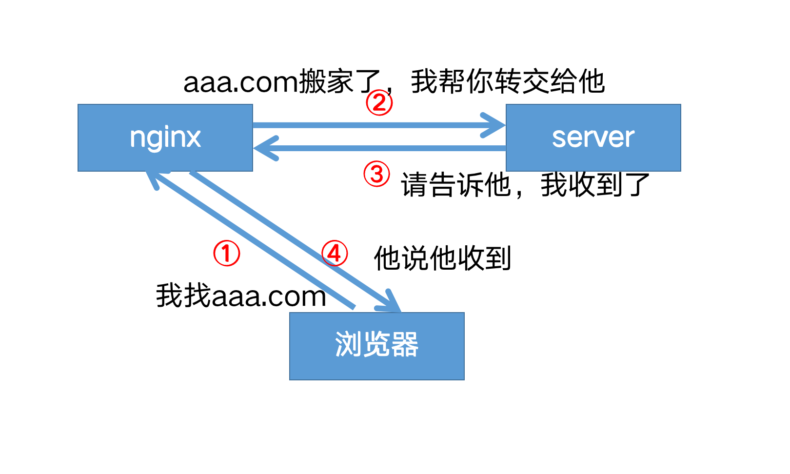

#### 重定向

return，rewrite属于重定向，在客户端进行。浏览器的访问栏输入的地址会发生变化。

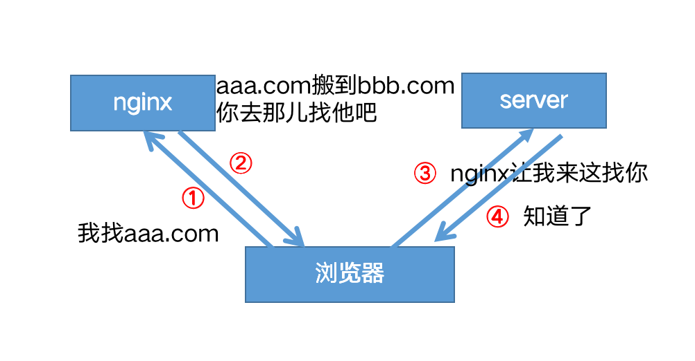

域名迁移，不让用户收藏的链接或者搜索引擎的链接失效

将请求从 www.old-name.com **old-name.com** 永久重定向到 **www.new-name.com，包含http和https请求**