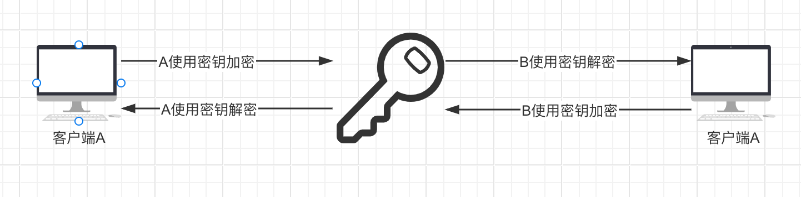
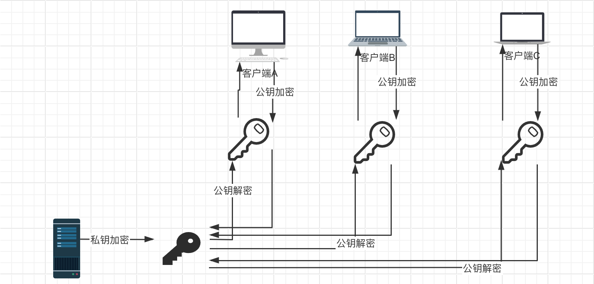

# 加密基础知识

在服务部署时，经常会遇见一些证书安装、https等问题，对于这些基础知识存在盲区，这次彻底搞懂加密基础知识：对称密钥，非对称密钥，CA机构，证书，HTTPS的底层原理

### 对称密钥

对称密钥指的是通信双方使用同一个密钥对密文信息进行加密解密，这个密钥对于通信双方是对称的，但是这中加密方式存在重大安全隐患，即一旦对称密钥被获取，那么通信双方的加密信息即可破解。对称密钥如下图所示：

### 非对称密钥

非对称密钥是一对密钥对由公钥和私钥组成。从加密解密的角度来看，这个过程是单向的，也就是使用私钥加密的信息只能用公钥解密，而使用公钥加密的信息只能用私钥解密，这也是被称之为非对称的原因。其实还可以换个角度来看这个过程，即数字签名，当使用私钥签名的信息，必须使用对应的公钥认证，也就是说可以确定这个信息的私钥的来源，这也就是CA机构的由来这点后面再讨论。非对称密钥如下图所示：

非对称密钥也存在的安全风险：一个黑客将某个客户端的公钥替换成了自己的公钥，那么客户端发送信息时使用黑客的公钥，然后黑客又监听到了客户端发送的信息，这时黑客可以使用自己的私钥来解密客户端发送的信息。

### CA认证机构

为了应对上述非对称密钥的安全风险，国际上出现了很多CA机构，上节讨论过非对称密钥签名的概念这时就可以派上用场。对于公钥可能会被替换和篡改的风险，CA认证机构会使用自己的私钥来对这些公钥进行签名，而这个大型的CA机构的公钥是经常写入操作系统中的，需要很高的权限该能更改所以保证了被CA机构认证签名的公钥的安全性。我们只需到CA机构去下载相应的公钥就可以放心使用。

### HTTPS的加密过程

HTTPS对传输信息的加密过程是混合使用了对称密钥和非对称密钥，首先客户端肯定需要下载HTTPS服务端的公钥，然后在传输信息过程中使用自己的公钥加密一个对称密钥发送给服务器端，服务器使用私钥解密得到对称秘钥后在本次连接中都使用该对称密钥来通信知道下次连接，重新开始新的连接后再重复上述过程，使用对称秘钥加密数据。这样做的原因是使用非对称密钥加密解密过程中耗费的计算资源远比使用对称密钥大，所以混合使用对称密钥和非对称密钥将会更节省计算资源。