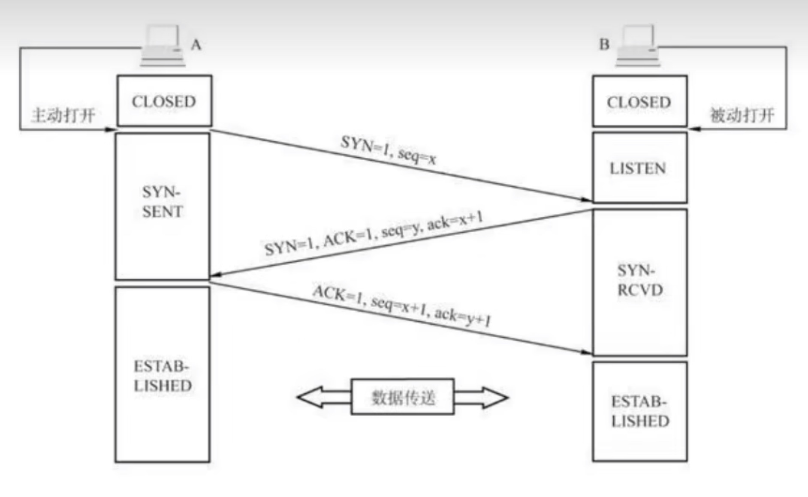

# 加密基础知识

在服务部署时，经常会遇见一些证书安装、https等问题，对于这些基础知识存在盲区，这次彻底搞懂加密基础知识：对称密钥，非对称密钥，CA机构，证书，HTTPS的底层原理

### 对称密钥

对称密钥指的是通信双方使用同一个密钥对密文信息进行加密解密，这个密钥对于通信双方是对称的，但是这中加密方式存在重大安全隐患，即一旦对称密钥被获取，那么通信双方的加密信息即可破解。对称密钥如下图所示：


### 非对称密钥

非对称密钥是一对密钥对由公钥和私钥组成。从加密解密的角度来看，这个过程是单向的，也就是使用私钥加密的信息只能用公钥解密，而使用公钥加密的信息只能用私钥解密，这也是被称之为非对称的原因。其实还可以换个角度来看这个过程，即数字签名，当使用私钥签名的信息，必须使用对应的公钥认证，也就是说可以确定这个信息的私钥的来源，这也就是CA机构的由来这点后面再讨论。非对称密钥如下图所示：


非对称密钥也存在的安全风险：一个黑客将某个客户端的公钥替换成了自己的公钥，那么客户端发送信息时使用黑客的公钥，然后黑客又监听到了客户端发送的信息，这时黑客可以使用自己的私钥来解密客户端发送的信息。

### CA认证机构

为了应对上述非对称密钥的安全风险，国际上出现了很多CA机构，上节讨论过非对称密钥签名的概念这时就可以派上用场。对于公钥可能会被替换和篡改的风险，CA认证机构会使用自己的私钥来对这些公钥进行签名，而这个大型的CA机构的公钥是经常写入操作系统中的，需要很高的权限该能更改所以保证了被CA机构认证签名的公钥的安全性。我们只需到CA机构去下载相应的公钥就可以放心使用。

### 非对称加密过程的基础原理

简单的说加密就是将一个已知的数字根据一定的规则转换变成另一个数字，也就是说加密的本质是`num -> x`，其中num是已知数，x是未知数，那么我们换个复杂的转化过程，比如求余运算`5 ^ 2 mod 7 = 4`。这个求余过程很简单，但是如果我们换一下位置`5 ^ x mod 7 = 4`，这时求x没有什么好的方法，只能一个一个去试，虽然麻烦但是由于数据小，所以还是可以一个一个尝试后得出结果为2。那我们把模数字变得巨大无比呢？比如：`5 ^ x mod 56868369895 = 4`， 那这个尝试的过程就需要大量计算，有可能是几年，这样我们就认为这是无法算出的，实际上上面的公式都是将5加密成4。虽然取模运算是不可逆的，但是结合欧拉公式，却可以让上面这个公式变的可逆。我们令x = p * q，取模公式为`text ^ p * q mod n = text`。如果p，q，n选取得当的话，text进过取模运算后的结果还是text。经过欧拉公式的推导得出：`m ^ p mod n = x  x ^ q mod n = m`。这个推导过程有兴趣可以自行了解，从这个结果可以看出知道p就能加密，知道q就能解密。而这里就是公钥，q就是私钥。而且更秒的是p和q在公式里的位置是可以互换的，所以放过来说使用私钥加密的密文，只有通过公钥才能解开，这就印证了非对称加密、解密是单向的。

总结一下非对称密钥的加密过程：

1. 对于n ^ m取模且模数很大的情况下，方法是不可逆的，这也是基于现在计算机的算力，除非有很大的突破，不然可以认为其是不可逆；
2. 使用欧拉公式：选择特殊的p，q，n可以使得n ^ m变得可逆，这也是非对称加密的数学理论基础。

### HTTPS的加密过程

HTTP协议使用的是明文传输，为了让明文，变成密文，我们需要在HTTP层之上再加一层TLS层，目的就是为了做个加密。这就成了我们常说的HTTPS。


TCP（Transmission Control Protocol）用于在包交换网络中主机之间，或者互联系统之间的高可靠传输。首先我们来回顾一下TCP(传输控制协议)：需要了解的是TCP的首部格式，首部是用于数据传输的辅助信息，TCP的首部格式如下：

```
    0                   1                   2                   3
    0 1 2 3 4 5 6 7 8 9 0 1 2 3 4 5 6 7 8 9 0 1 2 3 4 5 6 7 8 9 0 1
   +-------------------------------+-------------------------------+
   |          Source Port          |       Destination Port        |
   +-------------------------------+-------------------------------+
   |                        Sequence Number                        |
   +---------------------------------------------------------------+
   |                    Acknowledgment Number                      |
   +-------+-----------+-+-+-+-+-+-+-------------------------------+
   |  Data |           |U|A|P|R|S|F|                               |
   | Offset| Reserved  |R|C|S|S|Y|I|            Window             |
   |       |           |G|K|H|T|N|N|                               |
   +-------+-----------+-+-+-+-+-+-+-------------------------------+
   |           Checksum            |         Urgent Pointer        |
   +-------------------------------+---------------+---------------+
   |                    Options                    |    Padding    |
   +-----------------------------------------------+---------------+
   |                             data                              |
   +---------------------------------------------------------------+
```

TCP首部是前五行的固定字段，每个字段4个字节，我们先了解一下这些三个重要的标志位：

1. SYN：表示建立连接；
2. FIN：表示关闭连接；
3. ACK：表示响应

在首部信息中Sequence Number表示当前端成功发送到的位置，刚开始建立连接时是随机的。Acknowledgment Number表示当前成功接受到的位置，**这里有一个重要的说明在计算seq和ack时，都是基于自己发送和接收的包来进行计算的，在计算的时候读到的SYN标志位和FIN标志位都被算成1个位置**。

先来看看TCP建立连接的三次握手：



1. 客户端向服务端发送建立连接请求，TCP首部中的SYN设置为1，同时生成随机的sequense number：x；
2. 服务器端接收到了客户端的请求，并读出了SYN标志位，当服务器发出同意建立连接请求，这时将SYN和ACK的标志位设置为1，acknowledge number是接受到了x这个sequence number并且接收到了SYN，所以基于自己的成功接收计算ack = x + 1(SYN占用一个位置)，同时生成一个随机的sequence number：y。
3. 客户端向服务器发送确认连接请求，将ACK的标志位设置为1，基于自己的发送计算seq = x(上次成功发送的位置) + 1(SYN占用一个位子)，计算ack = y(接受到的seq位y) + 1(接受到的SYN占用一个位置)。

上面对于三次握手的解释跟网络上的解释非常不一样，所以对TCP的理解需要深入，不能人云亦云。当建立完连接后所有的sequence number和acknowledge number都需要基于当前端的发送和接收情况来计算。比如中间客户端又发送了长度为100的数据到服务器端那么这时seq = x + 1 + 100。

最后我们看看关闭连接的四次挥手：


有了上面对三次握手的理解，现在来看看关闭连接的四次挥手：

1. 客户端向服务器发送关闭连接的请求，将FIN设置为1，seq和ack都是基于自己的计算；
2. 服务器响应客户端的关闭连接请求，将ACK设置为1，seq是上次发送的位置，计算ack = u(上次成功接收的位置) + 1(FIN也算一个位置)；
3. 服务器向客户端发送确认关闭连接的请求，将FIN、ACK都设置为1，同时seq = 上次发送的位置v + 数据传送的长度，ack = u + 1(和上次一样，这段时间没有接受新的数据)；
4. 客户端响应服务请的确认请求：将ACK设置为1，seq = 上次发送的位置u + 1(FIN也算一个位置)，ack = 上次接收的位置w + 1(FIN在计算时也占一个位置)。

##### HTTPS握手过程

首先是建立TCP连接，毕竟HTTP是基于TCP的应用层协议。在TCP成功建立完协议后，就可以开始进入HTTPS的加密流程。总的来说。整个加密流程其实分为**两阶段**。


**第一阶段**是TLS四次握手，这一阶段主要是利用**非对称加密**的特性各种交换信息，最后得到一个"会话秘钥"。

**第二阶段**是则是在第一阶段的"**会话秘钥**"基础上，进行**对称加密**通信。

我们先来看下第一阶段的**TLS四次握手**是怎么样的。

**第一次握手**：

• `Client Hello`：是客户端告诉服务端，它支持什么样的加密协议版本，比如 `TLS1.2`，使用什么样的加密套件，比如最常见的`RSA`，同时还给出一个**客户端随机数**。

**第二次握手**：

• `Server Hello`：服务端告诉客户端，**服务器随机数** + 服务器证书 + 确定的加密协议版本（比如就是TLS1.2）。

**第三次握手**：

• `Client Key Exchange`: 此时客户端再生成**一个随机数**，叫 `pre_master_key `。从第二次握手的**服务器证书**里取出服务器公钥，用公钥加密 `pre_master_key`，发给服务器。

• `Change Cipher Spec`: 客户端这边**已经拥有三个随机数**：客户端随机数，服务器随机数和pre_master_key，用这三个随机数进行计算得到一个"**会话秘钥**"。此时客户端通知服务端，后面会用这个会话秘钥进行对称机密通信。

• `Encrypted Handshake Message`：客户端会把迄今为止的通信数据内容生成一个摘要，用"**会话秘钥**"加密一下，发给服务器做校验，此时客户端这边的握手流程就结束了，因此也叫**Finished报文**。

**第四次握手**：

• `Change Cipher Spec`：服务端此时拿到客户端传来的 `pre_master_key`（虽然被服务器公钥加密过，但服务器有私钥，能解密获得原文），集齐三个随机数，跟客户端一样，用这三个随机数通过同样的算法获得一个"**会话秘钥**"。此时服务器告诉客户端，后面会用这个"会话秘钥"进行加密通信。

• `Encrypted Handshake Message`：跟客户端的操作一样，将迄今为止的通信数据内容生成一个摘要，用"**会话秘钥**"加密一下，发给客户端做校验，到这里，服务端的握手流程也结束了，因此这也叫**Finished报文**。

##### HTTPS到底是对称加密还是非对称机密？

**都用到了**。前期4次握手，本质上就是在利用**非对称加密**的特点，交换三个随机数。目的就是为了最后用这三个随机数生成**对称加密的会话秘钥**。后期就一直用对称机密的方式进行通信。

##### 为什么不都用非对称加密呢？

因为非对称加密慢，对称加密**相对来说快一些**。

##### 第二次握手里的服务器证书是什么？怎么从里面取出公钥？

**服务器证书**，本质上是，被**权威数字证书机构（CA）的私钥**加密过的**服务器公钥**。


上面提到过，**被私钥加密过的数据，是可以用公钥来解密的**。而公钥是任何人都可以得到的。所以第二次握手的时候，客户端可以通过CA的公钥，来解密服务器证书，从而拿到藏在里面的**服务器公钥**。


##### 为什么我不能只传公钥，而要拿CA的私钥加密一次再传过去？

反过来想想，如果只传公钥，公钥就有可能会在传输的过程中就被黑客替换掉。然后第三次握手时客户端会拿着**假公钥**来加密**第三个随机数** `pre_master_key`，黑客解密后自然就知道了最为关键的 `pre_master_key`。又因为第一和第二个随机数是公开的，因此就可以计算出"**会话秘钥**"。所以需要有个办法证明客户端拿到的公钥是**真正的服务器公钥**，于是就拿**CA的私钥**去做一次加密变成**服务器证书**，这样客户端拿**CA的公钥**去解密，就能验证是不是真正的**服务器公钥**。

##### 怎么去获得CA的公钥？

最容易想到的是请求CA的官网，获取公钥。但全世界要上网的人那么多，都用去请求CA官网的话，官网肯定顶不住。考虑到能颁发证书的CA机构可不多，因此对应的CA公钥也不多，把他们**直接作为配置放到操作系统或者浏览器里**，这就完美解决了上面的问题。


##### 别人就拿不到你这三个随机数？

这三个随机数，两个来自客户端，一个来自服务端。第一次和第二次握手里的客户端随机数和服务端随机数，都是明文的。只要有心，大家都能拿到。但第三个随机数 `pre_master_key` 则不行，因为它在客户端生成后，发给服务器之前，**被服务器的公钥加密过**，因此只有服务器本器才能用**私钥**进行解密。就算被别人拿到了，没有服务器的私钥，也无法解密出原文。


##### 为什么要用三个随机数？而不是一个或两个？


看上去第三个随机数 `pre_master_key`才是关键，另外两个看起来可有可无？确实，就算没有另外两个，也并不影响加密功能。之所以还要两个随机数，是因为只有单个 `pre_master_key`随机性不足，多次随机的情况下有可能出来的秘钥是一样的。但如果再引入两个随机数，就能大大增加"**会话秘钥**"的随机程度，从而保证每次HTTPS通信用的会话秘钥都是不同的。

##### 为什么第三和第四次握手还要给个摘要？

第三和第四次握手的最后都有个 `Finished`报文，里面是个**摘要**。**摘要，说白了就是对一大段文本进行一次hash操作。目的是为了确认通信过程中数据没被篡改过**。第三次握手，客户端生成摘要，服务端验证，如果验证通过，说明客户端生成的数据没被篡改过，服务端后面才能放心跟客户端通信。第四次握手，则是反过来，由服务端生成摘要，客户端来验证，验证通过了，说明服务端是可信任的。那么问题叒来了。

**为什么要hash一次而不是直接拿原文进行对比？**

这是因为原文内容过长，hash之后可以让数据变短。更短意味着更小的传输成本。


##### 这个过程中到底涉及了几对私钥和公钥？

两对。**服务器本身的公钥和私钥**：在第二次握手中，服务器将自己的**公钥**（藏在数字证书里）发给客户端。第三次握手中用这个服务器**公钥**来加密第三个随机数 `pre_master_key`。服务器拿到后用自己的**私钥**去做解密。

**CA的公钥和私钥**：第二次握手中，传的数字证书里，包含了被**CA的私钥**加密过的服务器公钥。客户端拿到后，会用实现内置在操作系统或浏览器里的**CA公钥**去进行解密。